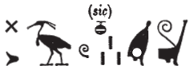
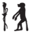

## Esna 335 {-}  

  

- Location: Column 13, base
- Date: Hadrian 
- [Hieroglyphic Text](https://www.ifao.egnet.net/uploads/publications/enligne/Temples-Esna003.pdf#page=319){target="_blank"}  
- Bibliography: @sayed-neith, II, pp. 639-640, Doc. 1038; see also [Tempeltexte 2.0](http://www.tempeltexte.uni-tuebingen.de/portal/#/text-detail/1237){target="_blank"}

^A^ *nṯr nfr nb ʿnḫ  *  
*ḫnty sḫ.t=f  *  
*ỉwn wr*   
*rdỉ ṯȝw n dwȝ=f  *  
   
*bȝ šfy.t-ḥȝ.t  *  
*m-m psḏ.t  *  
  
*qn m mr[.t]  *  
*nḫt m Nwn  *  
    
*ṯȝy ʿwn(.t)  *  
*smȝ bṯn.w  *  
*tȝ r-ḏr=f ẖr ḥry.t=f  *  
*wr bȝw *  
*n šmʿ-mḥw  *
  
^A^ The great god, Lord of life,  
foremost of his field.  
Great Iun-pillar,   
who gives air to whomever praises him.  
  
Ba, prestigious of face  
among the Ennead.

Mighty in heav[en],[^fn-335-0]  
victorious in Nun.  
  
He who seizes the baton,  
and slays the rebels:  
the entire land is in fear of him,  
greatest of Ba-power   
across Upper and Lower Egypt.[^fn-335-1]
  

[^fn-335-0]: This entire sequence of epithets, until "rebels", is paralleled in [Esna 397], B, which explicitly ties these phrases to the festival of "seizing the baton" on [Epiphi 20](https://bookdown.org/shemanefer/Esna2/calendar-ii-77.html#epiphi-20).  
[^fn-335-1]: {width=18%} - Reading confirmed by parallels such as: [Esna 225], 4 (3); [Esna 261], 16, §4; [Esna 360], 17.

^B^ *nṯr nfr wȝḏḏ(?) nfr  *  
*ḫpr (ẖr) ḥȝ.t  *  
*pȝwty.w-tpy*  
*r-ḫt ḥm=s  *  
*bẖ(.t) ỉtn  *  
*ḫrs.n=f knḥ  *  
*m ỉrw=s n gb.t rʿ-nb  *  
   
*dỉ=s m ḥr.t=tp  *  
*m zȝ n ḥʿw=f  *  
*ḥʿʿ ỉb=f n mȝn=s  *  
      
*ẖnm=f s(y) m ȝw(.t)-ỉb  *  
*m rn=f n ẖnmw  *  
     
*mn=s ḥr tp=f  *  
*m rn=s n Mnḥy.t    *  
    
^B^ The good god, good *wȝḏḏ*-serpent(?) [^fn-335-2],  
who came about in the beginning,  
the primeval ones   
are in her Majesty's following.  
  
She who birthed the sundisk,  
as he dispelled darkness,  
in her form of the firmament, daily.  
  
She puts herself as a uraeus  
in protection of his body,  
he rejoices to see (*mȝn*) her.   
  
He joins (*ẖnm*) with her in happiness,  
in his name of Khnum (*ẖnmw*).  
  
She remains (mn) upon his head,  
in her name of Menhyt (*Mnḥy.t=*).[^fn-335-3]  

[^fn-335-2]: {width=8%} - Reading uncertain, this might alternatively write *nṯr.t nfr.t*, "good goddess."
[^fn-335-3]: Multiple allusions to the spelling of Menhyt. Khnum rejoices to see (*mȝn*, infinitival form, written with two eyes) Neith. She then remains (*mn*, spelled with two pupils < *mȝn*) on his head, as Menhyt (also spelled with two pupils).

