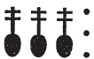
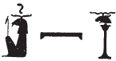

# Column 14 (337-352) {-}

## Esna 337 {-}  
  
  

- Location: Column 14
- Date: Hadrian
- [Hieroglyphic Text](https://www.ifao.egnet.net/uploads/publications/enligne/Temples-Esna003.pdf#page=323){target="_blank"}  
- Bibliography: @recklinghausen-fremden, pp. 543-544 (337, B); see also [Tempeltexte 2.0](http://www.tempeltexte.uni-tuebingen.de/portal/#/text-detail/1241){target="_blank"} 

  

^A^ *nsw.t-bỉty  *  
*štȝ.t wr.t  *  
*rr.t ẖms.w  *  
*ʿšȝ np(r)y  *  
*sḫpr ỉt bd.t pr.t nb *   
*nn ḏr.w=sn  *  
    
*Rnn.t nfr.t  *  
*nb(.t) np(r)y  *  
*nb.t kȝw ḏfȝw  *  
*Mnḥy.t nb.t wnn.t  *  

^A^ The King of Upper and Lower Egypt,  
the Great mysterious one,  
who nurtures wheat;  
plentiful of grain,  
who creates all wheat, barley, seeds,[^fn-337-0]  
without their limit.  
  
Good Renenutet,  
lady of grain,[^fn-337-1]  
lady of food and provisions.  
Menhyt, lady of what exists.  

  
[^fn-337-0]: Note that priests carry all these grains to the festival of Khoiak 1, as described on the same column: [Esna 346], 16; cf. @sauneron-5, p. 55.
[^fn-337-1]: {width=12%} - Similar spellings of *npry*, "grain" (Coptic: ⲛⲁⲫⲣⲓ) occur in *Esna* II, 155, 4; 176, 6; [Esna 351], A; cf. @vernus-form.

  

^B^ *nsw.t-bỉty  *  
*ẖnmw pȝ qn  *  
*wsr-ḫpš  *  
*nb sḫ.t  *  
    
*pr m mȝʿ-ḫrw  *  
*m ḥb=f nfr   *  
*n wḏʿ-mdw  *  
      
*nṯr.w spȝ.wt nỉw.wt  *  
*ỉb=s(n) nḏm(.w)  *  
*ỉỉ.tw r mȝȝ=f  *  
*m mȝʿ-ḫrw  *  
*wḥm=sn *  
*m wpy=f ʿȝ  *  
      
*ʿn.wy ḥr=f m tpy  *  
*ȝm=k hrw 2  *  
*ẖnmw  *  
*ršw=f r'-(ʿ)-ḫt  *  
  
^B^ The King of Upper and Lower Egypt,  
Khnum the victorious(?)[^fn-337-2]  
mighty of scimitar,  
Lord of the Field.  
  
He who comes forth in justification,  
in his good festival  
of rendering decisions.  
  
The gods of nomes and cities -   
their hearts are pleased,  
having come to see him  
in justification;  
they repeat (this visit)  
in his great *wpy*-festival.[^fn-337-4]  
   
How lovely is his face on the first day,  
may you seize the second day![^fn-337-5]  
Khnum,  
combat is his delight.[^fn-337-6]
 

[^fn-337-2]: {width=16%} - The reading is not entirely certain, since this epithet appears to be without parallel. But similar spellings of *qn*, "power; might", occur on the same column in [Esna 350], 1 and 6. Compare also the epithet "Khnum Lord of power and might (*nb qn nḫt*)": [Esna 375], A. 
[^fn-337-4]: All of these phrases occur in the description of the "great *wpy*-festival" of [Khoiak 1](file:///C:/Users/klotzd/Esna/_book/calendar-i-55.html#khoiak-1): [Esna 346], 22; with allusions to this festival in *Esna* II, 81, 5-6; 127, 8.
[^fn-337-5]: Similar phrases occur in [Esna 346], 25; [Esna 351], A. Apparently days 1 and 2 refers to events on Khoiak 1 and 2: Khnum receives justification on the first, and visits his father Re on the second: [Esna 348]; cf. @sauneron-5, pp. 65-66.
[^fn-337-6]: The reading of these final signs is confirmed by [Esna 350], 16. Khnum Lord of the Field receives weapons from the king, and his epithets include: "battle is his delight (*ršw=f pw r'-(ʿ)-ḫt*)."
