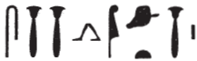
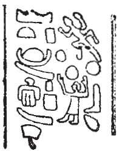
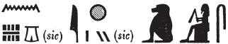
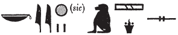
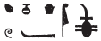
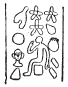

## Esna 340 {-}  
  
   
  
  
- Location: Column 14
- Date: Hadrian 
- [Hieroglyphic Text](https://www.ifao.egnet.net/uploads/publications/enligne/Temples-Esna003.pdf#page=325){target="_blank"}  
- Bibliography: @sauneron-1, p. 128; @sauneron-5, pp. 30-34 (excerpts); see also [Tempeltexte 2.0](http://www.tempeltexte.uni-tuebingen.de/portal/#/text-detail/1245){target="_blank"} 

 

^4^ *ȝbd 3 ȝḫ.t hrw 22*  
*ḥȝ.t n ḥb*   
*Ḥkȝ p(ȝ) ẖrd *  
*ḥry-ỉb Ỉwny.t*  
*nb ʿḥ pw*  
*šm r sḫ.t *  
*n Ḥkȝ p(ȝ) ẖrd*  
*[ḫr(.w) r=f]*  
   
*ỉr ḫp(r) wnw.t 1*  
*n hrw pn*  
*nỉs ỉn ỉmy-p.t*  
*m pr pn*  
   
*wʿb s(w) ỉn wʿb*  
*m š wʿb n ḥw.t-nṯr*  
*ỉỉ(.t) m ʿb*  
*mȝʿ ʿȝb.t ʿȝ.t*  
*ỉḫt nb nfr*  
*m* ^5^ *t ỉḥ.w ȝpd.w*  
*ỉrp ʿtḫ dq(r).w *  
*šdḥ bỉ.t rnp.w*  
*nn ỉḏr(.w)=sn*  
  
^4^ Akhet III day 2 (= [Hathor 22](https://bookdown.org/shemanefer/Esna2/calendar-i-55.html#hathor-22)),  
Beginning of the Festival  
of Heka the Child  
within Iunyt,   
that means: Lord of the Palace.  
'Going to the field  
by Heka the Child'  
[so it is also called].  
  
Now when the first hour  
of this day arrives  
the sky-watching priest calls out  
in this temple.  
  
Each priest purifies himself  
in the pure lake of the temple;  
arrive in purity,  
presenting a great, composed offering   
(of) all good things:  
of ^5^ bread, cattle, fowl,  
wine, brewed beer, fruits,  
fortified wine, honey, fresh plants,  
without limit.

*ỉr(.t) snṯr*  
*fȝỉ(.t) ỉḫt*  
*mzỉ wdn*  
*ỉn sš-mḏȝ.t-nṯr*  
   
*sḫʿ.n pȝ ẖrd*  
*ʿq r sḫ.t*  
*ỉỉ ḥp.ty*  
*nỉs sȝḫ(.w)*  
*n šm r sḫ.t*  
*r' ḏ(d.w)*  
   
*mỉ(?) pȝ ẖrd*  
*zȝ Nb.t-ww *  
*ʿȝ wr tpy (n) ẖnmw*  
*(r) ww nfr n ḫnt-tȝ*  
*swtwt m ḫnt wȝḏ*  
*sm.w ṯḥn(.w)*   
*mỉ ḫsbḏ*  
*šd(=k) qnw *  
*ʿšʿ wȝḥ(.w)*  
*mỉ ỉwn-ḥʿʿ(?)*  
  
Offering incense,  
elevating food offerings,  
presenting litanies,  
by the Scribe of the God's Book.  
  
Procession of The Child,  
enter to the field,   
and coming to the limits.   
Recite the *sȝḫ.w*-hymns  
of 'Going to the Field':  
recitation to be spoken:  
  
Come, o child,  
son of Nebtu,  
very great, first-born of Khnum,  
(to) the good field of Khent-ta!  
Wander among the vegation,[^fn-340-1]  
So the plants scintillate     
like[^fn-340-2] lapis-lazuli;  
and remove (all) blight,[^fn-340-3]  
(you who are) numerous of garlands,    
just like the moon(?).[^fn-340-4]  

 

[^fn-340-1]: {width=16%} - Note that *swtwt*, "to wander; roam", is spelled here as if it were *swȝḏwȝḏ*, "make verdant." The same, rare verb describes Heka in the fields in [Esna 341], 8.

[^fn-340-2]: Here and throughout this text, two circles appear to write *mỉ*, "like" < *mȝȝ*, "to see." 

[^fn-340-3]: Note a similar sequence of epithets in [Esna 239], A, with parallels noted there. For *qnw*, "blight", see P*WL*, p. 1060.

[^fn-340-4]: {width=10%} - @sauneron-5, p. 32 did not translate this portion, and did not even transcribe all of the signs. Understanding here the moon sign writing *wȝḥ*, "garland" < *wḥʿ*.

*bḥs.w ẖ(r) ỉḫt n mhr*  
*wdn.tw n kȝ=f nfr*  
*ʿq r sḫ.t*  
*mȝȝ=s*  
   
*nʿỉ ỉn ḥm nṯr pn*  
*r ḫft-ḥr n s.t-ʿȝ.t*  
*ỉỉ.ỉn wʿb ʿq m Pr-nṯr*  
*m ʿb wr*  
*sḥtpy qbḥw (m)-ʿ=f*  
*ʿ n ỉrṯ.t*  
*ỉḫt nb nfr*  
*fȝỉ(.w) m-sȝ=f*  
   
*swʿb (m) ḥr n nṯr pn*  
*dỉ(.t) snṯr*  
*dỉ(.t) qbḥw*  
^6^ *ḥr ḥtp.w ʿȝ.w*  
*m-rw.ty*  
   
*ỉw ẖry-ḥb ḥry-tp*  
*(ḥr) nỉs r'.w*  
*m qȝ n ẖrw*  
*šmʿy.w ḥr ỉʿy*  
*zbȝ.w ḥr zbȝ*   
  
Calves bearing milk offerings(?),   
one offers to his good Ka.  
Enter into the field.  
Behold it.  
  
Then the Majesty of this god goes  
to the pronaos of the Great Place;  
a *wʿb*-priest with access to Per-netjer   
arrives in great purity,  
a censer and vase in his hands,  
also a cup of milk(?),  
and all good things   
are carried behind him.  
  
Purify (in) view of this god,  
offer incense,   
offer cool water   
^6^ upon the great altars   
all around (the place).  
  
The Chief Lector Priest  
reads out recitations  
with a loud voice;  
the chanters rejoice,  
and the woodwinds play music.  

*sš ʿȝ.wy nw s.t-ʿȝ.t*  
*ḏd-mdw*  
   
*wn p(ȝ) ẖrd *  
*ʿȝ.wy nw s.t-ʿȝ.t*  
*mỉ wn.tw p.t n Rʿ*  
*mȝȝ r nty-ʿ*  
   
*pr ỉn ḥm nṯr pn*  
*r ḫft-ḥr*  
*n ky šps*  
*ḥnʿ ms.w-Rʿ*  
  
Opening the Doors of the Great Place.  
Words spoken:  
  
'The Child opens   
the Doors of the Great Place,    
just like the sky is opened for Re...'  
(Look to the papyrus for the rest).  
   
The Majesty of this god goes forth   
to the forecourt    
of the August Ape (Atum),[^fn-340-5]   
along with the Children of Re.  

[^fn-340-5]: {width=28%} - @sauneron-5, p. 33, translated this group as "(le) beau protecteur sacro-saint (= Khnoum)", apparently understanding *p(ȝ) nḫy nfr šps*. Yet while that form of Khnum also visits the divine necropolis, the correct reading can be found by comparing the litany to Heka, [Esna 242], 20 (32): {width=26%}. That ape is mentioned in connection with the double-doors of the Great Place, and most likely the Children of Re (text partially restored). As elsewhere, the ape most likely is a form of Atum, revered alongside his children in the Great Place. Note that on the north exterior wall (*Esna* VII, 613) the king offers the simian *wnšb*-symbol to the Children of Re alongside Re-Horakhty. 

*r' ḏ(d.w)*  
*ṯz ḥȝ.t=tn*  
*ỉmy.w-ḫt Rʿ*  
*zȝ Sḫm.t ʿq(.w)*  
*r s.t tn(?)*  
   
*n(ȝ)ỉ(.t) r p(ȝ) ʿḥ*  
*fȝỉ(.t) ỉḫt*  
*ỉr(.t) snṯr*  
*dỉ(.t) qbḥw*  
*ỉr(.t) bḥs(?) m ỉrṯ.t*  
*n kȝ n nṯr.w nṯry.t*  
*ms.w Rʿ*  
*nỉs=sn*  
   
*ḥtp ỉn ḥm nṯr pn*  
*ỉr(.t) ḥb *  
*m-dbn ỉȝ.t tn*  
  
Recitation to be spoken:  
'Lift up your hearts,  
you who follow Re!    
The son of Sakhmet (Heka) has entered   
to this place(?).'  
  
Proceed to the Palace,  
elevate offerings,  
perform incense,  
offer cool water,  
perform the (offering?) of a milk-calf(?)[^fn-340-7]  
for the Ka of the gods and goddesses,  
the Children of Re;  
invoke their (names).  
    
The majesty of thie god rests;  
then perform the festival  
all around this mound.  

[^fn-340-7]: {width=14%} - The reading is unclear to me. A similar phrase seems to occur above in column 5. This would be a variant of the phrase *bḥz* ***r*** *ỉrṯ.t*, for which see *Wb.* I, 469, 5-7. Presumably a young calf would be sacrificed in honor of Heka the Child. @sauneron-5, p. 33 translated "faire l'offrande de lait", but did not comment on what the word for "offering" is here.

*ḫr ỉỉ wnw.t 4 m hrw pn*  
*ỉỉ.ḫr wʿb ʿq(ȝ)-ỉb*  
*ḥr ỉrw=f*  
^7^ *ỉr(.t) ḥn.t*  
*ỉr(.t) mỉt.t*  
*tr n rwhȝ*  
   
*m-ḫt nn*  
*sḫʿ.n nṯr pn *  
*r-ẖnw Pr-ẖnmw n sḫ.t*  
*spr r p(ȝ) -ḫnty*  
*mzỉ ʿnḫ.w*  
*mỉ nty-ʿ*  
  
Now at the 4th hour of this day,  
a reliable priest arrives   
doing his job;  
^7^ perform the service,   
and act likewise  
at the time of evening.  
  
After this,   
procession of this god  
toward Per-Khnum of the Field;  
arrive at the forecourt;  
offer bouquets of flowers    
as in the ritual text. 

*dỉ=f n=k nḥḥ*  
*r-gs Nḥp *  
*ḏ.t m-ḫnt šnwy.t=f*  
   
*dỉ=f n=k rsy*  
*r-ʿ ṯȝw*  
*mḥy r-ʿ mr*  
*ỉȝbty r wbn Rʿ*  
*ỉmnty r ḥtp=f*  
   
*ỉỉ=f m Nwn*  
*r sḏfȝ tȝ.wy*  
*r sʿnḫ pʿ.t rḫy.t*  
   
*dỉ=f n=k ḫntš*  
*n tȝ nb*  
*šnw n p.t*  
*ḥr ỉfdw=s*  
  
May he give you *nḥḥ*-eternity  
beside the Potter (*Nḥp*),  
and *ḏ.t*-eternity among his entourage.  
  
May he give you the South,  
as far as the wind;  
the North as far as the sea;  
the East to the rising of Re;  
the West to his setting.  
  
May he arrive as Nun,  
to feed the two lands,  
and sustain elites and commoners.  
  
May he give you the property  
of all lands;  
the circuit of heaven  
upon its four corners.  

*dỉ=f n=k ȝḫ.t*   
*ȝḫ.tw r tr=s*  
*sḫ.t (ḥr) ms n=k*  
*ỉḫt=s *  
*ʿḥʿ [qȝ] m ḫnt-tȝ*  
*nswy.t ʿȝ.t m Pr-nṯr*  
*ỉr ḥp.ty m ḥw.t-ṯȝ.wy*  
*ḥqȝ(?)* ^8^ *Km.t*  
*r sḫr dšrty.w*  
   
*ḫȝs.wt nb.w *  
*ḫr(.w) n bȝw=k*  
*šmʿ-mḥw ḥtp(.w)*  
*ḥr mrw.t=k*  
   
*nsw.t-bỉty*  
*nsw.t nṯr.w*  
*Ḥkȝ pȝ ẖrd zp-snw*  
*ỉt=k ẖnmw*  
*m zȝw n ḥʿw=k*  
*psḏ.t=f ḥr t(r) ḫfty=k*  
    
May he give you the *ȝḫ.t*-field,  
made excellent (*ȝḫ*) at its season;  
the *sḫ.t*-field birthing its products   
for you;  
a [long] lifetime in Khent-ta,  
a great kingship in Per-netjer,  
achieving the limits in Temple of the Chicks,   
rule(?) ^8^ over Egypt,  
to strike down the desert folk.  
  
All foreign lands,  
fall down to your power;  
Upper and Lower Egypt are at peace  
through love of you.  
  
O King of Upper and Lower Egypt,  
King of the Gods,  
Heka the Child:[^fn-340-10]  
your father Khnum  
is in protection of your body,   
and his Ennead rep(els) your enemy.  

[^fn-340-10]: {width=8%} - Reading uncertain. @sauneron-5, p. 34, translated "qui n'as pas ton égal", apparently recognizing the phrase *nn ḥr-ḫw=k*.  