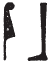

## Esna 345 {-}  
  
   
  
  
- Location: Column 14
- Date: Hadrian 
- [Hieroglyphic Text](https://www.ifao.egnet.net/uploads/publications/enligne/Temples-Esna003.pdf#page=330){target="_blank"}  
- Bibliography: @sauneron-5, pp. 45-46.

 

^14^ *ȝbd 3 ȝḫ.t ʿrqy  *  
*sḫʿ n Ỉs.t nb ʿbȝ  *  
*nt pr(.t) r ḥȝ  tp hrw 10 nb  *  
    
*ỉr(.t) ỉrw mỉ nty   *  
*r nt-ʿ ḥb ṯȝy ʿwn.t  *  
*ḏd bȝ.w-Rʿ  *  
      
*wn.ỉn Ỉs.t nb.t ʿbȝ  *  
*ḥr wȝḥ ỉḫt  *  
*n bȝ-ʿȝ nty km-ȝ.t=f  *  
*ḥnʿ ỉt=s Rʿ Šw Gbb  *  
*ḥnʿ sn=s Wsỉr  *  
*m-ʿb ḏȝỉs.w wr.w nw Mḥ.t-wr.t  *  
*[...]   *  
      
*ỉr ḥr sȝ nn(?)  *  
*pȝ-ẖrd r tȝ s.t-ʿȝ.t  *  
*m ḥb ẖn.t  *  
      
*sṯȝ r pr-ẖnmw  *  
^15^ *m tr n rwhȝ  *  
  
^14^ III Akhet 30 (= [Hathor 30](https://bookdown.org/shemanefer/Esna2/calendar-i-55.html#hathor-30){target="_blank"} ):    
Procession of Isis, Lady of Aba,[^fn-345-1]  
who goes forth every ten days.   
  
Perform rites like what  
is on the Rite of Seizing the Baton,  
that is, the Power of Re.    
  
Then Isis, Lady of Aba,  
lays down funerary offerings  
for the great Ba of Kematef,  
and her fathers Re, Shu, and Geb,  
and her brother Osiris,  
along with[^fn-345-2a] the Great Djaisu of Mehet-weret.  
[...]  
  
Now after this:  
the child towards the Great Place[^fn-345-2]  
in the bark procession.    
  
Return to Per-Khnum  
^15^ at the time of evening.

[^fn-345-1]: {width=8%} - Twice in this inscription the local cult center of Isis is spelled this way, recalling the toponym *ȝbw*, "Elephantine."
[^fn-345-2a]: {width=5%} - The compound preposition *m-ʿb* is spelled in a non-etymological fashion: *m(ȝ)ʿ-b*. 
[^fn-345-2]: Understand: "(A procession of Heka) the child towards..." A similarly abbreviated festival description occurs in *Esna* II, 55, 6 for [Khoiak 5](https://bookdown.org/shemanefer/Esna2/calendar-i-55.html#khoiak-5).