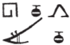

## Esna 347 {-}  
  
  

- Location: Column 14
- Date: Hadrian
- [Hieroglyphic Text](https://www.ifao.egnet.net/uploads/publications/enligne/Temples-Esna003.pdf#page=339){target="_blank"}  
- Bibliography: @sauneron-5, pp. 64-65.

  

^25^ *ȝbd 4 ȝḫ.t hrw 1  *  
*ḥb kȝ-ḥr-kȝ  *  
*wpy-ʿȝ ḫr(.w) r=f  *  
*hrw pn ỉr(.w)  *  
*m pr-ẖnmw-Rʿ nb sḫ.t  *  
   
*mzỉ ʿȝb.t ʿȝ.t  *  
*ỉḫt nb nfr  *  
*m t ḥnq.t kȝ.w ȝpd(.w)  *  
*wp(.t) hn.w  *  
*ṯtf ỉrp  *  
*bʿḥ m ỉrṯ.t   *  
*ỉr(.t) pȝ wdn  *  
*n ẖnmw-Rʿ nb sḫ.t  *  
*mỉ rʿ-nb  *  
  
*ḏd-mdw   *  
^26^ *mỉ nty r-ḥȝ.t  *  
  
^25^ IV Akhet 1 (= [Khoiak 1](https://bookdown.org/shemanefer/Esna2/calendar-i-55.html#khoiak-1){target='_blank'}),  
Khoiak Festival,  
also called the Great *wpy*-festival,  
on this day, performed  
in Per-Khnum-Re Lord of the Field.  
  
Presenting a great offering,  
all good things,  
bread, beer, cattle, fowl,  
opening the (beer) jars,[^fn-347-1]  
pouring out wine,  
inundating with milk;  
performing the great litany  
for Khnum-Re Lord of the Field,  
just like every day.  
  
Words spoken  
^26^ (just like what was before):

[^fn-347-1]: {width=8%} - A remarkable spelling for hnw, "jar; *hỉn*-measure".

*wn Rʿ (ḥr) ds ʿȝpp  *  
*m hrw pn  *  
*ḏȝỉ Rʿ r ỉmnt.t  *  
*ỉ(w)=f m mȝʿ nfr  *  
*ỉb=f ỉqr zp-snw  *  
    
*wn Rʿ ḥr ḏ(d)  *  
*ỉb=ỉ ỉqr zp-snw  *  
*wnf-ỉb=ỉ   *  
*r mȝȝ zȝ=ỉ Šw  *  
  
*bȝ.tw nṯr pn m ỉȝ.t tn  *  
*nty ḥr mḥy.t n Ỉwny.t  *  
*pr-ẖnmw n sḫ.t  *  
   
Re stabs Apophis  
on this day;  
Re sails to the West,[^fn-347-2]  
having a good wind,  
and his heart is thrilled!  
  
Re says:  
'My heart is thrilled!  
My heart delights  
to see my son, Shu.'   
  
This god is present in this mound,  
which is to the north of Iunyt:  
(namely) Per-Knum of the Field.    

[^fn-347-2]: Not just a cardinal direction; the subsequent text from Khoiak 2 specifies "the West" is actually the name of the sacred mound where Khnum-Shu visits Re: [Esna 348], 26-27.
