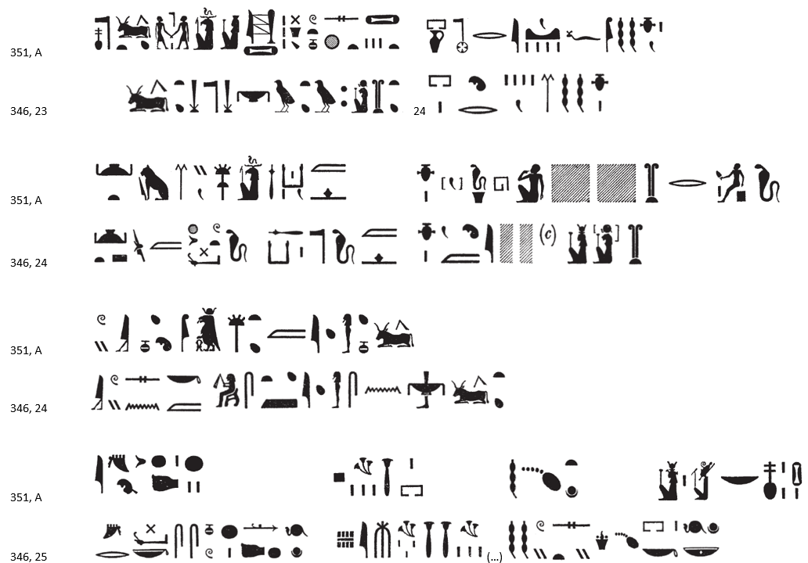
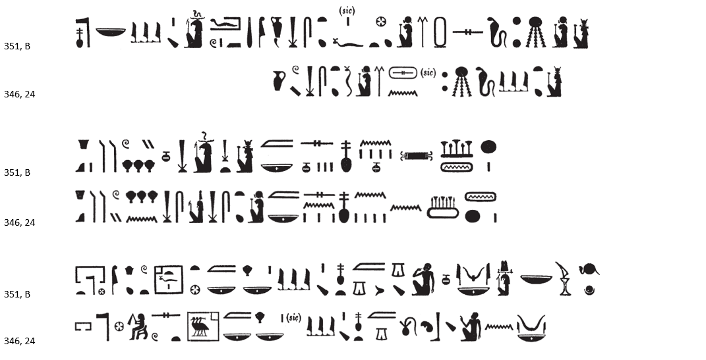

## Esna 351 {-}  
  
  

- Location: Column 14
- Date: Hadrian
- [Hieroglyphic Text](https://www.ifao.egnet.net/uploads/publications/enligne/Temples-Esna003.pdf#page=347){target="_blank"}  
- Bibliography: See also [Tempeltexte 2.0](http://www.tempeltexte.uni-tuebingen.de/portal/#/text-detail/1260){target="_blank"}  
- Parallels: [Esna 346], 23-26

NB: Inscription A contains many difficulties, most of which can be resolved by comparing the close parallels in description of festival proceedings in North Esna on Khoiak 1 in [Esn 346], as already noted by @sauneron-3, p. 302. For that reason, of both hieroglyphic variants are reproduced here.

**A**  
  
{width=99%}

  

^A^ *nṯr nfr*  
*nbỉ.t snsn(.t) nṯr*  
*ḥnw.t ʿȝb.t wr*  
*ḥnw.t wḏb*  
*wdn=s ỉḫt*  
   
*pr-nṯr r ỉfd.w=s*  
*m nḏm-ỉb*  
*ỉȝ.t ḏsr.tw *  
*m ḫrwy.t=f*  
*ʿȝ kȝ=f m ḥtp*  
*ỉb=[f] m ỉhȝy*  
   
*[Nb.t-ww-Mnḥy.t] wr.t*  
*r ḫft-ḥr=k*  
*ỉỉ=s n=k m šps.t*  
*m ỉrw=s n nbỉ.t*  
   
*ỉḏr=k ssw wʿ*  
*ȝm ssw 2*  
*pȝ ỉms wȝḏ(wȝḏ.w)*  
*nḏm sṯỉ (rʿ)-nb*  
*Nb.t-ww (?)*  
*nb.t nfr.w*  
   
^A^ The good god,  
*nbỉ.t*-cow, who unites with the god (Khnum),[^fn-351-1]  
Mistress of the great offering,  
mistress of reversion offerings,  
who consecrates things.  
  
Per-netjer in all its four corners  
is in happiness!  
The (sacred) mound is sanctified  
through his (Khnum's) decree,[^fn-351-2]   
his Ka is great in peace,  
and [his] heart rejoices.  
  
[Nebtu-Menhyt] the great  
is before you!  
She has arrived to you as the August one,  
in her visible form of a *nbỉ.t*-cow.  
   
May you seize the first day,    
and grasp the second day![^fn-351-3]   
The dill is flourishing,  
and the scent is sweet, every (day):  
Nebtu (?),  
Lady of good products.

[^fn-351-1]: Emphasizing the agricultural nature of the Khoiak festival, Nebtu returns to the fields of North Esna in this specific form of a *nbỉ.t*-cow.
[^fn-351-2]: For this type of divine decree, granting royal legitimacy to Khnum Lord of the Field on Khoiak I, see recently @fortier-2018, p. 381, n. c.
[^fn-351-3]: A similar phrase also occurs in [Esna 337], B. Apparently this refers to events on Khoiak 1 and 2: Khnum Lord of the Field receives justification on the first, and visits his father Re on the second: [Esna 348]; cf. @sauneron-5, pp. 65-66.  

**B**  

{width=99%}  

^B^ *nṯr nfr*  
*nb sḫ.t*  
*pr.w m mȝʿ-ḫrw*  
*ẖnm=f sn.t=f tfn.t*  
*m rn=s n Mnḥy.t-Nb.t-ww*  
*ʿqȝ ḥr.w*  
*n sn sn.t*  
*m ḥb=sn nfr *  
*n 4.nw n ȝḫ.t sw 1*  
   
*pr-nṯr šps.tw*  
*ḥw.t-ỉt m ḥb-ḥr-ḥb*  
*sḫ.t nfr.t*  
*m grg n wpy*  
*ẖnmw nb qn rʿ nb*  
  
^B^ The good god,  
Lord of the Field,  
has emerged in justification,   
and unites with his sister, Tefnut,   
in her name of Menhyt-Nebtu:  
the faces align[^fn-351-4]   
of the brother and sister  
in their good festival   
of IV Akhet day 1 (= Khoiak 1).  
  
Per-netjer is made august,  
Temple of the Father is truly festive,  
and the Good Field   
is overwhelmed with *wpy*-festival:[^fn-351-5]  
Khnum, Lord of Victory, every day.

[^fn-351-4]: While this curious expression might refer to the divine couple embracing or encountering one another, it seems more like technical terminology for an astronomical conjunction, of Khnum-Shu (the sun) and Tefnu-Menhyt-Nebtu (Sothis). In descriptions of the Khoiak festival, the divinities are likened to "the two celestial disks (*ỉtn.wy*)": *Esna* II, 31, 39; 80, 3; 81, 6; [Esna 346], 22. For the astrological significance of Khnum and Nebtu's reunion, see also @quack-monumental, p. 116, n. k.
[^fn-351-5]: Similar passage in a description of the same festival in *Esna* II, 81, 6. For the term *grg* (spelled in various ways), see @meeks-ten, p. 138, n. 1 (kindly noted by Daniel Arpagaus).