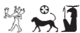
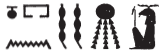
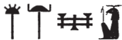
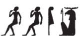
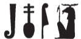
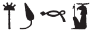

## Esna 355 {-}  

  

- Location: Column 15
- Date: Domitian 
- [Hieroglyphic Text](https://www.ifao.egnet.net/uploads/publications/enligne/Temples-Esna003.pdf#page=373){target="_blank"}  
- Bibliography: @sauneron-5, pp. 165-166; @ruter, pp. 73-75; see also [Tempeltexte 2.0](http://www.tempeltexte.uni-tuebingen.de/portal/#/text-detail/1289){target="_blank"}  

NB: This hymn continues from [Esna 277] and [Esna 366].

**§25** &nbsp;&nbsp; {width=15%}

^1^ *snḏ n ẖnmw*     
*nȝ nty(.w) šm n bw nb*  
  
*ntf zȝw mnḫ *   
*n ḫnd ḥr mw=f*  
*nb zḫn*  
*sšm šsm.w=f nb*  
*r mṯn n ʿnḫ*  
    
^1^ Have fear for Khnum,  
those who travel in any place!  
   
He is the effective guardian,    
of whomever walks on his water.  
The lord of astral influence,  
who guides all his followers  
to the path of life.

   

**§26** &nbsp;&nbsp; {width=17%}

*snḏ n ẖnmw*    
*nty(.w) snḏm m pr=sn*  
*m nỉw.wt spȝ.wt*  
*ḥnʿ ḫȝs.wt nb(.w)*  
   
*ntf ḫy ḫʿỉ m ȝḫ.t*  
^2^ *nb kȝ.w*  
*ʿšȝ ḏfȝ.w*  
*wp stw.t=f ʿnḫ*  
*n ḥr.w nb.w*  
   
Have fear for Khnum,    
those who sit in their houses,  
in (Egyptian) cities and districts,  
and all foreign lands.   
  
He is the child who appears in the Akhet,  
^2^ Lord of food,  
numerous of provisions:  
his rays send out life  
for everybody.

   

**§27** &nbsp;&nbsp; {width=15%}

*snḏ n ẖnmw*       
*nty(.w) nh(.w) m ḥw.t-wr.w*  
   
*ntf nb fȝỉ*  
*wr bỉȝ.wt*  
*rdỉ wȝ.t n šzp.w*  
*r mrw=f*  
^3^ *[...] n zȝ.t=f ẖnm.t*  
  
Have fear for Khnum,  
those who are detained in courts![^fn-355-27]
  
He is the lord of prestige,  
great of miracles,  
who releases prisoners  
as he desires,  
^3^ [...] of his daughter, Khnumit.  

   

[^fn-355-27]: @sauneron-5, p. 173, n. nn, translated "les châteaux-de-princes", with the nuance "un château féodale," assuming it had something to do with important officials who could place people in prison. This interpretation was followed by @ruter, p. 73, n. 346. Both interpretations overlook the juridical institution known as the *ḥw.t-wr.w 6*, "House of the 6 Great Ones." A Late Period biography links official duties in that office, with shackled prisoners: @guermeur-bastet, pp. 180-181, col. 2, 184, n. p. The people addressed in this verse are not high officials, as above in verses 17-19. Rather, the hymn now speaks to people in need of protectors, whether legal aid or physical distress (verse 28). 

**§28** &nbsp;&nbsp; {width=15%}

*snḏ n ẖnmw*  
*nty(.w) ỉw ḥʿw=sn m srf*  
  
*ỉr=sn nỉs n=f*  
*ỉw=f m ṯȝw nḏm*  
*sqb=f ḥʿw=tn*  
*m ḥnbb*    
  
Have fear for Khnum,  
those whose bodies are burning!  
   
When they call out to him,  
he arrives as a pleasant wind,  
and cools your body  
as the north-wind.  

   

**§29** &nbsp;&nbsp; {width=15%}

*snḏ n ẖnmw*        
*nty(.w) ḥḏ.w=sn m ḥsw*  
*ỉm=tn* ^4^ *wrḏ*  
*n šms kȝ=f*  
   
*ḏbȝ=f tn*  
*m pr*  
*m ḥnb.t=f*  
*rwty.w m wš n šfy.t=f*  
  
Have fear for Khnum,   
those whose bones are freezing!  
Do not ^4^ tire  
of serving his Ka.  
  
He will reward you  
with what comes forth  
from his plots of land.  
Outsiders are ignorant of his prestige.  

   

**§30** &nbsp;&nbsp; {width=15%}

*snḏ n ẖnmw*     
*ỉr.wt nb.w *  
*nty.w m ḥnk.(w)t=sn*  
   
*ntf mnhz*  
*zȝw n nmʿ*  
*nb ʿnḫ pw*  
^5^ *dỉ r mr=f*  
  
Have fear for Khnum,[^fn-355_30]  
everybody   
who are in their beds!   
    
He is the guardian,  
protector of the bed.  
That means Lord of life,   
^5^ who gives as he pleases. 

   

[^fn-355_30]: The lion in Khnum's name alludes to the epithet *mnhz*, as well as multiple allusions to the lion-shaped bed.

**§31** &nbsp;&nbsp; {width=11%}

*snḏ n ẖnmw*     
*nȝ nty m*   
*sbḫ.t ȝḫ.t*    
   
*ntf nb stwḫ*  
*stwḫ ḥʿw=tn*  
*srnp ḥḏ.w*  
*m ỉrw=f n*  
*ḫnty sḥ-nṯr*  
  
Have fear for Khnum,[^fn-355_31]    
those who are in   
the Portal of the Akhet.  
  
He is lord of mummification,  
who mummifies your bodies,  
and rejuvenates bones,  
in his form of   
Foremost of the Divine Tent.  

   

[^fn-355_31]: The beard and feather allude to attributes worn by the properly mummfieid and justified dead, just like Osiris.  

**§32** &nbsp;&nbsp; {width=14%}

*snḏ n ẖnmw*     
*ỉmy.w rsy.t*  
   
*ntf bȝ ʿnḫ*  
*m ḥȝ.t-spȝ.wt*  
*ỉỉ.n=f m ḥʿpỉ*  
^6^ *ỉỉ.n=f m ḥʿpỉ*  
*r ỉwḥ ȝḫ.t*  
*r bʿḥ tȝ*  
*m nfrw=f*  
  
Have fear for Khnum,    
those who are in the South![^fn-355-32]  
  
He is the living Ba  
in First of the Nomes (Elephantine).  
That he arrived as the Inundation  
^6^ (that he arrived as the Inundation)  
is to flood the field,  
and to inundate the land  
with his goodness.

   

[^fn-355-32]: Note this spelling of Khnum features two *rsy*-hieroglyphs.

**§33** &nbsp;&nbsp; {width=14%}

*snḏ n ẖnmw*     
*ỉmy.w mḥy.t*  
   
*ntf bȝ n Šw*  
*ḫnty Ỉwny.t*  
*ỉỉ=f m ṯȝw nḏm*  
*r sʿnḫ wnn.t nb*  
*r srwḏ ȝḫ.t*  
*r sḫp(r) pr.t nb*   
^7^ *r sḫpr pr.t nb.w*  
*n qmȝ.n=f*  
  
Have fear for Khnum,  
those who are in the North![^fn-355-33]  
  
He is the Ba of Shu,  
foremost of Iunyt.[^fn-355-33b]  
He arrives as a pleasant wind    
to enliven all that exist,   
to make the field grow,    
and to produce all seeds,  
^7^ (to produce all seeds)   
for those whom he created.[^fn-355-33c]  

   

[^fn-355-33]: Note this spelling of Khnum featuring the *mḥ*-hieroglyph.
[^fn-355-33b]: The hymn distinguishes between Khnum of Elephantine in the preceding verse (§32), and Khnum-Shu from northern Heliopolis, alluded to via the alternative name of Esna, Iunyt. 
[^fn-355-33c]: Other texts allude to this ancient Egyptian conception: Khnum from Elephantine releases the flood waters from the south, while Khnum-Shu as the north-wind blows from the Mediterranean, temporarily blocking the Inundation waters in the Delta for the growing season: @sauneron-agricole. 

**§34** &nbsp;&nbsp; {width=6%}{width=4%}

*snḏ n ẖnmw*   
*ỉmy.w ỉmnt.t*  
   
*ntf sr wr *  
*sḥḏ.n=f dwȝ.t m grḥ*  
*(ḥr) srnp Wsỉr m ḥḏḏ.w=f*  
*(ḥr) sẖrd ỉmnty.w*  
*m mȝwy=f*  
  
Have fear for Khnum,  
those in the West!  
  
He is the great ram,  
who illumined the Duat at night,   
rejuvenating Osiris with his rays,  
making young the Westerners  
with his solar brilliance.

   

**§35**  &nbsp;&nbsp; {width=10%}

*snḏ n ẖnmw*     
*ỉmy.w ỉȝbt.t*  
   
*ntf bȝ wbn*  
^8^ *ntf bȝ wbn*   
*m bȝẖw*  
*ʿnḫ ḥr.w-nb.w m st.wt=f*  
  
Have fear for Khnum,  
those in the East!  
   
He is the Ba who rises  
^8^ (he is the Ba who rises)  
from Bakhu,  
everybody lives from his rays.  

   

**§36** &nbsp;&nbsp; {width=10%}

*snḏ n ẖnmw*     
*nty(.w) ỉwty.w*  
   
*ntf nb kȝ.w ḏfȝ.w*  
*mw ṯȝw ȝm(.w) m ḫfʿ=f*  
*dỉ=f ỉm n mr=f*  
  
Have fear for Khnum,  
those with and those without!  
    
He is the lord of food and provisions,  
water and air are held in his grasp:  
he gives them to whomever he pleases.  

   

