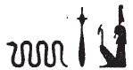

## Esna 358 {-}  

  

- Location: Column 15
- Date: Domitian 
- [Hieroglyphic Text](https://www.ifao.egnet.net/uploads/publications/enligne/Temples-Esna003.pdf#page=358){target="_blank"}
- Bibliography: @sauneron-5, pp. 182-183; see also [Tempeltexte 2.0](http://www.tempeltexte.uni-tuebingen.de/portal/#/text-detail/1269)
  
NB: The conclusion to the hymn [Esna 368], 36, apparently points to this hymn, since both text mention the phrase *ḏsr kȝ=f* in the title.  
  

  
  
^29^ *nỉs rn n nṯr pn*  
*m ḏsr wr*  
*r sḥtp ỉb[...]*  
*[...]*  
*[s]nḏm ḥr srḫ*  
^30^ *ḏsr kȝ=f *  
*m ỉr.n=f*  
*ḏd-mdw*  
   
*nfr.wy ỉr(.w).n=k nb.w*  
*ẖnmw-tȝ-ṯnn*  
*ỉt nṯr.w*  
*sḫm wr*  
*ʿšȝ ỉrw*  
*ʿḫ.n=k p.t*  
*m r-ʿ.wy=k*  
*grg.n=k [tȝ]*  
*[m ...]*  
*[...]=k *   
   
^29^ Calling the name of this god,  
in great sancity,  
to pacify the heart[...]  
[...]  
[he who s]its upon the *serekh*.  
^10^ Sanctifying his Ka 
by means of that which he made.  
Words spoken:  
  
How good is all you have made!  
Khnum-Tatenen,  
father of the gods,   
great power,  
numerous of forms.  
As you raised the sky  
through your handiwork,  
so did you populate [the earth]  
[through ...]  
[...] your [...]  
  

*qdỉ.n=k* ^31^ *rmṯ.w*  
*ỉr.n=k nṯr.w*  
*nḥp.n=k ʿ.wt mnmnm.t*  
*nbỉ.n=k r'.w ḏdf.w*  
*rm.w ȝpd.w*  
*[qmȝ].n=k ỉḫt nb.w*  
^32^ *ḥr nḥp=k rʿ-nb*  
   
*sṯnỉ.n=k nsw.t*  
*m nb ỉmỉ.tw=sn*  
*ḥr wḏ=f n=sn sḥn*  
*swr.n=k šfy.t=f*  
*ḥr ỉr(.t)=sn m wḏ=f*  
   
^33^ *ỉw nṯr.t nty r-ḥnʿ=k*  
*ỉr=s mḥn.t ḥr tp=f*  
*m rn=s n Mnḥy.t*  
   
*mw.t-nṯr Rʿ*  
*mhr.n=s ḥm=f*  
*swr=s pḥty=f*  
*r ḫfty.w=f*  
^34^ *m rn=s pfy n N.t*  
  
As you built ^31^ humans,  
so you made the gods,  
you modelled small and big livestock,  
and you fashioned snakes, serpents,  
fish and fowl:  
thus do you [create] all things  
^32^ upon your potter's wheel, daily.  
  
You distinguished the king,   
as a lord among them all,   
issuing commands to them.   
You magnified his prestige,    
as they act through his decree.    
  
^33^ The goddess who is with you:  
she acts as uraeus (*mḥn.t*) upon his head,  
in this her name of Menhyt (*Mnḥy.t*).  
  
The divine mother of Re:  
she nursed his Majesty,  
so she might magnify his strength   
against his enemies,  
^34^ in this her name of Neith.  

*ỉn ḥnw.t sḫ.t*  
*ỉr=s n=f ȝḫ.w n ȝḫ.t*  
*qȝb=s nfr.w m rk=f*  
*m rn=s pfy n Nb.t-ww*  
   
*ỉn nsw.t-bỉty*  
*ỉr=f n=f*  
^35^ *nfr.t m nsw.t šmʿ*  
*n.t m bỉty mḥw*  
*ỉw ḫȝs.wt nb.w ẖr ṯb.ty=f*  
*m rn=f pfy n Wsỉr*  
   
*ỉn nb.t tȝ.wy*  
*ỉr=s n=f mks*  
^36^ *ỉmỉ.t-pr n tȝ r-ḏr=f*  
*m rn=s pfy n Ỉs.t*  
   
*ỉn ỉwʿʿ=k Gbb*  
*ỉr=f n=f ns.t=f*  
*r ḥqȝ.n=f tȝ.wy*  
*m rn=f pfy n Ḥkȝ*  
  
The Mistress of the Field:  
she makes excellent things of the field for him,  
and she doubles good products in his time,  
in this her name of Nebtu.  
  
The King of Upper and Lower Egypt:  
he makes for him   
^35^ the white crown as King of Upper Egypt,  
the red crown as King of Lower Egypt,  
with all foreign lands under his sandals,  
in this his name of Osiris.    
  
The Lady of the Two Lands:   
she make the inheritance document for him,   
^36^ the property deed of the entire earth,  
in this her name of Isis.[^fn-358-0]    
  
Your heir, Geb:   
he makes the throne for him,  
so he could rule (*ḥqȝ*) the two lands,   
in this his name of Heka (*Ḥkȝ*).  

  

[^fn-358-0]: Isis and Khnum receive the *mks* and *ỉmỉ.t-pr* from the king in the nearby scene [Esna 359].  

  
 
*ỉb n Rʿ*  
*spẖr=f n=f* ^37^ *ḥb.w-sd.w wr.w*  
*m rn=f pfy n Ḏḥwty*  
   
*sšm=k n=f*  
*m nḫy nfr*  
*ḥr zȝ=f m tȝ.wy ḫȝs.wt*  
*twt(.w) kȝ=f*  
*n šw=k ỉm=f*  
*m rn=k pfy n Šw*  
   
*ḥtp ḥr=k nfr*  
*n nsw.t-bỉty*  
*nb tȝ.wy*  
*(ȝwtwgrtwr kysrs)|*  
*zȝ Rʿ*  
*nb ḫʿ.w*  
*(tmdyns nty-ḫwỉ)|*   
*wḏ=k n=f ʿnḫ r ḥn.ty*  
   
The Heart of Re:  
he inscribed for him ^37^ great jubilees,  
in this his name of Thoth.[^fn-358-1]  
  
Your image is with him,  
as a good protector,  
guarding him in all lands.  
You are his Ka,  
and you are not lacking (*šw*) in him,  
in this his name of Shu (*Šw*).[^fn-358-2]  
  
May your good face be kind  
to the King of Upper and Lower Egypt,  
Lord of the Two Lands,  
(Autokrator Caesar)|  
Son of Re,  
Lord of Appearances,  
(Domitian Augustus)|,  
and grant him life for all eternity!    

[^fn-358-1]: {width=12%} - There is a graphic pun involving the heart hieroglyph in this spelling of Thoth, and his standard epithet "Heart of Re" mentioned above.
[^fn-358-2]: {width=11%} - Shu's name is spelled with the *ʿȝ*-sign for the similar *wȝḏ*-papyrus (a commmon substitution at Esna: @sauneron-2, p. xxxii).

^39^ *m-sȝ nn*  
*mȝȝ r pȝ wḫȝ n rsy.t*  
*n nȝ ỉrw.w n ẖnmw*  
*ḥnʿ psḏ.t=f*  
*nty m pȝ wḫȝ rsy.t ỉmnt.t*  
*n ḫft-ḥr*  
  
^39^ After this,    
see the column to the south,   
for 'The Rituals of Khnum  
along with his Ennead'  
which is on the south-western column  
of the processional axis (see [Esna 369]).  

