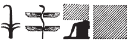
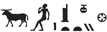

## Esna 362 {-}  

  

- Location: Column 15
- Date: Domitian 
- [Hieroglyphic Text](https://www.ifao.egnet.net/uploads/publications/enligne/Temples-Esna003.pdf#page=367){target="_blank"}  
- Bibliography: See [Tempeltexte 2.0](http://www.tempeltexte.uni-tuebingen.de/portal/#/text-detail/1276){target="_blank"} 

^A^ *nṯr nfr*  
*ỉṯ ḥḏ.t *  
*ẖnm n.t*  
*mỉ Ḥr *  
*šzp.n=f sḫm.ty*  
*nb ỉmỉ.t-pr*  
*(ȝ[w]twkrtr ksrs)|*  
*ʿnḫ mỉ-Rʿ ḏ.t*  
   
^A^ The Good God,  
who seizes the white crown,  
and joins the red crown,  
like Horus,  
when he received the double crown;  
Lord of the inheritance document  
(A[u]tokrator Caesar)|  
living eternally like Re.  

^B^ *mry ẖnmw [...]*  
*nb kȝ.w ḏfȝ.w*  
*dỉ=f ỉm n mr=f*
  
^B^ Beloved of Khnum [...]  
Lord of food and provisions,  
he gives therefrom to whomever he likes.  

^C^ *nṯr nfr*  
*nsw.t (??) [...]*  
*[...]*  
*nb ršw [...]*  
*(tmdy[ns nty-ḫwỉ])|*  
*ʿnḫ mỉ-Rʿ ḏ.t*  
  
^C^ The good god,  
(???) king [...][^fn-362-1]  
[...]  
Lord of joy [...]  
(Domiti[an Augustus])|  
living eternally like Re.  

[^fn-362-1]: {width=18%} - This epithet remains obscure to me. The following damaged sign appears to be *šps*, "august".

^D^  *mry ẖnmw-Rʿ nb tȝ-sn.t*  
*Šw wr ḫnty Ỉwny.t*  
*ʿȝ ỉrw m p.t tȝ*  
*nỉs n=f tȝ.wy nb*  
*m rn=f wr*  
*r sʿnḫ ṯȝw m-ẖnw štȝ.t*  
*nn nṯr ỉr ỉr.n=f*  
  
^D^ Beloved of Khnum-Re Lord of Esna,[^fn-362-2]  
Shu the great within Iunyt,  
all lands call out to him  
in his great name,  
to enliven the fetus within the womb;  
there is no (other) god who does what he did.  

[^fn-362-2]: {width=25%} - Usually the ram wearing a red crown writes nb, but here it is apparently an error or an ideogram for the same word; see also *Esna* IV, 437, 5. The child apparently writes *tȝ < ṯȝw*, "child", a word used later in this text.
