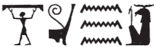
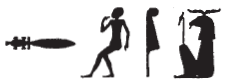
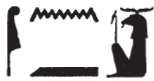
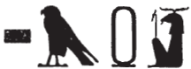
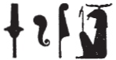
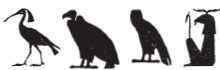
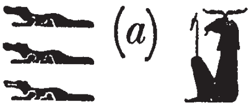
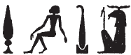
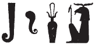
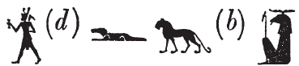

## Esna 366 {-}  

  

- Location: Column 16
- Date: Domitian 
- [Hieroglyphic Text](https://www.ifao.egnet.net/uploads/publications/enligne/Temples-Esna003.pdf#page=373){target="_blank"}  
- Bibliography: @sauneron-5, pp. 164-165; @ruter, pp. 69-72; see also [Tempeltexte 2.0](http://www.tempeltexte.uni-tuebingen.de/portal/#/text-detail/1289){target="_blank"}  

NB: This hymn continues from [Esna 277] .

**§14 *bis* **  &nbsp;&nbsp; {width=18%}

^1^ *snḏ n ẖnmw*     
*nȝ nty ỉȝd(.w) m ỉȝd.t*  
   
*sbḥ n=f*  
*nṯr pfy ẖr p.t*  
*wbȝ=f n=t((n) zȝ.t=f Nw.t*  
*m fd.t ȝb=tn*  
   
^1^ Have fear for Khnum,  
those who lack moisture!  
  
Cry unto him,   
this god bearing the sky:  
he will open his daughter Nut for you,  
with the rain (lit. sweat) you desire.  
   

   

**§15**  &nbsp;&nbsp; {width=17%}

*snḏ n ẖnmw*   
*ṯȝy.w ḥmw.wt*  
*nty(.w) mr ṯz pr.t=sn*  
   
*ntf kȝ* ^2^ *sṯỉ*  
*ḥry ỉd.wt*  
*nn sȝq ẖ.t gȝy*  
*m kȝ.t=f*  
     
Have fear for Khnum,    
men and women  
who desire to bind their seed.  
  
He is the procreating ^2^ bull,  
who mounts the females:  
an empty womb is never assembled  
through his work.  

   

**§16**  &nbsp;&nbsp; {width=16%}

*snḏ n ẖnmw*     
*ỉwr.(w)t *  
*thỉ=sn dmḏy.t=sn*  
   
*ntf Šw ḫnty pr-ms*  
*r sš ỉd.wt*  
*ṯz msḫn.t*  
*m ỉrw=f n Ỉmn*  
    
Have fear for Khnum,    
pregnant women  
who have passed their due date.  
   
He is Shu, foremost of the Mammisi,  
in order to open up wombs  
and bind the birthbrick,  
in his visible form of Amun.

   

**§17** &nbsp;&nbsp; {width=12%}

^3^ *snḏ n ẖnmw*        
*wr.w nḏs.w*  
*zȝ.w ḏd grg *  
*ḥr rw.t-dỉ-mʿȝ.t=f*  
   
*ḥw pfy *  
*nb šsr.w*  
*mrỉ mȝʿ.t*  
*qnd ḥr grg*  
*bwt=f pw rdỉ ḥr gs*  
   
^3^ Have fear for Khnum,    
great and small!  
Avoid telling lies  
in his portal of justice.  
  
This (god) Hu,  
lord of statements,  
who loves Maat,  
and is furious about lies:  
partiality is his abomination.

   

**§18** &nbsp;&nbsp; {width=14%}

*snḏ n ẖnmw*      
*nty m ḫȝ n sḏm.w*  
   
*ntf* ^4^ *ỉty n šmʿ-mḥw*  
*ḥqȝ n ḫȝs.wt nb.w*  
*nb n ḫt-mn r-ȝw=f*  
   
Have fear for Khnum,    
those in the Hall of Judges!  
  
He is ^4^ the sovereign of all Egypt,  
ruler of all foreign lands,  
and Lord of the entire earth.  

   

**§19** &nbsp;&nbsp; {width=12%}

*snḏ n ẖnmw*    
*nty(.w) m srḫ*  
*m b(w)ȝ.w ḥnʿ wsr.w*  
   
*ntf zmȝ mȝʿ.t*  
*rdỉ mȝʿ[.t]*  
*n mȝr.w mỉ wsr.w*  
   
Have fear for Khnum,  
those who are in the palace,  
great and mighty people!  
  
He is the companion of Maat,  
who gives Maa[t]  
to both the weak and the strong.  

   

**§20** &nbsp;&nbsp; {width=17%}

^5^ *snḏ n ẖnmw*   
*ʿw.t nb.w *  
*nty(.w) šm ḥr ỉfd.w=sn*  
   
*ntf nb šȝs-ḥtp*  
*qdỉ tn*  
*m nfw n rȝ=f*  
*sšm=f tn m sḫr.w=f*  
*n wr mdw*  
  
^5^ Have fear for Khnum,  
all livestock  
who walk upon their four legs!  
  
He is the Lord of Shas-hotep,  
who modeled you  
with the breath of his mouth;  
he guides you in his condition  
of the one Great of Staff.    

   

**§21** &nbsp;&nbsp; {width=15%}

*snḏ n ẖnmw*      
*ȝpd.w* ^6^ *msw.w ww*  
   
*ntf nb sḫ.t*  
*sḫp(r) ỉḫt nb.w*  
*wn ʿnḫ=tn*  
*m ȝḫ.w*  
*n ȝḫ.t=f*
  
Have fear for Khnum,     
birds ^6^ and children of the field.  
  
He is Lord of the Field,  
who produces all things.  
That you live  
is from the brilliant products (*ȝḫ.w*)  
of his brilliant field (*ȝḫ.t*).  

   

**§22**  &nbsp;&nbsp; {width=13%}

*snḏ n ẖnmw*    
*rm.w ỉmy.w mw*  
   
*ntf nb Qbḥw*  
*sd s.t=f*  
*wbȝ qr.ty*  
*r bʿḥ=tn m bʿḥ=f*  
  
Have fear for Khnum,  
fish that are within the water!  
  
He is the Lord of the First Cataract,  
who breaks its lock,  
and opens up the grottoes,  
to inundate you with its flood.  

   

**§23**  &nbsp;&nbsp; {width=13%}

^7^ *snḏ n ẖnmw*  
*ḏdf.w nty(.w) m bȝbȝ=sn*  
   
*wn=ṯn ḥr ỉnr nty kȝ=f*  
*nỉ ḫpr wʿ ḫnt=tn*  
*m ḫm ḥm=f*  
  
^7^ Have fear for Khnum,    
reptiles in their holes!  
  
You dwell on the stone of his Ka,  
and not even one of you can exist  
without his Majesty knowing.  

   

**§24**   &nbsp;&nbsp; {width=12%}

*snḏ n ẖnmw*    
*šȝ.w nb(.w) *  
*ḥnʿ sm.w ỉry*  
*ẖnm.t ww *  
*sṯnỉ* ^8^ *ḥr rmn dšr.t *  
*n kȝ=f*  
   
*nfw=f pw *  
*ȝḫȝḫ gmḥ.w=tn*  
   
*mȝȝ r p(ȝ) wḫȝ n mḥty*   
  
Have fear for Khnum,   
all fields  
along with all their plants!  
The cistern and the field,[^fn-366-24]   
the white crown supports the red crown  
for his Ka.[^fn-366-24a]  
  
For it is his breath  
which makes your petals blossom.  
  
(Look to the northern column [Esna 355])
  

   

[^fn-366-24]: This seems to be an allusion to other texts that refer to Khnum-Shu (= the cistern (*ẖnm.t*)) uniting with the field in North Esna: *Esna* II, 127, 4; [Esna 348], 27-28.

[^fn-366-24a]: Perhaps the crowns are mentioned in this particular verse because they were originally made from plants? For a different explanation, see @sauneron-5, p. 172, n. jj.

**§25**   &nbsp;&nbsp; {width=22%}

*snḏ n ẖnmw*     
*nȝ nty(.w) šm n bw nb.w*  
  
*ntf zȝw mnḫ *  
  
Have fear for Khnum,  
those who travel in any place!

He is the effective guardian...

   

NB: This hymn continues in [Esna 355].