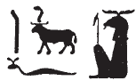
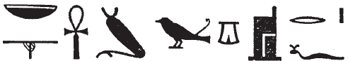
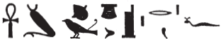

# Column 17 (375-384) {-}

## Esna 375 {-}  
  
  

- Location: Column 17
- Date: Trajan
- [Hieroglyphic Text](https://www.ifao.egnet.net/uploads/publications/enligne/Temples-Esna003.pdf#page=391){target="_blank"}  
- Bibliography: See entries in [Tempeltexte 2.0](http://www.tempeltexte.uni-tuebingen.de/portal/#/text-detail/1307){target="_blank"} 

<!--get Recklinghausen, Soubassementsudien vol. 2, ritueller Raum--> 

  

^A^ *nsw.t-bỉty  *   
*km-bȝw=f  *  
*ʿȝ-pḥty  *  
*wr-dndn  *  
*mḥr ȝ.t=f   *  
*r Sḫm.t m sḫm=s  *  
   
*bȝ-tkk  *  
*fdq šȝw  *  
*nb ṯȝw  *  
*ʿnḫ mwt ẖr s.t-rȝ=f  *  
*ẖnmw nb qn nḫt  *  
  
^A^ The King of Upper and Lower Egypt,  
Kematef,[^fn-375-0]  
magnificent of strength,  
great of rage,[^fn-375-1]  
whose moment of fury is fiercer  
than Sakhmet in her strength.  
  
Attacking Ba-ram,  
who tears up the marshes.[^fn-375-2]  
Lord of air,[^fn-375-3]  
life and death are under his control:  
Khnum, lord of power and might.  

[^fn-375-0]: {width=10%} - A similar spelling occurs in *Esna* VI, 507, where it designates the primeval serpent Neith. It is unclear precisely how the ram functions in these spellings. Possibly it just serves as a determinative, since the phonetic elements of Kneph/Kmeph are adequately supplied by the other signs (i.e. *qmȝ=f < km-ȝ(.t)=f*).
[^fn-375-1]: The following epithets are paralleled in a nearby hymn to Khnum from column 18: [Esna 392], 20-21.
[^fn-375-2]:  {width=18%} - The reading of the second sign is uncertain. *LGG* III, 196c proposed reading: "Der jedes überschwemmte Land zerteilt (*fdq šȝ nb*)", but the parallel from [Esna 392], 21 indicates *nb* belongs to the following epithet. Moreover, it seems unlikely the multiple aggressive and violent epithets would be followed by a reference to Khnum apportioning lands. Rather, the verb *fdq* often refers to mauling enemies, or tearing up plants and roots from their farms: P*WL*, p. 391.
[^fn-375-3]: {width=25%} - The second sign must be restored after the parallel in [Esna 392], 21: {width=8%}{width=23%}

^B^ *nsw.t-bỉty  *  
*Mnḥy.t sḥḏ tȝ.wy  *  
*ʿn.t-ḥr  *  
*mr(.t) ȝb  *  
*nb.t wrh  *  
*šȝʿ.tw n=s nhm  *  
*ḥnw.t ḥz.wt  *  
*sḏm(.t) spr(.w)  *  
*nb.t tḫ  *  
*mr(.t) hrw-nfr  *  
*ỉr.tw ḥb n kȝ=s  *  
*Nb.t-ww-Mnḥy.t nb(.t) wpy  *  
  
^B^ The King of Upper and Lower Egypt,  
Menhyt, who illumines the two lands,  
beautiful of face,  
who loves dancing,  
Lady of *wrh*-dancing,  
for whom rejoicing was invented;  
Mistress of singing,  
who hears supplications;  
Lady of drunkennes,  
who loves *hrw-nfr*,  
for whose Ka one celebrates:  
Nebtu-Menhyt, Lady of *wpy*-festival.[^fn-375-5] 

[^fn-375-5]: Most of these epithets allude to the scenes of Trajan, as Shu, dancing for Menhyt-Nebtu-Tefnut, as recorded on this column ([Esna 380], [Esna 382], [Esna 384], C, D), and elsewhere in the pronaos: *Esna* VI, 520. Cf. @nebtu-dance.