## Esna 377 {-}  
  
  

- Location: Column 17
- Date: Trajan
- [Hieroglyphic Text](https://www.ifao.egnet.net/uploads/publications/enligne/Temples-Esna003.pdf#page=393){target="_blank"}  
- Bibliography: @sauneron-5, pp. 208-211; see also [Tempeltexte 2.0](http://www.tempeltexte.uni-tuebingen.de/portal/#/text-detail/1311){target="_blank"}

^1^ *ky dwȝ ẖnmw*  
*ḏd-mdw*  
   
*nṯr nfr*  
*ỉȝw n=k *  
*pȝ nty m 4 ḥr.w*  
*ḥr nḥb.t wʿ.t*  
*qȝ ḫrw*  
*nn mȝȝ.tw=f*  
   
*wr bȝw*  
*ʿȝ šfy.t*  
*ḥry nḥp*  
*qd r mr=f*  
   
*ẖnm ỉr ẖnm.w*  
*šȝỉ rnn.t*  
*wḏ ḫp(r)*  
*ṯnỉ kȝ=f*   
*r nṯr.w nṯr.yt*   
   
^1^ Another hymn to Khnum.  
Words spoken:  
  
Praise unto you,  
o good god,[^fn-377-1]  
he with four heads  
upon one neck,  
loud of voice,  
but who is never seen.  
  
Great of power,  
great of prestige,   
chief of the potter's wheel,   
who builds as he desires.  
  
Khnum who made the Khnums,   
Shai and Renenet,  
who decrees what happens,    
whose Ka is distinguished   
beyond gods and goddesses.  

[^fn-377-1]: 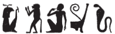{width=16%} - The ordering of these initial signs are a bit unusual, and one needs to remember this was inscribed in a column. @sauneron-5, p. 208, translated this entire phrase as "Jubilation en ton honneur", without any further comment.

^2^ *twt ẖnmw*  
*wʿ wʿ.w*  
*pr ḥḥ.w m kȝ.t=f*  
*rʿ-nb*  
   
^2^ You are Khnum (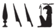{width=15%}),[^fn-377-1b]   
he who is truly singular,   
but millions emerge from his work,     
every day.    

[^fn-377-1b]: In each section of this hymn, Khnum is written in various acrophonic spellings, where the individual signs often resonate with the corresponding epithets.

*twt ẖnmw*  
*bȝ ỉmn*  
*khȝ ȝ.t*  
*ỉw ḫp(r) pȝ fdw ṯȝw ỉm=f*  
*pr wʿ nb ỉm=sn*  
*m bw mr=f*  
   
*wʿ m rsy*  
*ky m mḥy*  
*snw m ỉmnty ỉȝbtt*  
  
You are Khnum ({width=4.8%}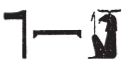{width=14%}),   
the hidden Ba (of air),[^fn-377-2]    
fierce of moment;    
the four[^fn-377-3] winds come about in him,    
and each of them comes forth    
at the place he desires:  
  
one in the south,   
another in the north,  
the other two in the west and east.[^fn-377-4]

[^fn-377-2]: 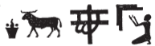{width=18%} - The epithet seems to just be "the hidden Ba", but the determinative to "Ba" evokes the wind.
[^fn-377-3]: {width=4%} - The Atef crown (*ȝtf*) writes "four" (*ỉfdw*) via metathesis and the consonantal principle: @sauneron-61, p. 245.
[^fn-377-4]: @sauneron-5, p. 209, translated "et d'autres quotidiennement, de l'Ouest et de l'Est." But here the sun and moon as a group write "two", just as elsewhere at Esna.

^3^ *twt ẖnmw*  
*srwḏ ḥtp.w-nṯr.w *  
*n nṯr.w rmṯ.w*  
*m mw.w wr.w*  
*pr(.w) m ḏdw=f*  
*ḏd.tw ẖnmw*  
*m ẖnm ṯȝw ḥnʿ mw*  
*r bʿḥ tȝ m nfrw=f*  
*m rn=f pfy *  
*n Km-ȝ.t=f*  
*m ṯpḥ.t-Nwn(?)*  
  
^3^ You are Khnum (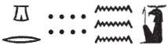{width=22%}),  
who makes divine offerings grow  
for gods and for people,     
from the divine waters  
which come forth from his spine.[^fn-377-5]  
  
Thus one says: 'Khnum' (*ẖnmw*)[^fn-377-6]  
when the air joins (*ẖnm*) the water (*mw*),  
in order to flood the land  
with his perfection,[^fn-377-7]  
in this his name of Kematef,   
in the grotto of Nun(?).[^fn-377-8]  

[^fn-377-5]: Possibly an allusion to the divine semen (also called "water"), presumed in antiquity to derive from a father's spinal column: @leitz-loeffler, p. 9 (with references to previous literature).

[^fn-377-6]: There are two puns here explaining Khnum's name: 1) visually, his name is spelled with the spinal column sign mentioned above; 2) phonetic, combining *ẖnm* and *mw*. 

[^fn-377-7]: Another allusion to the ancient conception that the north-wind blowing against the Nile, causing it to flood during the inundation: @sauneron-agricole.  

[^fn-377-8]: 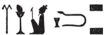{width=17%} - The reading is uncertain, and @sauneron-5, p. 209, simply translated: "le dieu du tour (?), Osiris des deux cavernes." Since there are multiple acrophonic spellings in this hymn, one may suggest: *n < nḥp*, *w < Wsỉr* = *Nw(n)*, "Nun," with *ṯpḥ.t*, "grotto" spelled normally. For the connection of Kematef to the "grotto of Nun" in Djeme, see @gabolde-1995, pp. 248-250.

  

*twt ẖnmw*  
*kȝ psỉ*  
*sỉwr ḥmw.wt*  
*sgȝ mnḥ.w *  
*r dmḏy.t=sn *  
   
You are Khnum (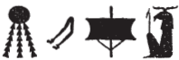{width=17%}),   
the blazing bull   
who makes women pregnant,[^fn-377-9]   
and who diminishes wax (figures)    
at their appointed time.  

[^fn-377-9]: The 'blazing bull' refers to Khnum as the full moon. 

^4^ *twt ẖnmw*  
*rdỉ zȝ n dbḥ sw*  
*ḥm.t n nḥỉ sw*  
*sšm ʿ=sn m wȝ.t=kkw*  
*dỉ ṯȝw n ỉwr.t*  
*r sfḫ ȝṯp=s*  
*sʿnḫ ṯȝw ḫnt ẖ.t=s*  
*m rn=f n Ỉmn*  
*ḫnty ḥw.t-nmỉ.t*  
  
^4^ You are Khnum (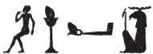{width=17%}),  
who gives a son to whomever entreats him,  
and a wife to whomever beseeches him,  
who guides them through the 'path of darkness',[^fn-377-10]  
who gives air to the pregnant woman,   
to relieve her burden,    
and who keeps the fetus alive[^fn-377-11] in her womb,  
in this his name of 'Amun',  
foremost of the Mammisi (lit. 'temple of the bed').
  

[^fn-377-10]: A euphemism for the birth canal: @leitz-loeffler, pp. 24-25.

[^fn-377-11]: 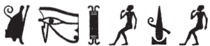{width=25%} - A difficult passage. @sauneron-5, p. 211, n. h, tentatively read: *sʿnḏ swḏȝ ḫy*, "celuie qui préserve et entretient en bon état l'enfant"; while @leitz-loeffler, pp. 24-25, with n. 104, offered: *swḏȝ nḫn* (?), "der das Kind im Mutterleib wohlbehalten sein läßt." Both interpretations make sense, but neither accounts for all the hieroglyphs. The proposal here understands: *s* (< *sḥn*) + *ʿnḫ* (< *ʿnḫ.t*, "living eye": *Wb.* I, 205, 5; and here in the subsequent verse) + *n* + *ḫ* (< *ḫy*, "child"), then *ḏȝw > ṯȝw*, "child." The homophones *ṯȝw*, "wind", and *ṯȝw*, "child", are spelled in many interesting ways in the present hymn.  
Khnum's role keeping the fetus alive (*sʿnḫ*) throughout the full term of pregnancy occurs in many texts, including later on in this hymn: cols. 5 (*ṯȝw*), 6 (*qmȝ.n=k*), 7 (*nḫn*). 

^5^ *twt ẖnmw*  
*ỉr šzp*    
*m wȝ.t-kkw*  
*r sʿnḫ ṯȝw*   
*m-ẖnw swḥ.t*  
*sʿr=k sk ṯȝw *  
*n gȝw-ḥty.t*  
*ʿnḫ.t (ḥr) sṯỉ=sn*  
*m ʿ.t-kkw*  
   
^5^ You are Khnum (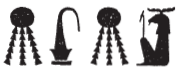{width=16%}),    
who makes light   
in the 'path of darkness',  
to keep alive the chick  
within the egg;   
moreover you lift up air  
to the fetus,[^fn-377-12]  
and the living-eye illumines them,  
in the 'chamber of darkness.'

[^fn-377-12]: 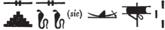{width=20%} - Another challenging passage. The two uraei are apparently inspired by the snakes in the preceding spelling for "path of darkness." Here the boat most likely writes *ṯȝw < ḏȝỉ*, "to sail", just as in the preceding writing of *ṯȝw*, "chick": 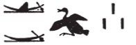{width=12%}. As in other hymns from Esna, the phrase *gȝw-ḥty.t*, "constricted of throat" refers to fetuses in utero, before they have started breathing through the mouth.

*rmṯ.w ʿ.wt pȝy.w*  
*ḏdf.w mỉt.t ḥnʿ ỉmy.w-mw*  
^6^ *wn=k (ḥr) ʿq pr*  
*ḫnt ẖ.t nb.w*  
*r sʿnḫ qmȝ.n=k m ẖ.t*  
   
*ḏr tȝ-mrỉ (r)-ḏr=s*  
*(ḥr) nhm n=k*  
*ntk nb=sn m wn-mȝʿ.t*  
*ỉḫt-mn r-ȝw=f*  
*ẖr sḫr.w nw ḥm=k*  
  
Humans, livestock, birds,  
snakes likewise and those in the water:  
^6^ you enter and exit  
within every single body,  
to keep alive what you created in the womb.  
  
Since all of Egypt  
rejoices for you,  
you are truly their lord.   
The entire planet   
is under your Majesty's control.    

*ḥr bȝ=k ȝbḫ.(w) *  
*m ḥʿw=sn*  
*ỉr ḥrỉ tỉ.t=k r=sn*  
*m km [n ȝ.t?]*  
^7^ *ḫpỉ=sn *  
*m km n ȝ.t*  
   
*nḥp=k r p.t*  
*(ḥr) qdỉ r tȝ*  
*(ḥr) sʿnḫ nḫn.w *  
*m ẖ.t n mw.wt=sn*  
*m r'-ʿ.wy=k*  
    
For your Ba is suffused  
through their bodies;  
if your form would abandon them,  
for the completion [of a moment?],  
^7^ they woud perish  
in the completion of that moment.   
  
Your potter's wheel is in heaven,    
as you fashion toward the earth,    
keeping alive the young   
in the womb of their mothers   
through your activity.

*nn wr r=k*  
*nn ky ḥr-tp=k*  
*r ḫsf ỉr.n=k *  
*m ḏ.t ḏ.t*  
   
*sʿšȝ ḏȝm.w n pr=k*  
*rʿ-nb*  
*grg.n[=k ...]*  
^8^ *m ḥtp*  

There is nobody greater than you,  
nobody else above you,  
who might repel what you have made  
in the body, ever:  
  
Magnifying generations of your domain,  
daily,    
after [you] established [...]  
^8^ in peace.

*pr-hyn pw *  
*n wtṯ nṯr.w*  
*m rn=f n ẖnmw-Ptḥ*  
*qmȝ swḥ.t*   
*pr m [Nwn]*  
   
*hȝy.t n bȝ=f*  
*s.t-sḫn n ḥm=f*  
*(ḥr) sḥḏ bs=f*  
*(m) spȝ.wt nỉw.wt mỉ Rʿ-nb*  
  
It is his *pr-hyn*,   
for he who begat the gods,   
in his name of Khnum-Ptah,    
who created the egg   
which emerged from [Nun].[^fn-377-13]  
  
It is a kiosk for his Ba,    
a place of landing for his Majesty,    
while illuminating his statue(s),  
in nomes and cities, like every day.

[^fn-377-13]: For this passage, see @klotz-baboons, pp. 44-46, No. 17. As noted there, the same *pr-hyn* is mentioned in *Esna* IV, 431, 3.

*twt ẖnm*  
*kȝ.t=f mn(.tỉ)*  
*grg(.w) spȝ.wt nb.w*  
*m rn[=f]*  
   
*ḥtp[ hr=k nfr]*  
*n [(pr-ʿȝ ʿnḫ ḏ.t)|]*  
  
You are Khnum,  
whose works endure,  
and all nomes are founded  
in [his] name.  
   
May [your beautiful face] be kind   
to [the (Pharaoh Living eternally)|!]  

