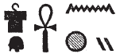
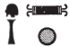

## Esna 378 {-}  
  
  

- Location: Column 17
- Date: Trajan
- [Hieroglyphic Text](https://www.ifao.egnet.net/uploads/publications/enligne/Temples-Esna003.pdf#page=395){target="_blank"}  
- Bibliography: @sauneron-5, pp. 212-217; see also [Tempeltexte 2.0](http://www.tempeltexte.uni-tuebingen.de/portal/#/text-detail/1312){target="_blank"}

^9^ *ky dwȝ ẖnmw*  
*ḏd-mdw*  
   
*twt nb tȝ-sn.t*  
*ḥry nḥp*  
*nḥp nṯr.w*  
*nbỉ ḥnmm.t*  
*ʿ.wt nb mỉ-qd*  
   
*ʿn-ḥr ẖr šw.ty wr*  
*nfr-ỉrw ḫnty nṯr.w*  
*nfr-ḥr m šfy.t-ḥȝ.t*  
*nn nṯr snỉ sw r qd=f*  
   
*sr mrỉty*  
*ỉr nty ỉwty*  
^10^ *ms nṯr.w*  
*wtṯ nṯr.wt*  
  
^9^ Another hymn to Khnum.  
Words spoken:  
  
You are the Lord of Esna,  
Chief of the potter's wheel,    
who models gods,  
who fashions the sunfolk,   
and literally all animals.   
  
Pleasant of face with double plumes,    
good of form, foremost of the gods,    
kind of face with ram heads,     
there is not god who resembles you.  
  
Truly beloved ram,  
who made what is and is not,[^fn-378-0]    
^10^ who birthed the gods,    
and begot the goddesses.  

[^fn-378-0]: Paralleled in *Esna* VII, 580, 9-10.

 

*twt nṯr šps*  
*ḫpr ẖr ḥȝ.t*  
*nṯr.t ḥnʿ=f m ḥȝ.t=k*  
   
*ỉmn nn rḫ.tw qd=f*  
*štȝ nn rḫ.tw sšm=f*  
   
*pr m Nwn*  
*ḫʿỉ m nbỉ.t*  
*pr Ḥʿpỉ m qr.ty*  
*ẖr ṯb.ty=f(y)*  
*pr ṯȝw nḏm ỉm=f n mḥy.t*  
*r fnḏ n nṯr.w rmṯ.w*  
  
You are the august god,  
who came about in the beginning,    
the goddess-with-him upon your brow.  
  
Hidden, his form cannot be known;  
remote, his image cannot be known.  
  
He who emerged from Nun,  
who appears with the flame (of a uraeus);  
Hapi emerges from the grottoes     
beneath his sandals;   
the sweet north-wind emerges from him    
to the nose of gods and humans.  

^11^ *twt nsw.t nṯr.w*  
*ḥqȝ m sḫ.t=f*  
*nfr-ḥr wȝḏ-mr.wt *  
*ṯḥn n=f tȝ.wy *  
*m nfrw=f*  
   
*nb nṯr.w rmṯ.w*  
*nʿš dnỉ.t*  
*ʿȝ nrw*  
*nb šfy.t*  
*rw wr*  
*nb nsr.t*  
*ḫsf ʿȝpp*  
*wnm snf*  
*ḥtp ḥr šʿy.t*  
*ḥbs-ḥr=f*  
*r ms.w bdš.w*  
*ỉr ḫfty.w=f*   
*m ʿḏ.t ʿȝ(.t)*  
  
^11^ You are the King of the gods,  
Ruler in his field,  
good of face, fresh of love,  
for whom the two lands scintillate[^fn-378-1]  
through his goodness.  
  
Lord of gods and humans,  
fierce of shouts,  
great of fear,  
lord of prestige;  
great lion,  
lord of the flame,  
who repels Apophis,  
who eats blood,  
who delights in massacres,  
who covers his face  
against the rebel children,   
who turns his enemies   
into a giant slaughter.  

[^fn-378-1]: {width=18%} - following the reading in *LGG* VII, 484c. Elsewhere the crocodile can write *ḥn* or even *ṯḥn*, but the present phonetic complements are unexpected.

^12^ *twt ḫỉ *  
*ḫʿʿ m ḥḏ-tȝ*  
*ỉwn nfr ḥry nṯr.w*  
*ỉȝw rnp*  
*nn mnỉ=f*  
*mn(.w) wȝḥ(.w) ḏ.t*  
   
*wbn m ỉȝbt.t n p.t*  
*m sḫt-šzp=f*  
   
*sḥḏ.n=f tȝ.wy*   
*m ȝḫ.ty=f*  
*wnm.t=f m šww*  
*ỉȝbt.t=f m ỉʿḥ*  
*qmȝ.n[=f] tȝ.wy dwȝ.t Nwn*  
  
^12^ You are the child   
who appears radiantly[^fn-378-2] in the morning,  
beautiful pillar, chief of the gods,   
old man who rejuvenates,    
never perishing,   
but remaining and enduring forever.   
  
He who rises in the east of the sky,    
as He who Weaves his Light.   
  
He illumined the two lands   
with his two, radiant eyes:    
his right eye is the sun,   
his left eye is the moon,   
[he] created the lands, Duat, and Nun.

[^fn-378-2]: {width=25%} - @sauneron-5, p. 213, translated the participle as "qui répand sa lumière", with no comment, while *LGG* II, 321a, transcribed it as *wbn*. Although that verb would fit the context, the child sign does not elsewhere stand for the first two consonants (*w* or *b*). Rather, the existing signs are appropriate for *ḫʿỉ*, "to appear; shine", and that word is spelled elsewhere with two children: *Wb*. III, 239, 4. The present reading assumes a geminating form (*ḫ+ʿ+ʿ*), but the first child could also write *ms*, thus resulting in the related term *msḫʿ*, "radiant birth; appearance." 

^13^ *twt ṯnn*  
*ṯnỉ r nṯr.w*  
*r'-ʿ.wy=f grg tȝ pn *  
*nḥp m-bȝḥ=f*  
*ʿ.wy=f ḥr qd*  
*ḏbʿ.w=f ḥr wp(.t) ʿ.wt*  
   
*ṯȝw n ʿnḫ*  
*ʿq m ḥʿw*  
*mȝȝ m ẖ.t n ỉwr.t*  
*ḥmww n ʿnḫ*  
*swnw n snb*  
*nfw dỉ ẖnmw ṯȝw* ^14^ *r ẖ.t*  
*ms zȝ m-snỉ r ỉt=f*  
*ỉwd ṯȝy r ḥm.t*   
*(m) qd=sn*  
   
*nn r-ȝw*  
*ỉr.n=f st*  
*nn nṯr ỉr ỉr.n=f*  
*nṯr pn šps*  
*ẖnmw-Rʿ nb tȝ-sn.t*  
  
^13^ You are Tatenen,  
most distinguished of the gods,  
his activity is populating this land:  
the potter's wheel is before him,  
his hands do the modeling,  
and his fingers separate limbs.  
  
The breath of life,[^fn-378-3]  
who enters into the body,  
and sees inside the pregnant womb;  
artisan of life,  
doctor of health,  
breath who attaches air ^14^ to the womb,  
who births a son resembling his father,  
and distinguished men from women   
(in) their forms.  
  
All of this entirely:  
he made it.  
There is no god who could do what he did,  
this august god,   
Khnum-Re Lord of Esna.  

[^fn-378-3]: {width=25%} - While this group might also be read *bȝ ḏȝỉ p.t, ṯȝw n ʿnḫ*, "Ba who sails across heaven, breath of life", similar spellings of *ṯȝw* throughout this same hymn (cols. 15, 17, 21) suggest this is the case here as well. The ram would write *ṯȝ < ṯȝy*, "male (ram)", and *w < wỉȝ*, "bark." So also @sauneron-5, p. 214; @leitz-loeffler, p. 59, n. 204; @klotz-baboons, p. 51.

*twt ʿḫỉ p.t*  
*Ḥḥ twȝ Nw.t*  
*Šw smsw n Ỉtm*  
^15^ *wʿ pw*  
*ms nty nb.w*  
*qmȝ šww m nṯr.ty=f*  
*r sḥḏ tȝ.wy bȝẖw*  
   
*bẖ šw.ty*   
*ṯnn nb wrr.t*  
*Nḥb-kȝ.w *  
*nḥb 4 kȝ.w nṯr.w*  
   
*sȝw n tȝ*  
*ndb.t ḥr gs.wy=f*  
*pr=sn ṯȝw n.t *  
*m-qȝb=f nb*  
   
*ḥqȝ.n=f ỉfdw*  
*ỉr(.w) ỉr.n=f ʿnḫ*  
^16^ *n qmȝ.n=f nb.w*  
*sḫp(r).n=f ỉḫt nb.w*  
*r ẖr.t=sn*  
  
You are he who lifts up the sky,  
Heh who supports Nut,   
Shu, eldest of Atum,  
^15^ that is the sole one,   
who birthed all that is,   
who creates light with his divine eyes,   
to illumine the two lands.    
   
Radiant of double plumes,  
lord of the double-crown,[^fn-378-4]  
Nehebkau (*Nḥb-kȝ.w*),  
who apportions (*nḥb*) the four divine Kas (*kȝ.w*).  
  
Beam of the earth (serpent),  
the earth rests upon his sides,  
they come forth, wind and water,   
from all his coils.[^fn-378-5]  
  
He ruled the four corners,   
the maker, who makes life   
^16^ for all he created;  
he produced all foods  
for their sustenance.

[^fn-378-4]: {width=12%}{width=5.5%} - Despite the determinative to *bẖ*, derived from the related term "Bakhu", the parallel in *Esna* VII, 580, 10, suggests it is a verb, as translated by @sauneron-5, p. 214. The regalia mentioned here are appropriate for Khnum as Tatenen, who is elsewhere mentioned alongside Nehebkau: e.g. @pichel, p. 32.  

[^fn-378-5]: Parallel epithets occur in *Esna* II, 17, 11; *Esna* VII, 580, 10-12.  

*twt nḫy nfr*  
*nn ḥr-ḫw=f*  
*qn pw *  
*ʿȝ nḫt*  
*wr nmt.t*  
*m ḥḥ n ḥp.t*  
*nḫt gb.ty=f*  
*r ḫfty.w=f*  
   
*ḥwnw nṯry*  
*spd ds*  
*ʿ.wy=f ẖr mʿbȝ*  
*ḥr zmȝ rqy.w=f *  
   
^17^ *nb mȝʿ.t*  
*ʿnḫ m mȝʿ.t*  
*bwt ḥm=f sȝṯ*  
*ḥr=s r pr=f*   
*rʿ-nb*  
  
You are the good champion,  
without peer;   
that means the mighty,    
great of strength,    
great of stride    
through millions of courses;  
he whose shoulders are strong   
against his enemies.  
  
The divine youth,  
sharp of knige,  
with a harpoon in his hands,  
slaying his rebels.  
    
^17^ Lord of Maat,   
who lives from Maat;   
his Majesty's abomination is filth,   
and it stays away from his temple,   
every day.

*twt nb ʿbw*  
*mrỉ mȝʿ.t*  
*ẖnmw Ḥʿpỉ wr *  
*sʿnḫ tȝ.wy*  
*ỉr ẖr.t*  
*n qmȝ.n=f nb.w*  
   
*ʿȝ tp.w-rd.w*  
*m hȝw pȝwty.w*  
*sʿnḫ ỉmy-ẖ.t*  
*m ṯȝw tp-r'=f*  
   
^18^ *ẖnmw pw ỉr ẖnmw.w 7*  
*qdỉ qdỉ.w*  
*qmȝ nty*  
*ms ỉnm.w nb.w nṯry*    
   
*Ḥʿpỉ ḥr ḫtm=f*  
*mḥy(.t) ḥr ḏbʿ=f*  
   
*nn nṯr *  
*twt sw r qd=f*  
*nb nḥp*  
*wʿ wʿ.w*  
   
You are the Lord of purity,  
who loves Maat;  
Khnum[^fn-378-6], Hapi the great,   
who enlivens the two lands,  
and makes sustenance   
for all he created.  
   
Great of regulations  
in the time of the Primeval ones;    
he keeps alive[^fn-378-7] those in the womb,  
with the breath from his mouth.  
  
He is Khnum, who made the 7 Khnums,  
builder of builders,  
who created what is,  
and birthed all divine colors.  
  
Hapi is on his signet,  
and the north-wind is on his seal.  
    
There is no (other) god    
who might resemble his form:  
Lord of the Potter's wheel,   
truly unique.  
   

[^fn-378-6]: {width=14%} - This ludic spelling of Khnum (*ẖ* < *ẖnm*-vessel, *n* < nms.t-vase, *mw*) clearly relates to his role of Hapi, as noted by @sauneron-5, p. 218, n. l.  

[^fn-378-7]: {width=9%} - @sauneron-5, p. 218, n. m, understood the phrase the same way, but could not explain the presence of the *tp*-sign. But that can write *ʿnḫ* especially in composite signs, such as below in col. 22: {width=7%}, and [Esna 379], 23. See also @kurth-1, p. 179, nn. 5 and 12. 

^19^ *twt mnỉw nfr*  
*qn*  
*nn qn.tw (r)=f*  
*nḫt*  
*nn nḫt.tw (r)=f*  
*wḫr.t=f (ḥr) nbnb ḏm.t=f*  
*n Pr-nṯr*  
   
*nṯr.w nṯr.yt*  
*m ỉȝw n ḥr=f*  
*ḥtpty.w ḥr dwȝ kȝ=f*  
*nṯr nʿỉ*  
*ỉỉ n ʿš n=f*  
   
*nhp.n=f mȝr *  
^20^ *m-ʿ ȝd sw*  
*pḥr n=f tpy.w-tȝ*  
*r pr=f ʿȝ šps*  
*m Pr-nṯr*  
   
^19^ You are the good shepherd,  
mighty one,   
nobody is mightier,    
strong one,    
nobody is stronger;  
whose staff protects his abode[^fn-378-8]      
in Per-netjer.  
  
God and goddesses  
make hymns to his face;    
the blessed dead worship his Ka;  
compassionate god,  
who comes to whomever calls to him.  
  
He protected the unfortunate  
^20^ from whomever oppresses them;  
those on earth run to him,  
to his great, august temple  
in Per-netjer.  

[^fn-378-8]: {width=28%} - This is a difficult passage, which @sauneron-5, p. 218, n. p, explained differently. Here the two ladies (*nb.ty*) would be a sportive writing of *nbnb*, "to protect", rather than just *nb* (Sauneron).  

*twt ỉwn ḥry Ỉwn.w *  
*mwnf nfr*  
*wp wȝ.t nfr.t*  
   
*ỉry-ḥmw m wȝḏ-wr*  
*r swḏȝ ḫdỉ ḫntỉ*  
*nỉs.tw n=f*  
*ỉn z nb*  
*r tm* ^21^ *ȝq dp=sn*  
*ỉw=f n=sn m ṯȝw ḥr*  
*spr=sn r dmỉ.t*  
   
*nn tȝ šw m ks*  
*r rd.wy ḥm=f*  
*ḫȝʿ=sn m ỉḫt nb.w nfr*  
   
You are the pillar, chief of pillars,   
good protector,  
who opens a good path.  
     
Oarsman in the Great Green,  
to preserve those going north and south;  
he is invoked  
by every person,  
lest ^21^ their boats sink;  
he comes to them as a happy wind,  
and they arrive to the port.    
   
There is no land which does not bend   
to the feet of his Majesty,   
as they set down all good products.    

  

*nṯr ḏsr*  
*ỉmn-rn=f*  
*ḫp(r) ẖr ḥȝ.t*  
*ỉr nṯr.w nb*  
   
*ẖnmw-Rʿ nb tȝ-sn.t*  
*ḥry nḥp*   
*n Psḏ.t*  
^22^ *ḏfn mnḫ *  
*n nṯr.w rmṯ.w*  
   
Sacred god,  
he whose name is hidden,  
who came about in the beginning,  
and made all the gods.[^fn-378-9]  
  
Khnum-Re[^fn-378-10] Lord of Esna,  
Chief of the potter's wheel   
of the Ennead;  
^22^ beneficent ancestor  
of gods and humans.  

[^fn-378-9]: {width=12%} - @sauneron-5, p. 216 already guessed the two kings here write *nb* through acrophony (*n < nsw*, *b < bỉty*), but he assumed it belonged to the following epithet.  
  
[^fn-378-10]: {width=23%} - @sauneron-5, p. 216, read the first groups literally ("le maître de chaque jour, (?), de la fête mensuelle, de la fête du quinzième jour"), and assumed Khnum was simply written as an ideogram. However most spellings of Khnum in this hymn employ sportive acrophony, and that is likely the case here as well. The first consonant is clearly *ẖ < ẖr.t-hrw*, but the derviation of *nm* from the other groups remains obscure to me.  

NB: From this point on, @sauneron-5, pp. 218-219, n. t, only translated isolated groups of the extremely difficult text. As throughout this hymn and the following ([Esna 379]), many of the non-divine words are spelled using acrophonic values, sometimes determined with traditional spellings. It is easy enough to recognize the phrase *rs=k nfr* here, which suggests the following verses actually belong to [Esna 379], rather than the preceding hymn where each stanza begins with *twt*, "You are..."  
  
  
  
{width=60%}    
  
{width=30%}{width=28%}   
   
{width=50%}  

*rs=k nfr*  
*wbn m nbw*  
*ỉtn nfr(?) rȝ-nb*  
*ẖnmw-Rʿ nb tȝ-sn.t*  
   
*bȝ m Bȝẖw*  
*ʿnḫ(.w) m mȝ.wy(=f)*  
    
May you awake[^fn-378-11] beautifully,  
He who shines as gold,[^fn-378-12]   
beautiful(?) sun disk,[^fn-378-13] every day:  
Khnum-Re Lord of Esna.  
  
Ba in Bakhu,   
from whose radiance one lives.[^fn-378-14]  

[^fn-378-11]: *r < rw, s < zmȝ, k < kȝ*, an ideogram of the royal Ka.

[^fn-378-12]: The ram wearing a uraeus appears elsewhere in spellings of *wbn*, with the uniliteral values *w* < *wȝḏ*, "cobra", *b < bȝ*, "ram": @klotz-baboons, p. 34, n. b. Here the two eyes would appear to write *n < nw*, "to see" (see the spelling of *wbn* above in col. 12). Then the final ram with a flail would be a variant of the expected *nṯr*-sign as a determinative. The following two signs would present too many determinatives. Instead, one of them (likely the sundisk) writes *m < mȝwy*, "radiance", while the two uraei write *w* (< *wȝḏ.ty*) in *nbw*. Khnum on top of the basket would be the determinative for the entire epithet.     

[^fn-378-13]: A similar writing of *ỉtn* with Tatenen and Neith occurs in [Esna 387], 1. Here the winged sundisk would write *ỉ* < *ʿ* < *ʿpy*. The next term is uncertain: *ỉtn nfr* is a common epithet (*LGG* I, 617b), note especially *Esna* VI, 541, south (also spelled: *ʿtn*). However, the trap almost always writes *sḫt*, but perhaps here a variant name for a net, *nn.t/nm.t*, is intended. Thus resulting in *n < nn.t, f < fȝỉ* (see the next stanza), *r < ršw*.  

[^fn-378-14]: *LGG* II, 159c, read this alternatively as *ʿnḫ.tw m stw.t=f*, presumably understanding the first lion as *tw* < "Tutu." However, the term *mȝwy*, "radiance", is elsewhere written with the lion (e.g. *Esna* VI, 541, north), and the same epithet with *mȝwy* occurs in *Esna* II, 48, A; [Esna 268], B; see also *LGG* II, 145b-c.

{width=4.5%}{width=28%}   
    
{width=60%}   
   
{width=5%}{width=30%}   
   
{width=33%}  

  

*rs=k* ^23^ *nfr*  
*Ḫprỉ m dwȝw*  
*ỉtn m hrw*  
*Ỉtm (m) mšrw*  
   
*ẖnmw-Rʿ nb tȝ-sn.t*  
*bȝ ỉȝbty*  
*šfy.t-ḥȝ.t*  
   
May you awake ^23^ beautifully,   
Khepri in the morning,   
solar disk in the day,   
Atum in the evening.[^fn-378-15]  
  
Khnum-Re Lord of Esna,  
Eastern Ba,   
prestigious of face. 

[^fn-378-15]: These epithets reflect the Egyptian solar cycle, and the riddle of the Sphinx; cf. [Esna 219], 5 (different phrasing). The exact reading of each sign is uncertain. The first verse is simple: Khepri = *ḫ < ẖr, p, r < Rʿ*, Morning = *d < dp, wȝ < wỉȝ*. In the second verse, the signs appear to be in the wrong order, and I emend to: solar disk = *ỉ < Ỉmn, t < ỉty, n < nṯr* (crocodile); the mummy writes *m*, and the sundisk with uraeus writes *hrw*. Finally, in the last verse Atum (*Ỉtm*) = *ỉ < ỉʿḥ*, "moon", *t < tḫn*, "obelisk", *m < mȝʿ.t*, "Maat." Finally *mšr(w)*, "evening", could be *m < msỉ*, "to give birth", *š* (standard value of crocodile), *r < rʿ-nb*. Other readings are certainly possible.