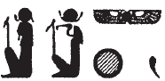

## Esna 379 {-}  
  
  

- Location: Column 17
- Date: Trajan
- [Hieroglyphic Text](https://www.ifao.egnet.net/uploads/publications/enligne/Temples-Esna003.pdf#page=399){target="_blank"}  
- Bibliography: None, but see LGG entries listed in [Tempeltexte 2.0](http://www.tempeltexte.uni-tuebingen.de/portal/#/text-detail/1313){target="_blank"}, which already identified several of these enigmatic epithets.

NB: This hymn migt be a continuation of the "Awakening Hymn" that began at the 'end' of the previous text [Esna 378], 22-23. Many of the words, not just divine epithets, are spelled using acrophonic values (some tabluated in @sauneron-8, pp. 192-194), unusual or superfluous determinatives, and perturbed sign order (e.g. *ỉtn*, *sqd*). @sauneron-5, p. 87, refrained from translating this section, noting: "nous ne somme pas parvenu à percer le mystère."
   
   
{width=55%}  

{width=8%}{width=35%}  

  

^23^ *rs=k nfr   *  
*ʿnḫ r-ȝw=f  *  
*sšp tȝ.wy m nfrw=f   *  
    
*ẖnmw-Rʿ nb tȝ-sn.t  *  
*ḏȝỉ p.t nỉ wrḏ.n=f  *  
  
^23^ May you[^fn-379-1] awake well,  
he who lives[^fn-379-2] in his entirety,  
who illumines[^fn-379-3] the two lands with his perfection.  
  
Khnum-Re Lord of Esna,  
who sails across[^fn-379-4] heaven without tiring.[^fn-379-5]  

  

[^fn-379-1]: *k < kȝr*, "shrine"; cf. @sauneron-8, pp. 165-166.
[^fn-379-2]: Following *LGG* II, 135a. The same sign, a human head on the potter's wheel, writes *ʿnḫ* nearby in [Esna 378], 22. Alternatively, if this is the beginning of the morning hymn, this might alternatively read as a title to what follows: "The 'May you awake Well each Morning (*tp dwȝw*)' hymn, in its entirety (*r-ȝw=f*)."
[^fn-379-3]: Apparently the first sign writes *s < stw.t*, "rays." *LGG* II, 371b, read this group as *wpš* (with *w < wbn*?), but that requires inverting the last two uniliteral signs. Epithets such as *sšp tȝ.wy* are also quite common: *LGG* VI, 614-615.
[^fn-379-4]: *ḏȝỉ < ḏ < ṯ < ṯnṯȝ.t*, "festival dais."
[^fn-379-5]: *w < wpš*, "to shine" + *rd*, "leg." 

{width=52%}{width=14%}   
  
{width=45%} 
  
{width=26%}{width=18%} 

  

*rs=k nfr  *  
*psḏ m hrw  *  
*sqd* ^24^ *m ḥr(.t)   *  
*m ỉtn wr  *  
    
*ẖnmw-Rʿ nb tȝ-sn.t  *  
*bȝ wr nn wn ỉḏr=f   *  
  
May you awake well,  
he who shines in the day,  
and sails[^fn-379-6] ^24^ through[^fn-379-7] heaven[^fn-379-8]  
as[^fn-379-8b] the great[^fn-379-9] solar disk.  
    
Khnum-Re[^fn-379-10] Lord[^fn-379-11] of Esna,[^fn-379-12]  
great Ba, he who is infinite.[^fn-379-13]  

[^fn-379-6]: The two men appear to be reversed. Reading *s < sṯỉ*, *q < qȝ*, *t < d*.
[^fn-379-7]: *m < mȝwy*, "rays."
[^fn-379-8]: *ḥ < Ḥḥ*, "Heh" + *r < Rʿ*, "Re" (atypical sundisk on Heh's head). This entire group evokes the phrase *wỉȝ n ḥḥ*, "bark of millions," used for solar travel.
[^fn-379-8b]: The figure is uncertain, but presumably this might be *m < Mnḥy.t*, "Menhyt".
[^fn-379-9]: The double crown (*wrr.t*, cf. *Esna* II 187, A) is a superfluous determinative to *wr*, "great."
[^fn-379-10]: *ḫ < ỉȝḫ*, "luminous", *n < nṯr* "god" (the ram), *m < p < p.t*, "sky."
[^fn-379-11]: *n* < "Neith", *b < bỉk*, "falcon" or *b < p < pȝỉ*, "bird."
[^fn-379-12]: *s < sfrr*, "gryphon" (cf. @sauneron-bifao62, pp. 15-18), *n < nḥb.t*, "lotus bud."
[^fn-379-13]: *ỉḏr*, plural of *ḏrw*, "limit", is spelled: *ỉ < Ỉmn*, "Amun", *ḏ < ṯȝw*, "wind" + *r*.
  
{width=40%}   
  
{width=35%}{width=12%}  
 

*rs=k nfr  *  
*psḏ m ȝḫ.t  *  
*nb ḫʿ(.w) *  
*ṯnỉ ẖprw  *  
*rḏỉ.n=f (???)=f  *  
     
*ẖnmw  *  
  
*mȝȝ r pȝ wḫȝ n rsy  *  
*m sȝ=f mḥty  *  
  
May you awake[^fn-379-14] well,  
he who shines[^fn-379-15] in the Akhet[^fn-379-16].  
Lord of appearances,[^fn-379-17]   
distinguished of forms,  
he gave[^fn-379-18] his (???)[^fn-379-19]  
  
Khnum ...  
  
(Look to the column to the south,  
on its northern face; cf. [Esna 318] ).  

[^fn-379-14]: *r < Rʿ*, *s* < "man"
[^fn-379-15]: *p < p.t, s < zȝ, ḏ < ḏw*, "mountain."
[^fn-379-16]: For this spelling of Akhet, see also [Esna 395], 16; *Esna* II, 185, A; *Esna* VII, 586.
[^fn-379-17]: Horus = *nb*, the child writes *ḫ*.
[^fn-379-18]: {width=12%} - Understanding: *r < Rʿ*, "Re", *ḏỉ < Ḏḥwty* (cf. *Esna* IV, 467, E), *ʿ < ʿpy*, "winged sun disk" (cf. [Esna 235], 6; [Esna 251], 25; [Esna 392], 20). This would produce a full spelling of *rḏỉ*, with the usual arm interpreted as uniliteral *'ayin*. Compare Esna spellings such as {width=8%} ([Esna 321, 24]) vs. {width=6%} ([Esna 255, B]), as well as [Esna 343], 11; [Esna 348], 27. The circular sign would be a mistake for *nỉw.t*, which functions the same way earlier in this text.
[^fn-379-19]: The reading of these final signs is unclear.