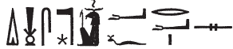
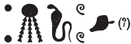

## Esna 382 {-}  
  
  

- Location: Column 17
- Date: Trajan
- [Hieroglyphic Text](https://www.ifao.egnet.net/uploads/publications/enligne/Temples-Esna003.pdf#page=404){target="_blank"}
- Bibliography: @sauneron-5, p. 62 (excerpt); @nebtu-dance, pp. 154-157; see also [Tempeltexte 2.0](http://www.tempeltexte.uni-tuebingen.de/portal/#/text-detail/1318){target="_blank"}

#### Formula {-}

  

^1^ *[...] wrh=t nfr[.t ...]*  
*[...].wy* ^2^ *jbȝ *  
*wn m bȝḥ=t*  
*m tp-dwȝw*  
*r mȝȝ nfrw ỉtn snw*  
   
*ỉỉ.n=ỉ ḫr=t*  
*tfnn ỉb=ỉ ḥr wrh*  

^1^ [...] your dance,[^fn-382-0] Beautiful one [...]  
how [...] ^2^ is the dancer  
who is before you  
at the top of the morning,  
to see the beauty of the second sundisk.  
  
I have come before you,  
and my[^fn-382-0b] heart  rejoices while dancing.  

[^fn-382-0]: The king as Shu is here performing the specific wrh-dance for Menhyt-Nebtu, for which see the longer hymn [Esna 380].
[^fn-382-0b]: The king speaks here as Shu, so the ideogram of the god is used for the suffix pronoun.

#### The King {-}

  

^3^ *nsw.t-bỉty*  
*nb-tȝ.wy*  
*(ȝwtwgrdwr kysrs)|*  
^4^ *zȝ-Rʿ nb ḫʿ.w*  
*(tryns nty-ḫwỉ)|*  
^5^ *snn ʿnḫ n* *Šw m Ỉwny.t*  
*w(r)h ỉbȝ n Mnḥy.t-Nb.t-ww*  

^6^ *nb ỉbȝ *  
*sḥtp ḥnw.t=f *  
*m mr=s*  
   
^7^ *nṯr nfr*  
*ỉbȝ n wpy n Mnḥy.t-Nb.tww*  
*wr[ḥ...]*  
*[...] wʿb.n=f s[...]*  
  
^3^ King of Upper and Lower Egypt,  
Lord of the Two Lands  
(Autokrator Caesar)|  
^4^ Son of Re, Lord of Appearances  
(Trajan Augustus)|  
^5^ Living image of Shu in Iunyt,  
who dances and leaps for Menhyt-Nebtu.  
  
^6^ Lord of the dance,  
who appeases his mistress   
with what she loves.  
  
^7^ The good god,  
who dances for the festival of Menhyt-Nebtu,  
who danc[es...]  
[...] having purified [...]

#### Menhyt {-}

  

^8^ *ḏd-mdw n Mnḥy.t wr.t*  
*nb.t ḫnt-tȝ*  
*Nb.t-ww* ^9^ *nb(.t) tȝ-[s]n.t*  
*tmȝ.t ḥr.t-tp*  
*ḫp(r.t) m ḥȝ.t*  
^10^ *šps.t ʿȝ.t*  
*mr.t Ptḥ*  
*sn.t(?) ʿn.t*  
*ẖnm(.t) ḥnʿ* ^11^ *sn=s ẖnmw*  
*Tfn.t wr.t*  
*wrh n=s Šw*  
*m* ^12^ *ḥb=s nfr*  
*n ʿq r sḫ.t*  

*nb(.t) wpy*  
^13^ *ḥnw.t ỉbȝ*  
*msḫȝ kȝ=s ḫbỉ *  
    
^8^ Words spoken by Menhyt the great,  
Lady of Khent-ta;  
Nebtu ^9^ Lady of E[s]na,  
the mother and uraeus,  
who came about in the beginning,  
^10^ the great August one,  
beloved of Ptah,  
pleasant sister(?),  
who joins with ^11^ her brother Khnum;  
Tefnut the great,  
for whom Shu dances  
in ^12^ her beautiful festival  
of entering the field.[^fn-382-1a]    
    
Lady of *wpy-*festival,  
^13^ mistress of dancing:  
the delight of her Ka is dancing.  

[^fn-382-1a]: Compare references to the festival of Nebtu "going to the field" or "entering the field" in North Esna on Khoiak I, in [Esna 346], 20 (bis), 21.

#### Nebtu {-}  

  

^14^ *ḏd-mdw n Nb.t-ww*  
*nb.t tȝ-sn.t*  
*Mnḥy.t wr.t *  
*nb.t ḫn.t-tȝ *  
^15^ *wḏȝ.t ỉb=s m ḥʿʿ*  
*nb(.t) wrh *  
*wrh n=s sn=s*  
^16^ *ʿȝ [...] m pr-ẖnmw*  
*nb(.t) ỉbȝ*  
*mr(.t) hrw-nfr*  
*š[ȝʿ.tw] wpy n ḥm=s*  
   
^14^ Words spoken by Nebtu,  
Lady of Esna,  
Menhyt the great,  
Lady of Khent-ta,  
^15^ The *wedjat*-eye, whose heart rejoices,  
Lady of dancing,  
whose brother dances for her,  
^16^ Great of [...] in Per-Khnum,  
Lady of the dance,  
who loves holidays,  
for whose Majesty festival was in[vented].[^fn-382-1]  

[^fn-382-1]: For the restoration, compare: [Esna 383], D

#### Behind the Goddesses {-}  

 

^17^ *nsw.t-bỉty*  
*Wps.t wr.t*  
*ʿn.t-ḥr*  
*nb.t ỉhȝy*  
*ỉr.tw smsm *  
*ʿb.tw ḥr=s ỉn nṯr.w nṯry.t*  
*p.t ḥr nhm*  
*tȝ m mfkȝ.t*  
*ḏr dgȝ.tw ḥm=s*  
*ḥr pẖr=s sḫ.t*  
   
*dỉ sn=s ʿ=f r ʿ=s*  
*ỉr=f n=s wrh m ršw*  
*spr=s nỉw.t=s m ḥb*  
*mȝȝ=s nfrw wpy*  
*Mnḥy.t-Nb.t-ww*  
  
^17^ The King of Upper and Lower Egypt,  
Wepset the great,  
pleasant of face,  
Lady of rejoicing,  
for whom the gods and godddesses make praises  
and perform dances.  
Heaven rejoices,  
the earth is turquoise with joy,  
since one has beheld her Majesty  
going around the Field.[^fn-382-2a]  
  
Her brother (Khnum) gives his hand to hers,[^fn-382-2]  
he performs the dance for her joyfully,  
she reaches her city in festival,  
so she might see the beauty of the *wpy*-festival:  
Menhyt-Nebtu.[^fn-382-3]  

[^fn-382-2a]: For Menhyt-Nebtu "going around (*pẖr*)" the field on Khoiak I, see also [Esna 346], 23.
[^fn-382-2]: {width=25%} - @sauneron-5, p. 62, translated the god's name as "Geb (sic)". However, the star seems to just be another divine determinative to "(divine) brother." The identical description of hand-holding occurs in [Esna 346], 23.
[^fn-382-3]: {width=22%} - Apparently the final determinative to the *nb.t*-cow, the bovine form Nebtu assumes when returning to the field on Khoiak I: [Esna 346], 23, 24; [Esna 351], A.
