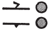
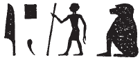

# Column 18 (385-398) {-}

## Esna 385 {-}  
  
  

- Location: Column 18
- Date: Trajan
- [Hieroglyphic Text](https://www.ifao.egnet.net/uploads/publications/enligne/Temples-Esna003.pdf#page=411){target="_blank"}  
- Bibliography: See entries in [Tempeltexte 2.0](http://www.tempeltexte.uni-tuebingen.de/portal/#/text-detail/1404){target="_blank"} 

  

^A^ *nb nḥp*  
*grg tȝ pn*  
*nṯr n nṯr.w m spȝ.wt*  
*Ỉrỉ-tȝ wr*  
*ỉr nn r-ȝw*  
*ẖnmw-Rʿ nb tȝ-sn.t*  
*nṯr-ʿȝ ḥr-ỉb [Ỉwny.t...]*  
  
^A^ Lord of the Potter's Wheel,  
who founded this land,[^fn-385-1]  
god of gods in the nomes;  
Great Irita,  
who made this all in its entirety:  
Khnum-Re Lord of Esna,  
great god within [Iunyt...]  

[^fn-385-1]: {width=12%} - The two circular signs make little sense as is. Tentatively emending them to *p* and *nw*-pot, since *grg tȝ pn* is a popular epithet for Khnum: *LGG* VII, 320-321.

^B^ *ḥry-ỉdb*  
*nṯr smȝ sbỉ.w*  
*nb ʿnḫ*  
*snb r-ḫt=f*  
*sr pw wr(?)*  
*ỉr.n=f nṯr ẖr[...]=f*  
*ršw ḥr.w (n) mȝȝ ḥr=f*  
*ẖnmw nb sḫ.t [...]*  
  
^B^ Chief of the field,  
God who slays the rebels,  
Lord of life,  
who controls health:  
that means the great prince (?).[^fn-385-2]  
He made divine [...] under his [...],  
faces rejoice (from) seeing his face:  
Khnum Lord of the Field [...]  

[^fn-385-2]: {width=18%} - This translation would fit the hieroglyphs. However, a similar epithet shows up related to Neith in *Esna* II, 71, 7: {width=18%} (note that the standing man sometimes writes *ỉ < ỉȝw*, "old man"). It is unclear if that is just a coincidence, or if these are really the same, mysterious phrase. 