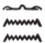
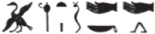

## Esna 387 {-}  
  
  

- Location: Column 18
- Date: Trajan
- [Hieroglyphic Text](https://www.ifao.egnet.net/uploads/publications/enligne/Temples-Esna003.pdf#page=413){target="_blank"}
- Bibliography: @sauneron-5, pp. 219-222; see also [Tempeltexte 2.0](http://www.tempeltexte.uni-tuebingen.de/portal/#/text-detail/1411){target="_blank"}

  

^1^ *ky dwȝ ẖnmw*  
*ḏd-mdw *  
   
*ỉnḏ-ḥr=k*  
*ẖnmw-Rʿ nb tȝ-sn.t*  
*ḏd Pth-tȝ-ṯnn*  
*Nwn wr ỉt nṯr.w*  
  
*ḏd ḫʿỉ m ỉtn*  
*ḏȝỉ p.t*  
*ỉwty wrḏ.n=f*  
*pẖr dwȝ.t*  
*sḥḏ tȝ.wy*  
*ḫrs kkw*  
*m-ḫt dỉ=f sw*  
   
*šȝʿ.n=f hrw*  
^2^ *ỉr.n=f grḥ*  
*rwḏ ỉb=f*   
*ḥr wbn ḥtp*  
*ỉtn wr*  
*psḏ m ȝḫ.t*  
  
^1^ Another hymn to Khnum.  
Words spoken:   
  
Greetings to you,    
Khnum-Re Lord of Esna,   
that is: Ptah-Tatenen;    
Nun the great, father of the gods!   
  
That is: he who appears as the sundisk,    
and sails across the sky,    
without tiring;  
who goes around the Duat,    
who illumines the two lands,    
and drives away darkness,   
after he has shown himself.  
  
He invented the day,  
^2^ and he made the night;  
his heart is firm   
while rising and setting:    
the great sundisk,   
who shines in the Akhet.

*wbny ʿnḫ.tw m mȝȝ=f*  
*dgȝ ỉr.t nb.w ỉm=f*  
*smn nty.w-ʿ nb r-nḥḥ*  
*qd rmṯ.w*  
*ms nṯr.w*  
*wtṯ psḏ.t*  
*wtṯ ỉḫt nb*  
   
*nḥp* ^3^ *nṯr.w*  
*m-ḫt ms(.t) pȝwty tpy*  
*qmȝ wnn.t nb*  
*ḥȝ.t ỉr nn [...] ḥȝ.t=f*  
*mȝṯ.n=f sḫr.w nb n ỉb=f*  
   
*štȝ msḫʿ.w*  
*ʿšȝ ḫpr.w*  
*nn rḫ.tw bs=f*  
  
Shining one, whom all live from seeing,  
every eye perceives through him;
he who established all eternall routines,  
who builds humans,  
who birthed the gods,    
who begat the Ennead,    
who begat everything.  
    
He who modelled ^3^ the gods on the wheel,   
after birthing the First Primeval one,    
who created all that exists.  
The first one, who made this [...] his heart,   
he conceived all plans through his mind.  
  
Mysterious of births,  
numerous of manifestations,  
one cannot know his sacred image.  

  

*nṯr wʿ*   
*ỉr sw m ḥḥ.w*  
*ỉr wnn.t nb *  
^4^ *m r'-ʿ.wy=f*  
   
*pȝwty šȝʿ ḫp(r)*  
*ṯz spȝ.wt m sḫr.w=f*  
*dỉ bw nb ḥr wȝ.wt*  
*ḥr ḫdỉ ḫntỉ*  
*ḥr mȝȝ nṯr.ty=f*  
   
Sole god   
who made himself into millions,[^fn-387-1] 
who made all that exists  
^4^ through his activity.  
  
Primeval one, who began existence,  
who bound the nomes through his plans;   
who puts everybody on the proper paths,   
going up and downstream   
beholding his two divine eyes (sun and moon).

[^fn-387-1]: Here and below (col. 5), the Heh god is followed by a *nb*-basket, which @sauneron-5, p. 221, n. e, rendered as *ḥḥ-nb*. Yet both spellings are most likely decomposed versions of the conventional Heh emblem, who usually kneels on a similar basket.

  

*pr m Nwn*  
*ḫntỉ mḥy.t *  
*m wḏ n nṯr pn šps*  
*ỉỉ Ḥʿpỉ r-ḏr ỉb=f*  
*mḥ.n=f tȝ.wy*  
*m nfrw=f*  
   
*ʿnḫ sʿnḫ* ^5^ *ỉḫt nb*  
*mw.w ṯȝ.w ȝm(.w) m ḫfʿ=f*  
*dỉ.n=f ỉm n mr=f*  
*ẖ.t nb pḫ(ȝ).tw m-bȝḥ=f*  
   
*dỉ zȝ zȝ.t*  
*n nḥỉ sw*  
*ṯȝw n ʿnḫ (n) srq-ḥty.t*  
*sšm=f s r fnḏ nb*  
     
He who emerged from Nun.  
The north-wind blows south  
through the command of this august god,  
and Hapi arrives according to his mind,     
having filled the two lands  
with his beauty.  
  
Living god, who enlivens ^5^ all things;  
water and air are held in his grasp,   
he gives thereof to whomever he pleases,  
all bodies are prostrate before him.  
  
He who gives a son and daughter  
to whomever beseeches him;  
the breath of life (for) humans,  
he guids it to every nose.  

  

*wȝỉ.w m ḥr.w*  
*tkn m sḏm ḥḥ.w*  
^6^ *nn rḫ.tw ỉnm=f*  
   
*ỉty n nḥḥ ḏ.t*  
*nswy.t=f mn(.w) rʿ-nb*  
*nb sḥ*  
*mnḫ sḫr.w*  
*wḥʿ.n=f kȝ.t m ʿ.wy=f*  
*wp mdw ỉr ḫrw*  
  
He who is remote from eyes,  
but approaches the hearing of millions,  
^6^ one cannot know his true appearance.  
  
Sovereign of all eternity,  
his kingship endures every day;  
lord of counsel,  
effective of designs,  
he began work with his hands,  
distinguishing speech and making sounds.  

  

*smsỉ tȝ m ỉmy=s*  
*ṯz ỉwʿ*  
*sḫp(r) tȝ.wy*  
*qmȝ ḥry.w ẖry.w*  
   
*nṯr mnḫ *  
*smn.n=f* ^7^ *nfy*  
*ỉr nfy*  
*nn pȝ wḏ=f tkk*  
   
*nn r-ȝw*  
*ntf ỉr=sn*  
*nn nq(ȝ) kȝ.t nb*  
*m-ḫm=f*  
   
*ḥtp ḥr=k nfr*  
*n (pr-ʿȝ ʿnḫ ḏ.t)|*  
   
He who makes the earth birth its contents,  
who binds together an heir,  
who produces the two lands,   
and created what is above and below.  
  
Beneficent god,  
he established ^7^ all that;  
he who makes all that,  
his commanded has never been overrun.[^fn-387-2]  
  
All this in its entirety:  
it is he who made it all,  
no work is even conceived   
without him knowing.  
  
May your beautiful face be kind   
to (Pharaoh, Living Eternally)|!  

[^fn-387-2]: {width=4.5%}{width=18%} - @sauneron-5, p. 222, n. k, thought the bird wrote *ḫn*. But overlooked parallels indicate it represents the auxiliary verb *pȝỉ*, "to accomplish in the past": see *Urk*. VIII, 142 (3); *Esna* II, 17, 41 (partially damaged).