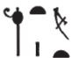
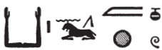

## Esna 391 {-}  

  

- Location: Column 18
- Date: Domitian 
- [Hieroglyphic Text](https://www.ifao.egnet.net/uploads/publications/enligne/Temples-Esna003.pdf#page=386){target="_blank"}  
- Bibliography: @sauneron-5, pp. 201-202; @leitz-loeffler, p. 4, §1f; see also [Tempeltexte 2.0](http://www.tempeltexte.uni-tuebingen.de/portal/#/text-detail/1417){target="_blank"}  

^18^ *ky dwȝ ẖnmw  *  
*ḏd-mdw  *  
    
*ỉnḏ-ḥr=k ẖnmw   *  
*nṯr nṯr.t ḥnʿ=f  *  
*zḫn nfr n Tfn.t  *  
*nb zḫn mry ẖnmw  *  
*wr ḥzw.t bnr mrw.t  *  
     
*kȝ m ẖnw  *  
^19^ *ḥry ḥmw.wt  *  
*bȝ ʿnḫ ỉr nḏmnḏm  *  
*nb mtw.t sṯỉ nṯr.w rmṯ.w  *  
    
*hy n=k   *  
*ḏfn n tȝ rn=k  *  
*ḥtp ḥr=k nfr n zȝ-Rʿ  *  
*(pr-ʿȝ ʿnḫ ḏ.t)|  *  
*mr=k  *  
*dỉ=k wr ms.w=f   *  
*m-bȝḥ=k rʿ-nb  *  

^18^ Another hymn of Khnum.  
Words spoken:  
  
Greeting to you, Khnum!  
The God, with whom is the Goddess;  
the good companion of Tefnut,  
Lord of embraces, who loves unions,  
great of praise, sweet of love.[^fn-391-1]  
  
Bull within the palace,[^fn-391-2]  
^19^ he who mounts the women,  
living Ba, who makes sexual pleasure,  
lord of semen, who begets gods and humans.  
  
Hail to you!  
'Ancestor of the Earth'[^fn-391-3] is your name.  
May your good face be kind to the Son of Re,  
(Pharaoh living eternally)|  
whom you love.  
May cause his children to be great  
in your presence, daily.

[^fn-391-1]: {width=6%} - This pair of epithets occurs frequently elsewhere, so I follow the emendation of @sauneron-5, p. 201, changing the first sign to *bnr*.
[^fn-391-2]: {width=16%}{width=7%} - @sauneron-5, p. 201, left the first group untranslated, but the ram determines the word *kȝ*, "bull", multiple times, e.g. [Esna 392], 19. The sexual nature of this epithet is clear from the following phrases.
[^fn-391-3]: {width=16%} - @sauneron-5, p. 202, translated this epithet as "Gardien du pays", apparently reading the first word as *mwnf* (so also *LGG* III, 273a). Since that epithet is unique, I prefer to read the obelisk here as *ḏ* (< *d < dḫn*, "obelisk"), a uniliteral value that also occurs in the nearby hymn [Esna 393], 23 (in *ḏsr*); cf. also [Esna 388], 8 (in 'Tatenen'). Not only is the phrase "ancestor of the earth" paralleled elsewhere (*LGG* VII, 623c), but this solution does not involve metathesis, and would better fit the procreative theme of the present text.