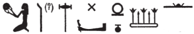

## Esna 392 {-}  

  

- Location: Column 18
- Date: Trajan
- [Hieroglyphic Text](https://www.ifao.egnet.net/uploads/publications/enligne/Temples-Esna003.pdf#page=419){target="_blank"}  
- Bibliography: @sauneron-5, pp. 203; see also [Tempeltexte 2.0](http://www.tempeltexte.uni-tuebingen.de/portal/#/text-detail/1419){target="_blank"}  
- Parallels: Multiple phrases occur in [Esna 375], A.

^19^ *ky dwȝ ẖnmw  *  
*ḏd-mdw  *  
   
*ỉȝw n=k*  
*pȝ bȝ šfy.t-ḥȝ.t*  
*kȝ nḫt spd* ^20^ *ḥn.ty*  
*wr dndn*  
*mḥr ȝ.t=f*  
*r Sḫm.t m sḫm=s*  
*nwd šn.w r mnw(.t)=sn*  
*m wsr=f*  
   
*ʿȝ šfy.t*  
*wšr snf m ḥʿw*  
*n pḥ sw*  
*ʿȝ bȝw*  
^21^ *sk rn *  
*n thỉ sw nb tp tȝ*  
*nb ṯȝw*  
*ʿnḫ mwt ẖr s.t-rȝ=f*  
   
*hȝy n=k*  
*ỉỉ.tw m ḥtp*  
*(ḥtp) ḥr=k nfr *  
*n (pr-ʿȝ ʿnḫ ḏ.t)|*  
   
^19^ Another hymn of Khnum.[^fn-392-1]    
Words spoken:    
      
Praise be unto you,  
o Ba, prestigious of face,  
mighty bull, sharp ^20^ of horns,  
great of rage,  
whose moment of anger is more painful  
than Sakhmet in her power!  
Trees quake[^fn-392-2] down to their roots  
through his power.    
  
Great of prestige,  
the blood freezes in the body  
of whomever reaches him;  
great of power,[^fn-392-3]  
^21^ who destroyes the name  
of whom ever crosses him on earth;  
lord of air,  
life and death are under his control.  
  
Jubilation be unto you!  
Come in peace!  
May your good face be kind  
to (Pharaoh living eternally)|

[^fn-392-1]: {width=10%} - It seems clear this should be a spelling of Khnum, but the sign values remain mysterious. The first sign, the potter's wheel, writes *n < nḥp* in other spellings of Khnum and Esna. That may suggest the signs are out of order, so then the final sharp sign could write *ẖ < ẖʿq*, "to shave." Alternatively, the first sign might be a mistake for the similarly shaped scimitar sign used at Esna, which elsewhere writes *q < qn*, "victory" (@sauneron-8, p. 176, 315-317). Other spellings of Khnum employ a baboon in the first position (@sauneron-8, p. 134, 101), apparently writing *q < qnd*, "rage", or *k < kyw*, "ape", and thus it is possible some trigrams actually write his name as *qnb/qnm*, corresponding to Greek vocalizations such as 'Knoubis'. In that case, the sharp sign might be a tooth, which can be used to write *b < bỉȝ*.
[^fn-392-2]: {width=25%} - @sauneron-5, p. 203, only translated a portion of this verse: "par la force de qui .... sur leurs arbres". Nonetheless, the initial verb appears to be *nwd*, "to move back and forth." As in [Esna 393], and later in this hymn, many words are spelled first acrophonically, and then in a standard, Ptolemaic spelling. Here the verb is written: *n < nhm*, "to rejoice", and *w* < *wnw.t*. This spelling of *šnw*, "tree" or "plant" occurs throughout Esna. Finally, Sauneron translated the final word as "arbres", but that makes less sense in context. Instead, this is most likely the similarly spelled word *mn.wt*, "roots", for which compare K*RI* V, 93, 11, where Amun tells the king: "I shall cause them to see your Majesty like the sky, clouded and pregnant with a storm, so that their trees (*mnw.w*) spring up from their roots (*mn.wt*) because of it." For Amun-Shu as a fierce wind, who disturbs trees, see also @klotz-ram, p. 61, n. B; similar hostile metaphors, in which the king attacks enemies "like the wind going through trees", occur in *Esna* II, 8, 13; [Esna 361], 9.
[^fn-392-3]: {width=15%}{width=7%} - As with other words in this text, *ʿȝ*, "great", is spelled first acrophonically, and then in a normal orthography. The first group is interesting: *ʿ < ʿpy*, "winged sundisk" (see the spelling of *pr-ʿȝ* in line 21), but then what does the solar bark represent? It could be an unique consonantal derivation *ȝ < wỉȝ* (the first two consonants are weak), but this almost always write *w*. In that case, *ʿȝ* would here be spelled *ʿw*, similar to the infinitive form of *ʿȝ*, "to be great" in Demotic.