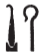

## Esna 395 {-}  

  

- Location: Column 18
- Date: Trajan
- [Hieroglyphic Text](https://www.ifao.egnet.net/uploads/publications/enligne/Temples-Esna003.pdf#page=422){target="_blank"}  
- Photograph: @sauneron-1, Pl. IX.
- Bibliography: @leitz-loeffler, pp. 105-110; see also [Tempeltexte 2.0](http://www.tempeltexte.uni-tuebingen.de/portal/#/text-detail/1424){target="_blank"}  

NB: This scene is extremely difficult, not only because of the unusual spellings, but also the poor quality of carving: as noted by @sauneron-3, p. 378, n. a; @leitz-loeffler, pp. 107-108, n. a.    
  
  
#### Title and Formula {-}

^1^ *[ḥnk] nḥp*   
*n nb=f*  
*ḏd-mdw*  
   
*mn n=k nḥp wr ʿȝ*  
*mry=k(?)*  
*grg.n=k tȝ pn*  
*m kȝ.t=f*  
   
*nbỉ.n=k msw nb*  
*ḥr tp=f*  
*m nṯr(.w) 30*  
   
*ỉmȝ[.n]=f kȝ.t* ^2^ *nb *  
*n ẖnmw.w wr.w*  
*sšm(.w) zȝ=k m r'-ʿ.wy=sn*  
   
*rdỉ.n=k s[m].w(?) *  
*n Ḏȝỉs.w *  
*r spnʿ ʿḥʿ.w*  
*n th wȝ.t[-nṯr]*  
*(m) wḏ-mnỉ*  
   
*zbỉ ḥr wȝ.t-nṯr*  
*rwḏ.tw m ʿnḏ wḏȝ*  
*(nn) pnʿ=sn*  
^3^ *(m) wḏ-mnỉ*  
   
*ḏȝỉ=sn rʿ-nb*  
*wḏ=sn m rȝ-nb*  
*mỉ šȝỉ=k*  
   
*dỉ.n=k ḥry.t n Ḫmnw*  
*r wḏʿ-mdw*  
*nṯr.w rmṯ.w*  
   
*rdỉ.n=(k) pȝ ḏbȝ*   
*n ḏbȝ.w*  
*(r) rdỉ.t zȝ wr n ỉt(?)*  
*r swr k(y).w *  
*ḥfnw ḏbʿ.w*   
   
^1^ [Offering] the potter's wheel   
to its lord.  
Words spoken:   
  
Take the very great potter's wheel,  
which you(?) love;  
it was through its work    
that you populated this land.  
  
You fashioned every child    
upon it,  
by means of the 30 gods.[^fn-395-1]  
  
You render perfect every ^2^ work  
of the Great Khnums,   
who fashion your son with their activity.   
  
You gave pla[nts](?)  
to the Djaisu,[^fn-395-1b]   
to scuttle the boats    
of whomever violates the path of [god],  
in all perpetuity.[^fn-395-2]  
  
Whomever travels on the path of god,  
thrives in safety and health,  
they (do not?) capsize,  
^3^ for all perpetuity.  
  
They sail, every day,  
they disembark, every day,   
just as you had fated.[^fn-395-3]   
  
You have given authority(?) to the Ogdoad,  
to decide the cases  
of gods and hymans.  
  
You have given a reward (*ḏbȝ*)  
to the Djebau (*Ḏbȝ.w*),  
to give an elder son to (each) father,   
to magnify the others,     
for myriads of thousands.  

 

[^fn-395-1]: {width=12%} - Based on similar spellings at Esna featuring three ram-headed staffs for 30 (10 = *mḏ < mdw*), @leitz-loeffler, p. 108, n. d, tentatively suggested a connection to the 30 Creator gods, even though one of the standards is missing here. As in a similar text from Armant, they are specifically listed in the following text: 7 Khnums + 7 Djaisu + 8 members of the Ogdoad + 8 Djebau = 30 primeval divinities.

[^fn-395-1b]: {width=8%} - Rather than *ṯz-nṯr.w*, "der die Götter knüpft" (@leitz-loeffler, p. 106), this most likely a spelling of *ḏȝỉs.w*, etymologically related to *ṯz.w*, "utterances": *LGG* VII, 499b and 592b. This group of gods fits nicely between the 7 Khnums and the Ogdoad.  

[^fn-395-2]: As @leitz-loeffler, pp. 108-109, n. g, it seems very unusual that this text concerning creation on the potter's wheel makes so many references to boats. Yet these nautical metaphors refer, as often in Egyptian texts, to the course of a person's lifetime. To travel on the "path" or "water" of a god is to act piously. More important is the key phrase, repeated at least twice: {width=4%} and {width=7%}. These appear to be variants of the idiomatic expression m *(s)wȝḏ-mnỉ*, literally "to disembark and to moor", a figurative expression meaning "throughout an entire lifetime; in perpetuity": @collombert-metaphor (to which these examples could be added).

[^fn-395-3]: {width=7%} - Emending the plant to the similar *šȝ*-sign, and *nb* to *=k*.  

#### The King {-}

^4^ *nsw.t-bỉty *  
*nb tȝ.wy*  
*(ȝwtkrtrs kysrs)| *  
^5^ *zȝ Rʿ*  
*nb ḫʿ.w*  
*(dryns nty-ḫwỉ)|*   
^6^ *ḥry-tȝ Km-ȝ.t=f *  
*ḫnty nḥp*  
*n ẖnmw ỉr ẖnm[.w]*  
  
^7^ *nṯr nfr*     
*sṯỉ.n kȝ nḏmnḏm*  
*qdỉ.n ḫnty Pr-ʿnḫ*  
*m ȝ.t ȝb ỉb=f*  
*sṯnỉ.tw=f m ẖ.t*  
*ḫnty ʿnḫ.w*  
*[r] ỉr.t nsw.t*  
*n šnw n ỉtn*  
   
*ỉwʿʿ Nḥp*  
*(trʿns [nty-ḫwỉ])|*   
  
^4^ The King of Upper and Lower Egypt,  
Lord of the Two Lands,    
(Autokrator Caesar)|  
^5^ Son of Re,    
Lord of Appearances,    
(Trajan Augustus)|  
^6^ Successor of Kematef (*Km-ȝ.t=f*),  
foremost of the potter's wheel,  
of Khnum who made the Khnum[s].  
   
^7^ The good god,  
engendered by the Bull of sexual pleasure,  
fashioned by Foremost of the House of Life,    
in the moment (*ȝ.t*) his heart desired,    
who was distinguished in the womb   
before (all) mortals,   
to serve as King[^fn-395-4]   
of the circuit of the solar disk.  
  
Heir of the Potter,  
(Trajan [Augustus])|

  

[^fn-395-4]: @leitz-loeffler, pp. 107, 109, n. l, translated these phrases quite differently, appealing to a similar text in [Esna 254], 6. However, I read that text differently as well, and it is much more likely that the king was "distinguished in the womb" (a very common epithet), and that the *wedjat*-eye here writes the verb *ỉrỉ*, and not the toponym "Egypt" (*Bȝq.t*), for which one would expect a determinative.

#### Khnum-Re Lord of Esna {-}

^8^ *ḏd-mdw n ẖnmw-Rʿ nb tȝ-sn.t*  
*nsw.t nṯr.w*  
*nṯr ʿȝ ḫnty ḥw.t-ỉt*  
*Ptḥ-^9^-ṯnn m ỉȝw*  
*ỉmȝḫw=f m Nwn*  
   
*qmȝ.n=f nb.t*  
^10^ *m ỉȝw n ḥr=f*  
*ḫntš ỉb=f*  
*r mȝȝ=st*  
   
*ỉỉ.n ỉb=f*  
*r smȝwy* ^11^ *msw=f*  
*r tm wš*  
*m kȝ.t ỉr.n=f*  
*ḏr ỉr.n=f [...] *  
^12^ *m ʿrqy [...]*  
*nn mȝȝ mỉt.t=f*  
   
*kȝ.n=f tȝ*  
*ḫr ẖnmw.w wr.w*  
*r ỉr(.t) kȝ.t*  
   
^13^ *dỉ=ỉ wr ḏȝm.w=k*  
*m ḫt-mn*  
*[mn=k ḥr?] ns.t=k*  
*(r)-ȝw nḥḥ*  
  
^8^ Words spoken by Khnum-Re Lord of Esna,  
King of the gods,  
Great god, foremost of Temple of the Father,  
Ptah-^9^-Tatenen as an old man,  
whose mummified form is in Nun.  
    
All those he created   
are in adoration to his face;  
his heart delights  
from seeing them.  
  
His heart arrived  
to renew ^11^ his creations,  
lest there be anything lacking   
in the work he performed,     
since he made [...]  
^12^ on the last day of [...]  
its like has never been seen.  
  
He planned the earth  
before the Great Khnums,  
in order to perform the work (of creation).[^fn-395-5]  
  
^13^ I cause your generations to be great   
throughout the world,   
[and you endure upon?] your throne    
for the extent of eternity.  

[^fn-395-5]: This unexpected spelling of the verb *kȝ*, "to plan; say" is confirmed via two parallels in *Esna* II, 58, 3; *Esna* VI, 474. 

#### Menhyt {-}

NB: As noted by @leitz-loeffler, pp. 109-119, n. n, the difficult epithets of Menhyt have a direct parallel in titles of Mut at North Karnak: *Urk* VIII, 18c (temple of Montu). Parallel epithets for Mut also occur in a still-unpublished scene from the Khonsu Temple in Karnak (reign of Augustus), which can be seen [here](https://oi-idb.uchicago.edu/id/a2b2cd82-809d-4b16-9808-07057452046d){target="_blank"}. See already @klotz-caesar, p. 171.

^14^ *ḏd-mdw n Mnḥy.t wr.t*  
*nb(.t) ḫnt-tȝ*  
*wbn(.t) m Nwn*  
^15^ *pr(.t) ḥnʿ ḏ*  
*m-ḥȝ.t nbỉ.tw=s*  
*m hȝy.t n(.t) wbn*  
*ḏsr* ^16^ *ȝḫ.t ḫnt=s*  
*ʿ(ȝ)ʿ ḏ.t=s*  
*m (ỉ)ʿrr.t*  
  
^17^ *nsw.t-nṯr.w m ḥȝ.t=s*  
*zȝ=s pȝwty-tpy dmḏ(.w) ḥnʿ(=s)*  
*nn mȝȝ nḥp.n[=f]* 
   
^18^ *dỉ=ỉ šzp=k nfrw*  
*ḫr ỉmy-nḥp=f*  
*ỉr=ỉ s.t=ỉ*  
*ỉmỉ.tw wp(.t=k)*  
  
^14^ Words spoken by Menhyt the great,  
Lady of Khent-ta,  
she who arose from Nun,  
^15^ and came forth with the *ḏ*-serpent,[^fn-395-6]    
on the brow of her fashioner;     
(existing) as a firmament for rising,  
he whose Akhet ^16^ is saced is in her;   
she whose body was ejaculated (*ʿȝʿ*)   
as a uraeus (*(ỉ)ʿrr.t*).   
    
^17^ The King of the gods is before her,    
her son, the First Primeval,    
is united with (her):  
one cannot see what [he?] built on the wheel.  
  
^18^ I cause you to receive good things  
from He who is at his potter's wheel;  
and I make my seat  
upon (your) forehead.  

[^fn-395-6]: Contra @leitz-loeffler, p. 110, n. n, the mysterious *ḏ*-serpent who emerges with the primeval uraeus-Menhyt is most likely Irita, not their father, Kematef. See @klotz-caesar, pp. 123, 171-173. 

#### Behind the Divinities {-}

   
^19^ *[...]*  
*ḏsr ḫprw*  
*ḫpr zp tpy*  
   
*ỉt-ỉt.w*  
*mw.t mw.wt [...*  
*ṯz [...] nṯr.w*  
*ḫpr Ỉwny.t *  
   
*kȝ.n=f tmȝ.t *  
*ʿnḫ(?)=f ḥnʿ [...]*  
*[...] ỉrw=s m-ḫt ỉry*  
*ʿnḫ nṯr ḥr-sȝ nṯr*  
   
*ms m ḥȝ.t*  
*ḫr.tw r=f*  
*wtṯ.n=f nṯr.w rmṯ.w*  
*r-gs=f*  
   
*wḥm.n=f ỉrw=f*  
*m zmȝ ḏsr [...]*  
  
^19^ [...]  
sacred of manifestation,  
who came about in the first moment;  
  
father of fathers,   
mother of mothers [...]  
who bound together [...] of the gods,   
so came about Iunyt.    
  
He planned the primeval mother,  
and he came to life(?) with [her?]   
[...] her form afterwards:  
thus a god lives after a god.  
  
He who was born in the beginning,  
(so he is called);  
he begat gods and humans   
beside him.  
  
He repeated his form  
as a statue, sacred of [...] 
  

