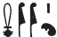

## Esna 396 {-}  

  

- Location: Column 18
- Date: Trajan
- [Hieroglyphic Text](https://www.ifao.egnet.net/uploads/publications/enligne/Temples-Esna003.pdf#page=426){target="_blank"}  
- Bibliography: see [Tempeltexte 2.0](http://www.tempeltexte.uni-tuebingen.de/portal/#/text-detail/1466){target="_blank"}  

#### Title {-}

^1^ *wn p.t zn tȝ*  
*sqr ỉtr.ty*  
*pr nṯr ỉỉ ỉt*  
   
*ṯȝỉ=ỉ ʿwn(.t)=k*  
*m-ʿ ʿ.wy=k*  
*tks tȝ m ṯb.ty=ỉ*  
*r s[...]*  
^2^ *n bȝ wr [šfy.t]*  
  
*ḫsf(=i) sbỉ n pr pn*  
*dỉdỉ(=ỉ) ḫfty*  
*tktk=ỉ ḏw-qd*  
*sbỉ zḥzḥ(.w) m rd.wy=ỉ*  
*r sḫr ḫfty.w *  
*nw* ^3^ *[...]*  
*[...]*  
   
*ȝm.n=k ỉỉ.t*  
*ds.n=k tp=sn*  
*m ds=k*  
*snwḫ ḥḏ=sn*  
*sn.t=k Sḫm.t*  
   
*ỉw=k m ṯȝw m-ḫt=s*  
*r ḫdỉ [...]*   
    
^1^ The sky opens, the earth opens,   
the double chapels are unlocked,    
the god comes forth, the father arrives!  
    
I seize your *ʿwn.t*-staff[^fn-396-1]  
from your arms,[^fn-396-1b]    
I puncture the earth with my sandals,   
in order to [...]   
^2^ for the Ba, great of [prestige].   
   
I repel the rebel of this domain,   
I demolish the enemy,   
I attack the one Evil of Character,    
the rebel is trampled by my feet,     
I strike down the enemies   
of ^3^ [...]   
[...]    
   
You have seized the *ỉỉ.t*-knife,   
and you chop of their heads   
with your knife.  
Your sister, Sakhmet,   
burns[^fn-396-2] their bones.  
   
You are as the wind after her,  
in order to [...]  

 

[^fn-396-1]: This scene belongs to the Festival of Seizing the *ʿwn.t*-staff, celebrated on Epiphi 19-20: see [Esna 196] and following texts.

[^fn-396-1b]: Note the spellings: {width=7%}. The feather writing *ʿ*, "arm", is attested elsewhere: @kurth-1, p. 269. For the first sign, Kurth did not register the phonetic value *m-ʿ*, "from" < *mỉ*, but see already @sauneron-4, p. 9, n. b; and add [Esna 249], 6 (27) and [Esna 366], 5 (19).

[^fn-396-2]: {width=11%} - See *Wb*. IV, 157, 12-17. The plant sign is a mistake for the expected brazier determinative.  

#### The King {-}

^4^ *nsw.t-bỉty *  
*nb tȝ.wy*  
*(ȝwtkrtrs kỉsỉrs)| *  
^5^ *zȝ Rʿ*  
*nb ḫʿ.w*  
*(dryns nty-ḫwỉ)|*  
^6^ *snn ʿnḫ*  
*n ḥry-ỉb Ḫmnw*  
*[ṯȝỉ] ʿwn.t(?)*  
*n nb sḫ.t*  
    
^7^ *nṯr nfr*  
*ty.t n nb sḫ.t*  
*šzp-ʿnḫ n ḥqȝ mnỉ.w*  
*ỉwʿ n ḥwỉ bṯn.w[=f]*  
*zȝ smsw n hd ʿȝpp*  
*qn sȝwy nḫt pw*  
*sḫm [...]*  
*[...]*  
*nb qn*  
*(trʿnys nty-[ḫwỉ])|*  
  
^4^ The King of Upper and Lower Egypt,  
Lord of the Two Lands,    
(Autokrator Caesar)|  
^5^ Son of Re,    
Lord of Appearances,    
(Trajan Augustus)|  
^6^ Living image  
of he who is within Hermopolis,   
[who seizes(?)] the *ʿwn.t*-staff(?)  
of the Lord of the Field.  
  
^7^ The good god,  
replica of the Lord of the Field,  
living image of the Ruler of herdsmen,  
heir of he who slays [his] rebels,   
eldest son of he who attacks Apophis.  
That means the mighty one, who has strength,    
who has power [over ...]  
[...]  
Lord of might,   
(Trajan Augus[tus])|  

  

#### Khnum-Re Lord of the Field {-}

^8^ *ḏd-mdw n ẖnmw-Rʿ nb sḫ.t*  
*nb tȝ-sn.t(?)*  
*Šw ṯmȝ-ʿ*  
*nbnb Rʿ [...]*  
   
^8^ Words spoken by Khnum-Re Lord of the Field,  
Lord of Esna(?)[^fn-396-3],   
Shu, valient of arm,    
who protects Re [...]  

[^fn-396-3]: {width=10%} - Reading highly speculative. *LGG* VII, 693c, offers no suggestions for this group. 

#### Nebtu {-}

^9^ *ḏd-mdw n Nb.t-ww nb tȝ-sn.t*  
*ỉr.t-Rʿ*  
*wbd(.t) sbỉ.w m hh^10^=s*  
*mḥ-ỉb n nb sḫ.t*  
*m hrw dmḏ*  
*m ỉỉ=f m nb pḥty*  
  
*mḥn^11^=s ḥr tp=f*  
*ȝm.n=s mnḥ*  
*mnḥ tp(.w) sbỉ.w=s*  
*m rn=s [n] Mnḥy.t*  
   
^12^ *wsr ʿ.wy=k*  
*r sḫr ḫfty.w=k*  
*zȝw ḥȝ=k*  
*m hrw sk*  
   
^9^ Words spoken by Nebtu Lady of Esna,  
Eye of Re,  
who burns the rebels with her fiery ^10^ breath,  
trusted companion of the Lord of the Field  
on the day of battle,   
when he arrives as the lord of strength.  
   
She ^11^ coils (*mḥn*) upon his head,  
having seizes the knife (*mnḥ*),  
to chop off (*mnḥ*) the heads of her rebels,  
in her name [of] Menhyt (*Mnḥy.t*).  
  
^12^ May your arms be strong  
in order to fell your enemies.  
Protection surrounds you  
on the day of attack.  

#### Behind the Divinities {-}

^13^ *nsw.t bỉty*  
*bȝ [tkk?]*  
*[...]*  
   
*[ḥbs]=f ḥr=f*  
*m ẖkrw=f*  
*r tm ȝms[-ỉb]*   
*[n] ḫfty p[n]*  
   
*[snỉ]=f sḫr.w=f n swḥ*  
*pr=f r ptr.t*  
*m pḏ nmt.t*  
*pḥ.n=f n pḥ.n sw*  
*(m?) pḥty=f*  
*ẖnmw nb nṯr.w rmṯ.w*  
  
^13^ The King of Upper and Lower Egypt,  
[raging?] Ba,[^fn-396-4]    
[...]  
  
He [covers] his face   
with his armor    
lest he [feel] mercy    
[for th]is enemy.[^fn-396-5]  
   
He [changes] his condition as the wind,  
and he comes forth to the battle field,    
with broad strides,    
he attacked whomever attacked him   
(with?) his strength:  
Khnum, Lord of gods and humans.

[^fn-396-4]: Restoring a common epithet of the bellicose Khnum. Many of these epithets occur in the scene of slaying enemies on the north exterior wall: *Esna* VII, 619.  

[^fn-396-5]: Similar epithets in *Esna* VII, 619, 26-27; see also [Esna 225], 28 (88).