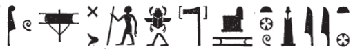

## Esna 397 {-}  

  

- Location: Column 18
- Date: Trajan
- [Hieroglyphic Text](https://www.ifao.egnet.net/uploads/publications/enligne/Temples-Esna003.pdf#page=429){target="_blank"}  
- Bibliography: @leitz-loeffler, p. 107 (397, A); see also [Tempeltexte 2.0](http://www.tempeltexte.uni-tuebingen.de/portal/#/text-detail/1468){target="_blank"}  

^A^ *nṯr nfr*  
*nḥp*  
*Šw ỉwn wr*  
*nb tȝ-sn.t *  
*ḫnty(?) Ỉwny.t*  
  
*nỉ ḫp(r) p.t tȝ*  
*sḫp(r).n=f Nwn *  
*m wrm*  
*ms.n=f ḥ(n)bb*  
*bs tȝ*  
   
*ẖnm.n=f ỉwʿʿ*  
*m [zȝ] mr=f*  
*nḥp.n=f [...]*  
*[...] Nwn*  
*ỉn pḥ=s mḏ*  
   
*bȝ ʿȝ ʿnḫ*  
*bs=sn (m)-ḫt=f (?)*  
*m zp tpy*  
*nn wn wnn.t*  
*ẖnmw nb sḫ.t*  
*rʿ nb*  
   
^A^ The good god,  
the Potter,  
Shu the great,  
Lord of Esna,  
foremost(?) of Iunyt.[^fn-397-1]  
  
Before heaven or earth existed,  
he created Nun  
as a flood,  
he birthed the cool waters,  
and the earth emerged.    
  
He modeled the heir  
as his beloved [son],  
he built [...]  
[...] Nun,  
its limit reaches the depths.  
  
The great living Ba,  
they came forth after(?) him  
in the initial moment,  
before what exists existed:  
Khnum Lord of the Field,  
forever.  

 

[^fn-397-1]: {width=38%} - Some of the signs appear to be in the wrong order, and @leitz-loeffler, p. 110, n. q, noted the presence of additional hieroglyphs for the epithet *ỉwn wr*. The standing man could be an ideogram for *nb*, "lord", after which the scarab could write *tȝ*, and the throne (*s.t*) + water (*n.t*) signs represent *tȝ-sn.t*, "Esna."  

^B^ *nṯr nfr*  
*ḥqȝ mnỉw*  
*ỉty ḥqȝ n Km.t*  
*ḥwỉ ḫȝs.wt nb.w*  
   
*nsw.t nḫt*  
*qn m mr.t*  
*m nḫ.w(=f)*  
  
*Nwn*  
*ṯȝy ʿwn*  
*smȝ bṯn.w=f*  
*m pḏ.wt 9.t*  
*m 2/3 n 3.nw n šmw*  
*m ḥb=f nfr*  
*n ḥb ṯȝy-ʿwn*  
   
*ỉn.n=f pr=f*  
*m qn nḫt*  
*nṯry=f nḏm(.w)*  
*ḥb=f r ḥn.ty*  
*ẖnmw nb sḫ.t*  
*nb qn rʿ-nb*  
    
^B^ The good god,  
Chief of the shepherds,   
sovereign, ruler of Egypt,  
who slays all foreign lands.  
  
Mighty king,   
victorious in the desert  
through his strength.  
  
Nun,   
who seizes the staff  
and slays his rebels  
from the Nine Bows,  
on the 20th of III Shomu (= [Epiphi 20](https://bookdown.org/shemanefer/Esna2/calendar-ii-77.html#epiphi-20) ),  
in his good festival  
of Seizing the Staff.  
  
He reached his domain   
in strength and victory,  
his heart is pleased,  
and he celebrates for eternity,  
Khnum Lord of the Field,  
Lord of Victory, every day.

