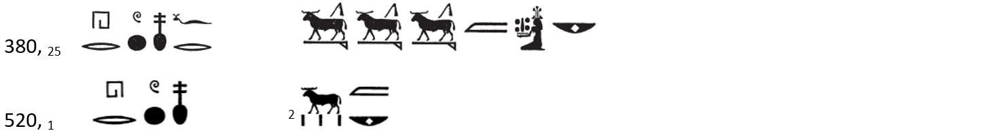
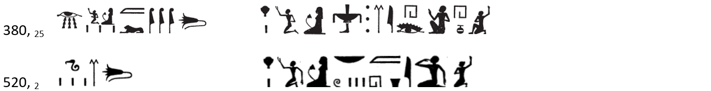
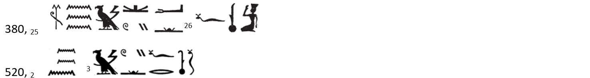
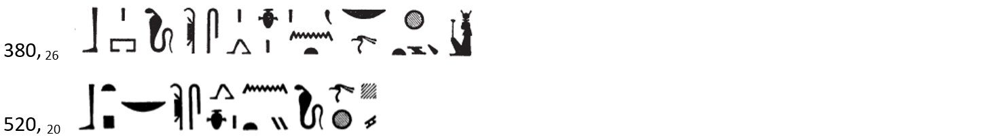
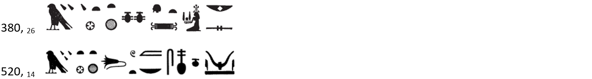
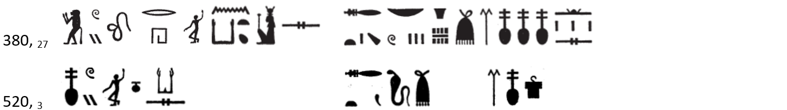
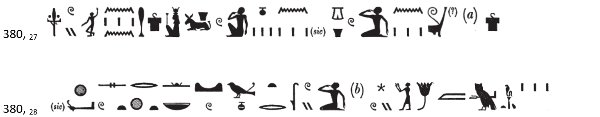

# The Dance for Menhyt-Nebtu {-} 

## Synoptic Text {-} 

[Esna 380] and *Esna* VI, 520  
  
{width=90%}  
  
{width=90%}  
  
{width=90%}  
  
{width=90%}  
  
{width=90%} 
  
{width=90%}  
  
{width=90%}  
  
{width=90%}  
  
{width=90%}  
  
{width=90%}  
  
{width=90%}  
  
{width=90%}  
  
{width=90%}  
    

