# Notable Spellings {-}  
  
*ȝw.t-ỉb*, "happiness"  
  
{width=5%}&nbsp;&nbsp;&nbsp;&nbsp;[Esna 194], B

*ȝḫ.t*, "the Akhet"  
  

{width=6.5%}{width=2.2%}&nbsp;&nbsp;&nbsp;&nbsp;[Esna 379], 24; [Esna 395], 16
Iwny.t, "Iunyt (Esna)  
  
{width=8%}&nbsp;&nbsp;&nbsp;&nbsp;[Esna 259], 3, §5; 

*ỉrỉ*, "to do; make"

{width=6%}&nbsp;&nbsp;&nbsp;&nbsp;[Esna 224], 1 (bis)  

*ỉrṯ.t*, "milk"  
  
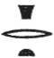{width=5%}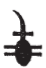{width=3.5%}&nbsp;&nbsp;&nbsp;&nbsp;[Esna 347], 24 
  
  
*ỉḫḫ*, "evening; dusk"
  
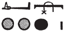{width=10%}&nbsp;&nbsp;&nbsp;&nbsp;[Esna 194], B

*ỉqr*, "excellent"  
  
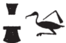{width=8%}&nbsp;&nbsp;&nbsp;&nbsp;[Esna 390], 17  
  
*Ỉs.t*, "Isis"   

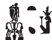{width=8%}&nbsp;&nbsp;&nbsp;&nbsp;[Esna 369], 38
  
*Ỉtm*, "Atum"  
  
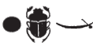{width=10%}&nbsp;&nbsp;&nbsp;&nbsp;[Esna 218], 9

*ỉtn*, "solar disk"  
  
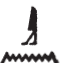{width=6%}{width=11%}&nbsp;&nbsp;&nbsp;&nbsp;[Esna 379], 24  
  
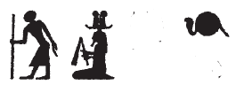{width=15%}&nbsp;&nbsp;&nbsp;&nbsp;[Esna 259], 2, §1

*ʿȝ*, "great"  
  
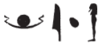{width=12%}&nbsp;&nbsp;&nbsp;&nbsp;[Esna 372], 15  
  
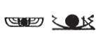{width=15%}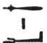{width=7%}&nbsp;&nbsp;&nbsp;&nbsp;[Esna 392], 20  
  
{width=8%}&nbsp;&nbsp;&nbsp;&nbsp;[Esna 392], 21  
  

*wr.t*, "the great one"  
  
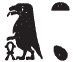{width=6%}&nbsp;&nbsp;&nbsp;&nbsp;[Esna 209], 28 (2)  
  
*wrḏ*, "to tire"  
  
{width=12%}&nbsp;&nbsp;&nbsp;&nbsp;[Esna 379], 23 
  
*bȝw*, "power"  
  
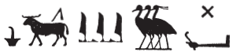{width=22%}&nbsp;&nbsp;&nbsp;&nbsp;[Esna 392], 20   
  
*pr*, "temple"  
  
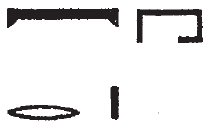{width=8%}&nbsp;&nbsp;&nbsp;&nbsp;[Esna 224], 1  

*pḥ*, "to reach; attack"  
  
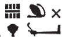{width=8.5%}&nbsp;&nbsp;&nbsp;&nbsp;[Esna 392], 20

*m*, "in; as; from"  
  
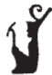{width=4%}&nbsp;&nbsp;&nbsp;&nbsp;[Esna 234], 27  
  
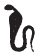{width=3.8%}&nbsp;&nbsp;&nbsp;&nbsp;[Esna 382], 11  

  
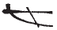{width=6%}&nbsp;&nbsp;&nbsp;&nbsp;[Esna 224], 1 (bis)  
  
{width=6%}&nbsp;&nbsp;&nbsp;&nbsp;[Esna 379], 24   

*mw*, "water"  
  
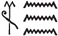{width=7%}&nbsp;&nbsp;&nbsp;&nbsp;[Esna 380], 25  
  
*mn*, "to remain; stay"  
  
{width=1.8%}&nbsp;&nbsp;&nbsp;&nbsp;[Esna 335], B  
  
*Mnḥy.t*, "Menhyt"  
  
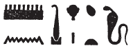{width=14%}&nbsp;&nbsp;&nbsp;&nbsp;[Esna 304], 17  
  
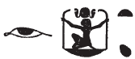{width=11%}&nbsp;&nbsp;&nbsp;&nbsp;[Esna 298], B
  
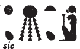{width=9%}&nbsp;&nbsp;&nbsp;&nbsp;[Esna 301], 10
  
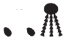{width=8%}&nbsp;&nbsp;&nbsp;&nbsp;[Esna 335], B   
  
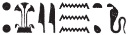{width=18%}&nbsp;&nbsp;&nbsp;&nbsp;[Esna 251], 22, §2  
  
*msỉ*, "to birth; create; fashion"  
   
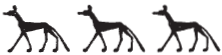{width=15%}&nbsp;&nbsp;&nbsp;&nbsp;[Esna 390], 17  
   
*mzỉ*, "to present; offer"
  
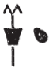{width=4%}&nbsp;&nbsp;&nbsp;&nbsp;[Esna 347], 25 

*Ptḥ*, "Ptah"

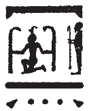{width=6%}&nbsp;&nbsp;&nbsp;&nbsp;[Esna 224], 2  

*N.t*, "Neith"  
  
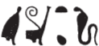{width=12%}&nbsp;&nbsp;&nbsp;&nbsp;[Esna 305], 18  
  
*nb*, "lord" and *nb*, "all" 
  
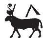{width=6%}&nbsp;&nbsp;&nbsp;&nbsp;[Esna 328], A; [Esna 393], 23   
   
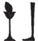{width=4.5%}&nbsp;&nbsp;&nbsp;&nbsp;[Esna 273], 6  
  
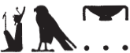{width=13%}&nbsp;&nbsp;&nbsp;&nbsp;[Esna 379], 24   

*Nb.t-ww*, "Nebtu"  
  
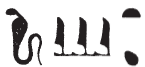{width=11%}&nbsp;&nbsp;&nbsp;&nbsp;[Esna 306], 30

*nn*, negation  
  
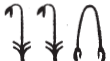{width=9%}&nbsp;&nbsp;&nbsp;&nbsp;[Esna 379], 24  

*nḥp*, "potter's wheel"  
  
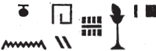{width=15%}&nbsp;&nbsp;&nbsp;&nbsp;[Esna 390], 17

  
{width=13%}&nbsp;&nbsp;&nbsp;&nbsp;[Esna 224], 1  

{width=11%}&nbsp;&nbsp;&nbsp;&nbsp;[Esna 320], 11   
  
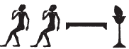{width=13%}&nbsp;&nbsp;&nbsp;&nbsp;[Esna 301], 11
  
{width=7%}&nbsp;&nbsp;&nbsp;&nbsp;[Esna 277], 20; [Esna 302], 14; [Esna 304], 16   
  
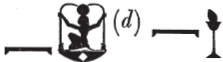{width=18%}&nbsp;&nbsp;&nbsp;&nbsp;[Esna 302], 13 
  
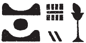{width=9%}&nbsp;&nbsp;&nbsp;&nbsp;[Esna 310], 28 

*r*, "to; towards; at; until"  
  
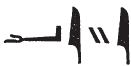{width=10%}  

*Rʿ*, "Re"  
  
{width=7%}&nbsp;&nbsp;&nbsp;&nbsp;[Esna 293], 27  
  
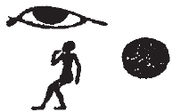{width=8%}&nbsp;&nbsp;&nbsp;&nbsp;[Esna 224], 1  
  
{width=8%}&nbsp;&nbsp;&nbsp;&nbsp;[Esna 231], 4, 9
  
*rs*, "to awaken" 
  
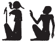{width=7%}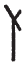{width=2.2%}&nbsp;&nbsp;&nbsp;&nbsp;[Esna 379], 24

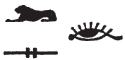{width=10%}&nbsp;&nbsp;&nbsp;&nbsp;[Esna 259], 2, §1  
  
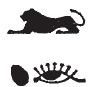{width=5.5%}&nbsp;&nbsp;&nbsp;&nbsp;[Esna 259], 3, §4  
  
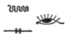{width=9%}&nbsp;&nbsp;&nbsp;&nbsp;[Esna 259], 4, §7

*ḥb*, "festival" 

{width=9%}&nbsp;&nbsp;&nbsp;&nbsp;[Esna 224], 1; [Esna 380], 25 and 26

*ḥb pn nfr*, "this good festival"  
  
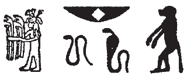{width=13%}&nbsp;&nbsp;&nbsp;&nbsp;[Esna 224], 1  
  
*Ḥr*, "Horus"  
  
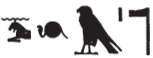{width=13%}&nbsp;&nbsp;&nbsp;&nbsp;[Esna 393], 23 
  
*Ḥkȝ*, "Heka"  
  
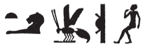{width=16%}&nbsp;&nbsp;&nbsp;&nbsp;[Esna 308], 25 *bis*  
  
*ḫʿỉ*, "to appear (on the throne; in procession)"  
 
{width=5%}&nbsp;&nbsp;&nbsp;&nbsp;[Esna 393], 23  

  
*ẖnmw*, "Khnum" (examples from outside the main Khnum litanies)   
  
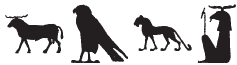{width=19%}&nbsp;&nbsp;&nbsp;&nbsp;[Esna 369], 36  
  
{width=14%}&nbsp;&nbsp;&nbsp;&nbsp;[Esna 261], 15 

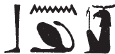{width=11%}&nbsp;&nbsp;&nbsp;&nbsp;[Esna 310], 28  
  
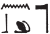{width=9%}&nbsp;&nbsp;&nbsp;&nbsp;[Esna 341], 9; [Esna 371], 1   
  
{width=14%}&nbsp;&nbsp;&nbsp;&nbsp;[Esna 225], 4, §3  
   
{width=14%}&nbsp;&nbsp;&nbsp;&nbsp;[Esna 277], 22, §6; [Esna 383], B  
  
{width=15%}&nbsp;&nbsp;&nbsp;&nbsp;[Esna 224], 1   
  
{width=15%}&nbsp;&nbsp;&nbsp;&nbsp;[Esna 264], 25  

    
{width=18%}&nbsp;&nbsp;&nbsp;&nbsp;[Esna 393], 21 

   
{width=16%}&nbsp;&nbsp;&nbsp;&nbsp;[Esna 364], B   
   
   
{width=8%}{width=5%}&nbsp;&nbsp;&nbsp;&nbsp;[Esna 230], B
{width=14%}&nbsp;&nbsp;&nbsp;&nbsp;[Esna 291], 21  
{width=9%}&nbsp;&nbsp;&nbsp;&nbsp;[Esna 379], 24
  
{width=14%}&nbsp;&nbsp;&nbsp;&nbsp;[Esna 224], 2  
  
{width=17%}&nbsp;&nbsp;&nbsp;&nbsp;[Esna 264], 25  
  
{width=14%}&nbsp;&nbsp;&nbsp;&nbsp;[Esna 353], A  
  
{width=17%}&nbsp;&nbsp;&nbsp;&nbsp;[Esna 364], A    

{width=2.9%}{width=18%}&nbsp;&nbsp;&nbsp;&nbsp;[Esna 393], 21 
  
{width=12%}&nbsp;&nbsp;&nbsp;&nbsp;[Esna 379], 24 
  
{width=14%}&nbsp;&nbsp;&nbsp;&nbsp;[Esna 353], B  
  
{width=10%}&nbsp;&nbsp;&nbsp;&nbsp;[Esna 392], 19    

*sy*, "her" (third person singular dependent pronoun)
    
{width=3.5%}&nbsp;&nbsp;&nbsp;&nbsp;[Esna 380], 28
    
*snw*, "two"  
  
{width=4%}&nbsp;&nbsp;&nbsp;&nbsp;[Esna 309], 27; [Esna 328], B; [Esna 346], 25.
  
*sḫ.t*, "field"  
  
{width=17%}&nbsp;&nbsp;&nbsp;&nbsp;[Esna 306], 20    
  
*sḫpr*, "to create"
  
{width=9%}&nbsp;&nbsp;&nbsp;&nbsp;[Esna 337], A  

{width=6.5%}&nbsp;&nbsp;&nbsp;&nbsp;[Esna 380], 26

*sḫm*, "power; image"  
  
{width=15%}&nbsp;&nbsp;&nbsp;&nbsp;[Esna 393], 22  
  

*zẖȝw*, "scribe"

{width=6%}&nbsp;&nbsp;&nbsp;&nbsp;[Esna 309], 26
  
*sqdỉ*, "to sail; travel"  

{width=3.3%}{width=9%}&nbsp;&nbsp;&nbsp;&nbsp;[Esna 379], 23-24
  
*qmȝ*, "to create"  
  
{width=6%}&nbsp;&nbsp;&nbsp;&nbsp;[Esna 388], 7, 9, 10; [Esna 393], 23
  
*=k*, "you; your" (second person singular masculine suffix pronoun)  

{width=4%}&nbsp;&nbsp;&nbsp;&nbsp;[Esna 379], 23  
  
{width=3%}&nbsp;&nbsp;&nbsp;&nbsp;[Esna 392], 21; [Esna 393], 23 
  
*tȝ-sn.t*, "Esna"  
  
{width=21%}&nbsp;&nbsp;&nbsp;&nbsp;[Esna 224], 1  
  
{width=15%}&nbsp;&nbsp;&nbsp;&nbsp;[Esna 234], 28  
  
{width=16%}&nbsp;&nbsp;&nbsp;&nbsp;[Esna 301], 10 (the damaged sign was a child)  
  

{width=12%}&nbsp;&nbsp;&nbsp;&nbsp;[Esna 231], 3, 10; [Esna 274], 8; [Esna 285], 14; [Esna 291], 21; [Esna 383], A (flowers vary slightly)

{width=14%}&nbsp;&nbsp;&nbsp;&nbsp;[Esna 287], 17  
  
{width=17%}&nbsp;&nbsp;&nbsp;&nbsp;[Esna 288], 18  

{width=10%}{width=7%}&nbsp;&nbsp;&nbsp;&nbsp;[Esna 293], 26  

{width=22%}&nbsp;&nbsp;&nbsp;&nbsp;[Esna 379], 24

  
{width=11%}&nbsp;&nbsp;&nbsp;&nbsp;[Esna 216], 1; [Esna 292], 22; [Esna 309], 26
  
{width=11%}&nbsp;&nbsp;&nbsp;&nbsp;[Esna 273], 6  
  
{width=16%}&nbsp;&nbsp;&nbsp;&nbsp;[Esna 302], 14; [Esna 369], 38  

{width=15%}&nbsp;&nbsp;&nbsp;&nbsp;[Esna 293], 27  
  
{width=12%}&nbsp;&nbsp;&nbsp;&nbsp;[Esna 393], 21   
  
*tp*, "head"  
  
{width=7%}&nbsp;&nbsp;&nbsp;&nbsp;[Esna 226], 11; [Esna 321], 23
  
*ṯpḥ.t-ḏȝ.t*, "blocked cavern (in Memphis)"
  
{width=8.5%}{width=28%}&nbsp;&nbsp;&nbsp;&nbsp;[Esna 393], 22 
  
  
*ṯnỉ*, "to distinguish"  
  
{width=16%}&nbsp;&nbsp;&nbsp;&nbsp;[Esna 393], 21  
  
*ḏȝỉ*, "to sail; travel"
  
{width=10%}&nbsp;&nbsp;&nbsp;&nbsp;[Esna 379], 23

*ḏrw, ỉḏr.w*, "limit; limits"  
  
{width=19%}&nbsp;&nbsp;&nbsp;&nbsp;[Esna 379], 24

*Ḏḥwty*, "Thoth"  
  
{width=13%}&nbsp;&nbsp;&nbsp;&nbsp;[Esna 309], 26  
  
*ḏsr*, "sacred"
  
{width=13%}&nbsp;&nbsp;&nbsp;&nbsp;[Esna 393], 22  

### Roman Emperors {-}

Hadrian  
   
{width=18%}  
  
  
### Phrases {-}
  
*r km ḏ.t*, "until the completion of eternity" (?)  
  
{width=22%} 