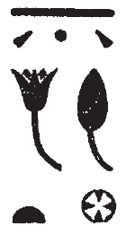

# Notable Spellings {-}  

*ȝw.t-ỉb*, "happiness"  
  
{width=6%}&nbsp;&nbsp;&nbsp;&nbsp;[Esna 194], B

*ỉrỉ*, "to do; make"

{width=6%}&nbsp;&nbsp;&nbsp;&nbsp;[Esna 224], 1 (bis)  
  
*ỉḫḫ wʿ*, "one evening"
  
{width=10%}&nbsp;&nbsp;&nbsp;&nbsp;[Esna 194], B
  
*pr*, "temple"  
  
{width=8%}&nbsp;&nbsp;&nbsp;&nbsp;[Esna 224], 1

*Ptḥ*, "Ptah"

{width=6%}&nbsp;&nbsp;&nbsp;&nbsp;[Esna 224], 2  

*nḥp*, "potter's wheel"  
  
{width=13%}&nbsp;&nbsp;&nbsp;&nbsp;[Esna 224], 1

*Rʿ*, "Re"  
  
{width=8%}&nbsp;&nbsp;&nbsp;&nbsp;[Esna 224], 1  
  
{width=8%}&nbsp;&nbsp;&nbsp;&nbsp;[Esna 231], 4, 9
  
*ḥb pn nfr*, "this good festival"  
  
{width=13%}&nbsp;&nbsp;&nbsp;&nbsp;[Esna 224], 1 
  
*ẖnmw*, "Khnum" (examples from outside the main Khnum litanies)   

{width=15%}&nbsp;&nbsp;&nbsp;&nbsp;[Esna 224], 1  

{width=8%}{width=5%}&nbsp;&nbsp;&nbsp;&nbsp;[Esna 230], B

  
{width=14%}&nbsp;&nbsp;&nbsp;&nbsp;[Esna 224], 2
  
{width=14%}&nbsp;&nbsp;&nbsp;&nbsp;[Esna 353], A  
  
{width=14%}&nbsp;&nbsp;&nbsp;&nbsp;[Esna 353], B  
  
*tȝ-sn.t*, "Esna"  
  
{width=22%}&nbsp;&nbsp;&nbsp;&nbsp;[Esna 224], 1  

  
{width=5%}&nbsp;&nbsp;&nbsp;&nbsp;[Esna 231], 3, 10