# Notable Spellings {-}  
  
*ȝw.t-ỉb*, "happiness"; *ȝw-ỉb*, "to be happy"  
  
{width=4.4%}&nbsp;&nbsp;&nbsp;&nbsp;[Esna 194], B; [Esna 341], 8; [Esna 346], 22    
   
*ȝpd.w*, "birds"  
   
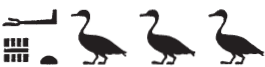{width=16%}&nbsp;&nbsp;&nbsp;&nbsp;[Esna 358], 31   
     
*ȝḫ.t*, "the Akhet"  
  

{width=6.5%}{width=2.2%}&nbsp;&nbsp;&nbsp;&nbsp;[Esna 379], 24; [Esna 395], 16  
  
*Ỉwny.t*, "Iunyt (Esna)"  
  
{width=8%}&nbsp;&nbsp;&nbsp;&nbsp;[Esna 259], 3, §5; 
   
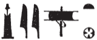{width=12%}&nbsp;&nbsp;&nbsp;&nbsp;[Esna 233], 25 (61)    
  
*ỉmỉ.t-pr*, "inheritance document"  
  
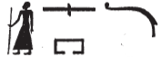{width=14%}&nbsp;&nbsp;&nbsp;&nbsp;[Esna 332^bis^], 28 
      
*ỉn*, "by" (agential particle)    
  
{width=7%}&nbsp;&nbsp;&nbsp;&nbsp;[Esna 358], 34  
  
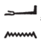{width=6%}&nbsp;&nbsp;&nbsp;&nbsp;[Esna 284], 2; [Esna 358], 34  
  
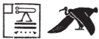{width=14%}&nbsp;&nbsp;&nbsp;&nbsp;[Esna 358], 35   
    
*ỉrỉ*, "to do; make"  

{width=6%}&nbsp;&nbsp;&nbsp;&nbsp;[Esna 224], 1 (bis); [Esna 319], 16; [Esna 330], 6; [Esna 331], 11; [Esna 332^bis^], 28; [Esna 334], 8; [Esna 339], 1; [Esna 388], 8; [Esna 395], 7       

*ỉrṯ.t*, "milk"  
  
{width=5%}{width=3.5%}&nbsp;&nbsp;&nbsp;&nbsp;[Esna 347], 24 
  
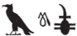{width=10%}&nbsp;&nbsp;&nbsp;&nbsp;[Esna 346], 15    
  
*ỉḫḫ*, "evening; dusk"
  
{width=10%}&nbsp;&nbsp;&nbsp;&nbsp;[Esna 194], B

*ỉqr*, "excellent"  
  
{width=8%}&nbsp;&nbsp;&nbsp;&nbsp;[Esna 390], 17  
  
*Ỉs.t*, "Isis"   

{width=8%}&nbsp;&nbsp;&nbsp;&nbsp;[Esna 369], 38  
  
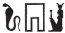{width=10%}&nbsp;&nbsp;&nbsp;&nbsp;[Esna 307^bis^], 23  
  
*Ỉtm*, "Atum"  
  
{width=10%}&nbsp;&nbsp;&nbsp;&nbsp;[Esna 218], 9  

*ỉtn*, "solar disk"  
  
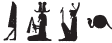{width=13%}&nbsp;&nbsp;&nbsp;&nbsp;[Esna 387], 1    
   
{width=6%}{width=11%}&nbsp;&nbsp;&nbsp;&nbsp;[Esna 379], 24  
  
{width=15%}&nbsp;&nbsp;&nbsp;&nbsp;[Esna 259], 2, §1
  
{width=10%}&nbsp;&nbsp;&nbsp;&nbsp;[Esna 387], 2; [Esna 395], 7       
  
*ʿȝ*, "great"  
  
{width=12%}&nbsp;&nbsp;&nbsp;&nbsp;[Esna 372], 15  
  
{width=15%}{width=7%}&nbsp;&nbsp;&nbsp;&nbsp;[Esna 392], 20  
  
{width=8%}&nbsp;&nbsp;&nbsp;&nbsp;[Esna 318], 11, §14; [Esna 392], 21  
  
*ʿ.wt*, "livestock; mammals"  
   
{width=5.5%}&nbsp;&nbsp;&nbsp;&nbsp;[Esna 377], 5
  
*ʿnḫ*, "life"  
  
{width=12%}&nbsp;&nbsp;&nbsp;&nbsp;[Esna 356], 27  

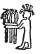{width=5%}&nbsp;&nbsp;&nbsp;&nbsp;[Esna 276], 12, §7    
  
{width=2.2%}&nbsp;&nbsp;&nbsp;&nbsp;[Esna 379], 23
      
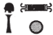{width=7%}&nbsp;&nbsp;&nbsp;&nbsp;[Esna 378], 22     
    
*ʿš*, "to call"  
   
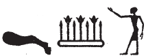{width=15%}&nbsp;&nbsp;&nbsp;&nbsp;[Esna 368], 34  
  
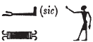{width=12%}&nbsp;&nbsp;&nbsp;&nbsp;[Esna 378], 19  
   
*wȝ.t*, "path; way"  
   
{width=12%}&nbsp;&nbsp;&nbsp;&nbsp;[Esna 387], 4  
   
*wbn*, "to rise; shine"  
  
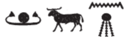{width=16%}&nbsp;&nbsp;&nbsp;&nbsp;[Esna 272], 4    

{width=14%}&nbsp;&nbsp;&nbsp;&nbsp;[Esna 331], 10 and 11   
   
{width=14%}&nbsp;&nbsp;&nbsp;&nbsp;[Esna 331], 7   
  
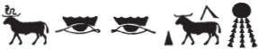{width=25%}&nbsp;&nbsp;&nbsp;&nbsp;[Esna 378], 22 (uncertain)   
  
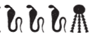{width=14%}&nbsp;&nbsp;&nbsp;&nbsp;[Esna 331], 21     
  
{width=10%}&nbsp;&nbsp;&nbsp;&nbsp;[Esna 378], 12  
   
*wn*, "to open"  
  
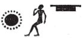{width=11%}&nbsp;&nbsp;&nbsp;&nbsp;[Esna 272], 2    
   
   
*wr.t*, "the great one"  
  
{width=6%}&nbsp;&nbsp;&nbsp;&nbsp;[Esna 209], 28 (2)  
  
*wrḏ*, "to tire"  
  
{width=12%}&nbsp;&nbsp;&nbsp;&nbsp;[Esna 379], 23 
  
*Wsỉr*, "Osiris"  
  
{width=17%}&nbsp;&nbsp;&nbsp;&nbsp;[Esna 307], 21    
 
*bȝw*, "power"  
  
{width=22%}&nbsp;&nbsp;&nbsp;&nbsp;[Esna 392], 20   
  
*p.t*, "sky"  
  
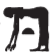{width=5%}&nbsp;&nbsp;&nbsp;&nbsp;[Esna 225], 6 (10) (the tranliteration*p.t* rather than *gb.t* is from context)   
  
*pȝwty*, "Primeval one"

{width=7%}&nbsp;&nbsp;&nbsp;&nbsp;[Esna 388], 8  
   
{width=7%}&nbsp;&nbsp;&nbsp;&nbsp;[Esna 387], 4  
    
*pr*, "temple"  
  
{width=8%}&nbsp;&nbsp;&nbsp;&nbsp;[Esna 224], 1  

*pḥ*, "to reach; attack"  
  
{width=8.5%}&nbsp;&nbsp;&nbsp;&nbsp;[Esna 392], 20
  
*psḏ*, "to shine"  
  
{width=9%}&nbsp;&nbsp;&nbsp;&nbsp;[Esna 331], 8 and 18  
   
*fdw*, "four"  
    
{width=4.5%}&nbsp;&nbsp;&nbsp;&nbsp;[Esna 377], 1   
  
{width=4.5%}&nbsp;&nbsp;&nbsp;&nbsp;[Esna 377], 2   
    
*fd.t*, "four (feminine)"  
  
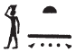{width=7%}&nbsp;&nbsp;&nbsp;&nbsp;[Esna 313], A  

*m*, "in; as; from"  
  
{width=4%}&nbsp;&nbsp;&nbsp;&nbsp;[Esna 233], 18 (19); [Esna 234], 27  
  
{width=3.8%}&nbsp;&nbsp;&nbsp;&nbsp;[Esna 382], 11  

  
{width=6%}&nbsp;&nbsp;&nbsp;&nbsp;[Esna 224], 1 (bis)  
  
{width=6%}&nbsp;&nbsp;&nbsp;&nbsp;[Esna 379], 24   

*mw*, "water"  
  
{width=7%}&nbsp;&nbsp;&nbsp;&nbsp;[Esna 380], 25  
  
*mn*, "to remain; stay"  
  
{width=1.8%}&nbsp;&nbsp;&nbsp;&nbsp;[Esna 335], B  
  
*mnmn.t*, "livestock"  
  
{width=20%}&nbsp;&nbsp;&nbsp;&nbsp;[Esna 319], 17    
  
*Mnḥy.t*, "Menhyt"  
  
{width=14%}&nbsp;&nbsp;&nbsp;&nbsp;[Esna 304], 17  
  
{width=11%}&nbsp;&nbsp;&nbsp;&nbsp;[Esna 298], B
  
{width=9%}&nbsp;&nbsp;&nbsp;&nbsp;[Esna 301], 10
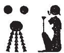{width=7%}&nbsp;&nbsp;&nbsp;&nbsp;[Esna 254], 12 
  
{width=8%}&nbsp;&nbsp;&nbsp;&nbsp;[Esna 335], B  
  
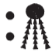{width=6%}&nbsp;&nbsp;&nbsp;&nbsp;[Esna 346], 24   
  
{width=5%}&nbsp;&nbsp;&nbsp;&nbsp;[Esna 346], 23    
   
{width=6%}&nbsp;&nbsp;&nbsp;&nbsp;[Esna 344], 14  
  
{width=18%}&nbsp;&nbsp;&nbsp;&nbsp;[Esna 251], 22, §2  
   
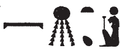{width=12%}&nbsp;&nbsp;&nbsp;&nbsp;[Esna 232], 12 (135)    
   
*mḥy.t*, "north wind"  
   
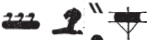{width=15%}&nbsp;&nbsp;&nbsp;&nbsp;[Esna 387], 4    
   
*msỉ*, "to birth; create; fashion"  
   
{width=15%}&nbsp;&nbsp;&nbsp;&nbsp;[Esna 390], 17  
  
{width=12%}&nbsp;&nbsp;&nbsp;&nbsp;[Esna 387], 3    
   
*mzỉ*, "to present; offer"
  
{width=4%}&nbsp;&nbsp;&nbsp;&nbsp;[Esna 347], 25 
  
*msḫn.t*, "birth brick"  
  
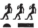{width=8%}&nbsp;&nbsp;&nbsp;&nbsp;[Esna 313], A  
  
*Ptḥ*, "Ptah"

{width=6%}&nbsp;&nbsp;&nbsp;&nbsp;[Esna 224], 2; [Esna 388], 7   
  
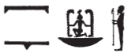{width=12%}&nbsp;&nbsp;&nbsp;&nbsp;[Esna 250], 14  
   
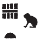{width=6%}&nbsp;&nbsp;&nbsp;&nbsp;[Esna 394], 24; [Esna 395], 8     
  
*N.t*, "Neith"  
  
{width=12%}&nbsp;&nbsp;&nbsp;&nbsp;[Esna 305], 18  
  
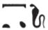{width=10%}&nbsp;&nbsp;&nbsp;&nbsp;[Esna 331], 7      
   
*nb*, "lord" and *nb*, "all" 
  
{width=6%}&nbsp;&nbsp;&nbsp;&nbsp;[Esna 328], A; [Esna 368], 29; [Esna 393], 23   
  
{width=6%}&nbsp;&nbsp;&nbsp;&nbsp;[Esna 362], D  
    
{width=4.5%}&nbsp;&nbsp;&nbsp;&nbsp;[Esna 273], 6  
  
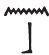{width=5%}&nbsp;&nbsp;&nbsp;&nbsp;[Esna 225], 24 (74)   
   
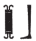{width=5%}&nbsp;&nbsp;&nbsp;&nbsp;[Esna 242], 18 (19)   
   
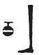{width=4%}&nbsp;&nbsp;&nbsp;&nbsp;[Esna 242], 19 (29)   
   
{width=13%}&nbsp;&nbsp;&nbsp;&nbsp;[Esna 379], 24   
   
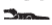{width=7%}&nbsp;&nbsp;&nbsp;&nbsp;[Esna 332], 26   
   
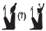{width=7%}&nbsp;&nbsp;&nbsp;&nbsp;[Esna 378], 21      
   
{width=8%}&nbsp;&nbsp;&nbsp;&nbsp;[Esna 250], 17   
   
*nb.t*, "lady"  
  
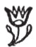{width=5%}&nbsp;&nbsp;&nbsp;&nbsp;[Esna 233], 25 (60)  
  
*Nb.t-ww*, "Nebtu"  
  
{width=11%}&nbsp;&nbsp;&nbsp;&nbsp;[Esna 306], 30   
  
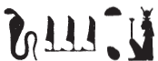{width=13%}&nbsp;&nbsp;&nbsp;&nbsp;[Esna 346], 24  
  
{width=5.5%}&nbsp;&nbsp;&nbsp;&nbsp;[Esna 240], 5

*nn*, negation  
  
{width=9%}&nbsp;&nbsp;&nbsp;&nbsp;[Esna 379], 24  
  
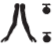{width=7%}&nbsp;&nbsp;&nbsp;&nbsp;[Esna 378], 10   
  
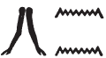{width=11%}&nbsp;&nbsp;&nbsp;&nbsp;[Esna 242], 22 (46)  
   
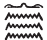{width=5%}&nbsp;&nbsp;&nbsp;&nbsp;[Esna 378], 18  

   
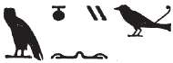{width=13%}&nbsp;&nbsp;&nbsp;&nbsp;[Esna 319], 20    
  
*nḥp*, "potter's wheel" (n.), "to build on the potter's wheel" (v.)    
  
{width=15%}&nbsp;&nbsp;&nbsp;&nbsp;[Esna 390], 17

  
{width=13%}&nbsp;&nbsp;&nbsp;&nbsp;[Esna 224], 1  

{width=11%}&nbsp;&nbsp;&nbsp;&nbsp;[Esna 320], 11; [Esna 300], 10; [Esna 358], 31    
  
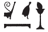{width=8%}&nbsp;&nbsp;&nbsp;&nbsp;[Esna 311], 1;  

  
{width=13%}&nbsp;&nbsp;&nbsp;&nbsp;[Esna 301], 11  
  
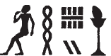{width=10%}&nbsp;&nbsp;&nbsp;&nbsp;[Esna 356], 16    
  
{width=7%}&nbsp;&nbsp;&nbsp;&nbsp;[Esna 277], 20; [Esna 302], 14; [Esna 304], 16   
  
{width=18%}&nbsp;&nbsp;&nbsp;&nbsp;[Esna 302], 13 
  
{width=10%}&nbsp;&nbsp;&nbsp;&nbsp;[Esna 310], 28; [Esna 358], 32 (slightly different)  
  
{width=12%}&nbsp;&nbsp;&nbsp;&nbsp;[Esna 276], 11 §2 
   
{width=15%}&nbsp;&nbsp;&nbsp;&nbsp;[Esna 313], A   
     
{width=5.2%}{width=8%}&nbsp;&nbsp;&nbsp;&nbsp;[Esna 378], 9     
     
{width=10%}&nbsp;&nbsp;&nbsp;&nbsp;[Esna 319], 18      
   
{width=10%}&nbsp;&nbsp;&nbsp;&nbsp;[Esna 394], 27  
  
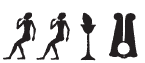{width=12%}&nbsp;&nbsp;&nbsp;&nbsp;[Esna 311], 1; 276, 11 §1  
  
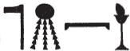{width=12%}&nbsp;&nbsp;&nbsp;&nbsp;[Esna 377], 7   
  
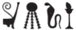{width=12%}&nbsp;&nbsp;&nbsp;&nbsp;[Esna 378], 9  
  
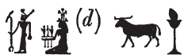{width=15%}&nbsp;&nbsp;&nbsp;&nbsp;[Esna 250], 7     
    
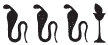{width=11%}&nbsp;&nbsp;&nbsp;&nbsp;[Esna 378], 21  

{width=7%}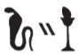{width=8%}&nbsp;&nbsp;&nbsp;&nbsp;[Esna 377], 1  
  
*ntk*, "you" (second person masculing independent pronoun)  
  
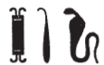{width=8%}&nbsp;&nbsp;&nbsp;&nbsp;[Esna 319], 19 bis  
  
*nṯr.w*, "the gods"  
   
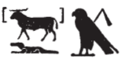{width=10%}&nbsp;&nbsp;&nbsp;&nbsp;[Esna 319], 17  
  
{width=11%}&nbsp;&nbsp;&nbsp;&nbsp;[Esna 358], 31  
  
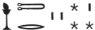{width=13%}&nbsp;&nbsp;&nbsp;&nbsp;[Esna 388], 9   
   
*r*, "to; towards; at; until"  
  
{width=10%}&nbsp;&nbsp;&nbsp;&nbsp;[Esna 304], 17   
  
{width=8%}&nbsp;&nbsp;&nbsp;&nbsp;[Esna 254], 6   

*Rʿ*, "Re"  
  
{width=7%}&nbsp;&nbsp;&nbsp;&nbsp;[Esna 196], 5; [Esna 293], 27; [Esna 318], 7, §4; 11, §14           
  
{width=8%}&nbsp;&nbsp;&nbsp;&nbsp;[Esna 224], 1  
  
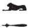{width=6%}&nbsp;&nbsp;&nbsp;&nbsp;[Esna 225], 4 (3)    
   
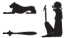{width=8%}&nbsp;&nbsp;&nbsp;&nbsp;[Esna 378], 23  
  
{width=8%}&nbsp;&nbsp;&nbsp;&nbsp;[Esna 242], 17 (11)    
   
{width=8%}&nbsp;&nbsp;&nbsp;&nbsp;[Esna 231], 4, 9
  
*rmṯ.w*, "humans"  
  
{width=18%}&nbsp;&nbsp;&nbsp;&nbsp;[Esna 225], 4 (2)  
  
*rs*, "to awaken" 
  
{width=7%}{width=2.2%}&nbsp;&nbsp;&nbsp;&nbsp;[Esna 379], 24

{width=10%}&nbsp;&nbsp;&nbsp;&nbsp;[Esna 259], 2, §1  
  
{width=5.5%}&nbsp;&nbsp;&nbsp;&nbsp;[Esna 259], 3, §4  
  
{width=12%}&nbsp;&nbsp;&nbsp;&nbsp;[Esna 378], 22    
   
{width=9%}&nbsp;&nbsp;&nbsp;&nbsp;[Esna 259], 4, §7
  
{width=4.5%}{width=7%}&nbsp;&nbsp;&nbsp;&nbsp;[Esna 378], 22    
  
*ḥb*, "festival" 

{width=9%}&nbsp;&nbsp;&nbsp;&nbsp;[Esna 224], 1; [Esna 380], 25 and 26

*ḥb pn nfr*, "this good festival"  
  
{width=13%}&nbsp;&nbsp;&nbsp;&nbsp;[Esna 224], 1  
  
*Ḥr*, "Horus"  
  
{width=13%}&nbsp;&nbsp;&nbsp;&nbsp;[Esna 393], 23 
  
*Ḥkȝ*, "Heka"  
  
{width=16%}&nbsp;&nbsp;&nbsp;&nbsp;[Esna 308], 25 *bis*  
  
*m-ḫt*, "after"  
  
{width=4%}&nbsp;&nbsp;&nbsp;&nbsp;[Esna 387], 3  
  
*ḫʿỉ*, "to appear (on the throne; in procession)"  
 
{width=5%}&nbsp;&nbsp;&nbsp;&nbsp;[Esna 393], 23  
  
{width=12%}&nbsp;&nbsp;&nbsp;&nbsp;[Esna 378], 12  
  
*nb-ḫʿ.w*, "Lord of Glorious Appearances"  
  
{width=5.5%}&nbsp;&nbsp;&nbsp;&nbsp;[Esna 334], 7
  
*Ḫmny.w*, "the Ogdoad"  
  
{width=12%}&nbsp;&nbsp;&nbsp;&nbsp;[Esna 272], 1  
  
{width=8%}&nbsp;&nbsp;&nbsp;&nbsp;[Esna 272], 5  
  
{width=10%}&nbsp;&nbsp;&nbsp;&nbsp;[Esna 272], 2  
  
*ẖnmw*, "Khnum" (examples from outside the main Khnum litanies)   
  
{width=19%}&nbsp;&nbsp;&nbsp;&nbsp;[Esna 358], 39; [Esna 369], 36  
  
{width=14%}&nbsp;&nbsp;&nbsp;&nbsp;[Esna 261], 15   
  
{width=22%}&nbsp;&nbsp;&nbsp;&nbsp;[Esna 378], 14  
   
{width=16%}&nbsp;&nbsp;&nbsp;&nbsp;[Esna 318], 9, §8  
  
{width=5%}{width=3%}&nbsp;&nbsp;&nbsp;&nbsp;[Esna 378], 23   
     
{width=14%}&nbsp;&nbsp;&nbsp;&nbsp;[Esna 378], 17  
   
{width=17%}&nbsp;&nbsp;&nbsp;&nbsp;[Esna 389], 16  
  
{width=10%}&nbsp;&nbsp;&nbsp;&nbsp;[Esna 310], 28  
  
{width=8%}&nbsp;&nbsp;&nbsp;&nbsp;[Esna 341], 9; [Esna 371], 1   
  
{width=14%}&nbsp;&nbsp;&nbsp;&nbsp;[Esna 225], 4, §3  
   
{width=14%}&nbsp;&nbsp;&nbsp;&nbsp;[Esna 277], 22, §6; [Esna 383], B  
    
{width=15%}&nbsp;&nbsp;&nbsp;&nbsp;[Esna 232], 6 (107)   
    
{width=16%}&nbsp;&nbsp;&nbsp;&nbsp;[Esna 211], 18; [Esna 294], 12   
  
{width=18%}&nbsp;&nbsp;&nbsp;&nbsp;[Esna 377], 3   
  
{width=15%}&nbsp;&nbsp;&nbsp;&nbsp;[Esna 224], 1   
  
{width=15%}&nbsp;&nbsp;&nbsp;&nbsp;[Esna 264], 25  

{width=20%}&nbsp;&nbsp;&nbsp;&nbsp;[Esna 393], 21   
   
{width=12%}&nbsp;&nbsp;&nbsp;&nbsp;[Esna 318], 10, §12  
  
{width=9%}&nbsp;&nbsp;&nbsp;&nbsp;[Esna 377], 1     
    
{width=13%}&nbsp;&nbsp;&nbsp;&nbsp;[Esna 318], 10, §13; 11, §14      
  
{width=14%}&nbsp;&nbsp;&nbsp;&nbsp;[Esna 377], 4    
    
{width=15%}&nbsp;&nbsp;&nbsp;&nbsp;[Esna 275], 9  
     
{width=7%}&nbsp;&nbsp;&nbsp;&nbsp;[Esna 195], 7  
     
{width=16%}&nbsp;&nbsp;&nbsp;&nbsp;[Esna 364], B   
  
{width=18%}&nbsp;&nbsp;&nbsp;&nbsp;[Esna 262], 23   
  
{width=13%}&nbsp;&nbsp;&nbsp;&nbsp;[Esna 368], 34 
   
{width=8%}{width=5%}&nbsp;&nbsp;&nbsp;&nbsp;[Esna 230], B  
  
{width=12%}&nbsp;&nbsp;&nbsp;&nbsp;[Esna 272], 1 
  
{width=14%}&nbsp;&nbsp;&nbsp;&nbsp;[Esna 291], 21  
  
{width=9%}&nbsp;&nbsp;&nbsp;&nbsp;[Esna 379], 24  
  
{width=10%}&nbsp;&nbsp;&nbsp;&nbsp;[Esna 318], 7    
   
{width=14%}&nbsp;&nbsp;&nbsp;&nbsp;[Esna 224], 2  
  
{width=12%}&nbsp;&nbsp;&nbsp;&nbsp;[Esna 387], 1  
   
{width=3.3%}{width=10%}&nbsp;&nbsp;&nbsp;&nbsp;[Esna 377], 2  
   
{width=9%}&nbsp;&nbsp;&nbsp;&nbsp;[Esna 388], 8  
   
{width=14%}&nbsp;&nbsp;&nbsp;&nbsp;[Esna 318], 8, §6    
   
{width=17%}&nbsp;&nbsp;&nbsp;&nbsp;[Esna 264], 25  
  
{width=14%}&nbsp;&nbsp;&nbsp;&nbsp;[Esna 353], A; [Esna 387], 1    
  
{width=17%}&nbsp;&nbsp;&nbsp;&nbsp;[Esna 364], A    
  
{width=13%}&nbsp;&nbsp;&nbsp;&nbsp;[Esna 272], 4     
   
{width=17%}&nbsp;&nbsp;&nbsp;&nbsp;[Esna 262], 19, §1  
  
{width=2.9%}{width=18%}&nbsp;&nbsp;&nbsp;&nbsp;[Esna 393], 21  
  
{width=13%}&nbsp;&nbsp;&nbsp;&nbsp;[Esna 318], 10, §11     
   
{width=12%}&nbsp;&nbsp;&nbsp;&nbsp;[Esna 379], 24   
  
{width=12%}&nbsp;&nbsp;&nbsp;&nbsp;[Esna 394], 23   
  
{width=15%}&nbsp;&nbsp;&nbsp;&nbsp;[Esna 377], 8  
  
{width=14%}&nbsp;&nbsp;&nbsp;&nbsp;[Esna 377], 5  
  
{width=18%}&nbsp;&nbsp;&nbsp;&nbsp;[Esna 292], 25  

{width=12%}&nbsp;&nbsp;&nbsp;&nbsp;[Esna 249], 1, §14bis

  
{width=13%}&nbsp;&nbsp;&nbsp;&nbsp;[Esna 353], B  
  
{width=15%}&nbsp;&nbsp;&nbsp;&nbsp;[Esna 318], 8, §7    
  
{width=10%}&nbsp;&nbsp;&nbsp;&nbsp;[Esna 392], 19    

{width=11%}&nbsp;&nbsp;&nbsp;&nbsp;[Esna 346], 23      
  
{width=11%}&nbsp;&nbsp;&nbsp;&nbsp;[Esna 272], 6  
   
{width=10%}&nbsp;&nbsp;&nbsp;&nbsp;[Esna 377], 2    
   
{width=5.5%}{width=7%}&nbsp;&nbsp;&nbsp;&nbsp;[Esna 318], 9, §9     
    
{width=15%}&nbsp;&nbsp;&nbsp;&nbsp;[Esna 318], 9, §10       
  
{width=12%}&nbsp;&nbsp;&nbsp;&nbsp;[Esna 249], 3, §21     
   
{width=18%}&nbsp;&nbsp;&nbsp;&nbsp;[Esna 378], 21      
   
*=s*, "she; her" (third person singular suffix pronoun)  
     
{width=7%}&nbsp;&nbsp;&nbsp;&nbsp;[Esna 216], 5 (23)  
      
*sy*, "her" (third person singular dependent pronoun)
    
{width=3.5%}&nbsp;&nbsp;&nbsp;&nbsp;[Esna 380], 28
    
*sʿnḫ*, "to keep alive; to support"
  
{width=15%}&nbsp;&nbsp;&nbsp;&nbsp;[Esna 377], 4   
    
{width=6.5%}&nbsp;&nbsp;&nbsp;&nbsp;[Esna 377], 6   
  
{width=10%}&nbsp;&nbsp;&nbsp;&nbsp;[Esna 378], 17  
    
*swḥ.t*, "egg"  
  
{width=8%}&nbsp;&nbsp;&nbsp;&nbsp;[Esna 249], 4, §23; [Esna 356], 20; [Esna 377], 5; [Esna 388], 7, 8     
   
{width=6%}&nbsp;&nbsp;&nbsp;&nbsp;[Esna 225], 21 (64)         
{width=10%}&nbsp;&nbsp;&nbsp;&nbsp;[Esna 276], 11, 2     
  
{width=9%}&nbsp;&nbsp;&nbsp;&nbsp;[Esna 249], 1, §15  
       
{width=7%}&nbsp;&nbsp;&nbsp;&nbsp;[Esna 377], 8
       
*sbȝ.w*, "stars"  
  
{width=12%}&nbsp;&nbsp;&nbsp;&nbsp;[Esna 394], 24   
  
*sm.w*, "plants; vegetables"  
  
{width=10%}&nbsp;&nbsp;&nbsp;&nbsp;[Esna 394], 27   
  
  
*snw*, "two"  
  
{width=4%}&nbsp;&nbsp;&nbsp;&nbsp;[Esna 255], A; [Esna 309], 27; [Esna 328], B; [Esna 339], 1; [Esna 346], 25; [Esna 377], 2.  
  
*sr*, "ram"  
  
{width=10%}&nbsp;&nbsp;&nbsp;&nbsp;[Esna 232], 13 (138)  
  
*srwḏ*, "to make grow; make thrive"   
  
{width=13%}&nbsp;&nbsp;&nbsp;&nbsp;[Esna 377], 3  
  
*sḥtp*, "to pacify; appease"  
  
{width=7%}&nbsp;&nbsp;&nbsp;&nbsp;[Esna 319], 13  
  
*sḥḏ*, "to illumine"  
   
{width=8%}&nbsp;&nbsp;&nbsp;&nbsp;[Esna 389], 15; [Esna 394], 24    
  
{width=9%}&nbsp;&nbsp;&nbsp;&nbsp;[Esna 331], 10; [Esna 387], 12, 15      
  
*sḫ.t*, "field" (spelled as if it were "place of offerings")    
  
{width=17%}&nbsp;&nbsp;&nbsp;&nbsp;[Esna 306], 20   
  
{width=5%}&nbsp;&nbsp;&nbsp;&nbsp;[Esna 340], 5  
  
{width=5%}&nbsp;&nbsp;&nbsp;&nbsp;[Esna 340], 7  
   
*sḫpr*, "to create"
  
{width=9%}&nbsp;&nbsp;&nbsp;&nbsp;[Esna 337], A  

{width=6.5%}&nbsp;&nbsp;&nbsp;&nbsp;[Esna 380], 26

*sḫm*, "power; image"  
  
{width=15%}&nbsp;&nbsp;&nbsp;&nbsp;[Esna 393], 22  
  
*zẖȝw*, "scribe"  
  
{width=6%}&nbsp;&nbsp;&nbsp;&nbsp;[Esna 309], 26  
  
*sḫr.w*, "conditions; plans"  
  
{width=12%}&nbsp;&nbsp;&nbsp;&nbsp;[Esna 387], 4     
    
*sqdỉ*, "to sail; travel"  

{width=3.3%}{width=9%}&nbsp;&nbsp;&nbsp;&nbsp;[Esna 379], 23-24
  
*Šw*, "Shu"  
   
{width=11%}&nbsp;&nbsp;&nbsp;&nbsp;[Esna 358], 38  
   
*šps.t*, "August one"  
  
{width=10%}&nbsp;&nbsp;&nbsp;&nbsp;[Esna 331], 17       
   
*qmȝ*, "to create"  
  
{width=6%}&nbsp;&nbsp;&nbsp;&nbsp;[Esna 250], 19; [Esna 387], 3, 6; [Esna 388], 7, 9, 10; [Esna 393], 23; [Esna 395], 9    
  
{width=13%}&nbsp;&nbsp;&nbsp;&nbsp;[Esna 356], 20  
  
{width=5.5%}&nbsp;&nbsp;&nbsp;&nbsp;[Esna 225], 8 (15)      
  
*=k*, "you; your" (second person singular masculine suffix pronoun)  

{width=4%}&nbsp;&nbsp;&nbsp;&nbsp;[Esna 379], 23  
  
{width=3%}&nbsp;&nbsp;&nbsp;&nbsp;[Esna 319], 17, 18; [Esna 334], 14; [Esna 346], 19; [Esna 392], 21; [Esna 393], 23 
   
{width=4%}&nbsp;&nbsp;&nbsp;&nbsp;[Esna 378], 22    
   
*kȝ*, "Ka; spirit"  
   
{width=6%}&nbsp;&nbsp;&nbsp;&nbsp;[Esna 241], 14 (95)  
  
*tȝ-sn.t*, "Esna"  
  
{width=21%}&nbsp;&nbsp;&nbsp;&nbsp;[Esna 224], 1  
  
{width=14%}&nbsp;&nbsp;&nbsp;&nbsp;[Esna 334], 7; [Esna 324], 7    
  
{width=15%}&nbsp;&nbsp;&nbsp;&nbsp;[Esna 234], 28  
   
{width=16%}&nbsp;&nbsp;&nbsp;&nbsp;[Esna 195], 4; [Esna 243], 9 (slight variant); [Esna 249], 1, §14bis; [Esna 254], 7; [Esna 301], 10 (partially damaged)  
   
{width=12%}&nbsp;&nbsp;&nbsp;&nbsp;[Esna 249], 3, §21; [Esna 394], 24  
  
{width=14%}&nbsp;&nbsp;&nbsp;&nbsp;[Esna 378], 23   
  
{width=13%}&nbsp;&nbsp;&nbsp;&nbsp;[Esna 272], 1  
  
{width=13%}&nbsp;&nbsp;[Esna 378], 9    
  
{width=12%}&nbsp;&nbsp;&nbsp;&nbsp;[Esna 231], 3, 10; [Esna 274], 8; [Esna 285], 14; [Esna 291], 21; [Esna 383], A (flowers vary slightly)

{width=14%}&nbsp;&nbsp;&nbsp;&nbsp;[Esna 287], 17  
  
{width=17%}&nbsp;&nbsp;&nbsp;&nbsp;[Esna 288], 18  
  
{width=10%}{width=7%}&nbsp;&nbsp;&nbsp;&nbsp;[Esna 293], 26  

{width=22%}&nbsp;&nbsp;&nbsp;&nbsp;[Esna 379], 24

  
{width=11%}&nbsp;&nbsp;&nbsp;&nbsp;[Esna 216], 1; [Esna 225], 3; [Esna 233], 15 (3); [Esna 241], 13 (89);  [Esna 249], 2, §16; [Esna 292], 22; [Esna 309], 26; [Esna 378], 22  
  
{width=11%}&nbsp;&nbsp;&nbsp;&nbsp;[Esna 273], 6  
  
{width=16%}&nbsp;&nbsp;&nbsp;&nbsp;[Esna 300], 1; [Esna 302], 14; [Esna 369], 38  

{width=15%}&nbsp;&nbsp;&nbsp;&nbsp;[Esna 293], 27  
  
{width=11%}&nbsp;&nbsp;&nbsp;&nbsp;[Esna 292], 25  
  
{width=12%}&nbsp;&nbsp;&nbsp;&nbsp;[Esna 393], 21   
  
{width=13%}&nbsp;&nbsp;&nbsp;&nbsp;[Esna 362], D  
   
{width=12%}&nbsp;&nbsp;[Esna 389], 13  
    
{width=13%}&nbsp;&nbsp;[Esna 254], 6   
   
{width=14%}&nbsp;&nbsp;[Esna 300], 7   
   
{width=15%}&nbsp;&nbsp;[Esna 378], 14      
  
{width=13%}&nbsp;&nbsp;[Esna 378], 21  
   
{width=6%}&nbsp;&nbsp;[Esna 240], 10{width=6%}&nbsp;&nbsp;[Esna 240], 12  
*tȝ-ṯnn*, "Tatenen"  

{width=15%}&nbsp;&nbsp;&nbsp;&nbsp;[Esna 331], 9; [Esna 378], 13    
  
{width=9%}&nbsp;&nbsp;&nbsp;&nbsp;[Esna 319], 19     
   
{width=10%}&nbsp;&nbsp;&nbsp;&nbsp;[Esna 388], 8
   
*tp*, "head"  
  
{width=7%}&nbsp;&nbsp;&nbsp;&nbsp;[Esna 226], 11; [Esna 321], 24
  
*ṯȝw*, "chick; fetus"  
   
{width=15%}&nbsp;&nbsp;&nbsp;&nbsp;[Esna 377], 5    

*ṯȝw*, "air; wind"  
  
{width=15%}&nbsp;&nbsp;&nbsp;&nbsp;[Esna 377], 4  
  
{width=12%}&nbsp;&nbsp;&nbsp;&nbsp;[Esna 377], 5  
   
{width=14%}&nbsp;&nbsp;&nbsp;&nbsp;[Esna 378], 17    
  
{width=16%}&nbsp;&nbsp;&nbsp;&nbsp;[Esna 378], 15, 21   
  
{width=16%}&nbsp;&nbsp;&nbsp;&nbsp;[Esna 378], 13   
  
*ṯpḥ.t-ḏȝ.t*, "blocked cavern (in Memphis)"
  
{width=8.5%}{width=28%}&nbsp;&nbsp;&nbsp;&nbsp;[Esna 393], 22 
  
*ṯmȝ-ʿ*, "valiant of arm"  
  
{width=10%}&nbsp;&nbsp;&nbsp;&nbsp;[Esna 242], 21 (44)    
  
*ṯnỉ*, "to distinguish"  
  
{width=16%}&nbsp;&nbsp;&nbsp;&nbsp;[Esna 393], 21  
  
*dgȝ*, "to see; behold"  
  
{width=17%}&nbsp;&nbsp;&nbsp;&nbsp;[Esna 225], 18 (50)  
  
{width=10%}&nbsp;&nbsp;&nbsp;&nbsp;[Esna 387], 2    
    
*ḏȝỉ*, "to sail; travel"
  
{width=10%}&nbsp;&nbsp;&nbsp;&nbsp;[Esna 379], 23

*ḏrw, ỉḏr.w*, "limit; limits"  
  
{width=19%}&nbsp;&nbsp;&nbsp;&nbsp;[Esna 379], 24

*Ḏḥwty*, "Thoth"  
  
{width=13%}&nbsp;&nbsp;&nbsp;&nbsp;[Esna 309], 26   
  
{width=11%}&nbsp;&nbsp;&nbsp;&nbsp;[Esna 358], 37  
 
  
*ḏsr*, "sacred"
  
{width=13%}&nbsp;&nbsp;&nbsp;&nbsp;[Esna 393], 22  

### Roman Emperors {-}

Hadrian  
   
{width=18%}&nbsp;&nbsp;&nbsp;&nbsp;[Esna 251], 10  
  
{width=19%}&nbsp;&nbsp;&nbsp;&nbsp;[Esna 334], 3   

{width=19%}&nbsp;&nbsp;&nbsp;&nbsp;[Esna 350], 7  
  
Trajan  

{width=6%}&nbsp;&nbsp;[Esna 240], 1&nbsp;&nbsp;{width=6%}&nbsp;&nbsp;[Esna 240], 6  
  
{width=6%}&nbsp;&nbsp;[Esna 195], 1&nbsp;&nbsp;{width=6%}&nbsp;&nbsp;[Esna 195], 12 
  
{width=28%}&nbsp;&nbsp;[Esna 235], 6   
  
  
### Phrases {-}
  
*r km ḏ.t*, "until the completion of eternity" (?)  
  
{width=22%} 