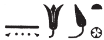

# Notable Spellings {-}  

*ȝw.t-ỉb*, "happiness"  
  
{width=6%}&nbsp;&nbsp;&nbsp;&nbsp;[Esna 194], B

*ỉrỉ*, "to do; make"

{width=6%}&nbsp;&nbsp;&nbsp;&nbsp;[Esna 224], 1 (bis)  

*ỉrṯ.t*, "milk"  
  
{width=5%}{width=3.5%}&nbsp;&nbsp;&nbsp;&nbsp;[Esna 347], 24 
  
  
  
*ỉḫḫ*, "evening; dusk"
  
{width=10%}&nbsp;&nbsp;&nbsp;&nbsp;[Esna 194], B

*wr.t*, "the great"  
  
{width=6%}&nbsp;&nbsp;&nbsp;&nbsp;[Esna 209], 28 (2)  
  
  
*pr*, "temple"  
  
{width=8%}&nbsp;&nbsp;&nbsp;&nbsp;[Esna 224], 1  

*m*, "in; as; from"  
  
{width=4.2%}&nbsp;&nbsp;&nbsp;&nbsp;[Esna 234], 27  
  
{width=6%}&nbsp;&nbsp;&nbsp;&nbsp;[Esna 224], 1 (bis)
  
*mzỉ*, "to present; offer"
  
{width=4%}&nbsp;&nbsp;&nbsp;&nbsp;[Esna 347], 25 

*Ptḥ*, "Ptah"

{width=6%}&nbsp;&nbsp;&nbsp;&nbsp;[Esna 224], 2  
  
*nb*, "lord"  
  
{width=6%}&nbsp;&nbsp;&nbsp;&nbsp;[Esna 328], A  
  
*nḥp*, "potter's wheel"  
  
{width=13%}&nbsp;&nbsp;&nbsp;&nbsp;[Esna 224], 1

*Rʿ*, "Re"  
  
{width=8%}&nbsp;&nbsp;&nbsp;&nbsp;[Esna 224], 1  
  
{width=8%}&nbsp;&nbsp;&nbsp;&nbsp;[Esna 231], 4, 9
  
*ḥb pn nfr*, "this good festival"  
  
{width=13%}&nbsp;&nbsp;&nbsp;&nbsp;[Esna 224], 1 
  
*ẖnmw*, "Khnum" (examples from outside the main Khnum litanies)   

{width=15%}&nbsp;&nbsp;&nbsp;&nbsp;[Esna 224], 1  
   
{width=16%}&nbsp;&nbsp;&nbsp;&nbsp;[Esna 364], B  
   
   
{width=8%}{width=5%}&nbsp;&nbsp;&nbsp;&nbsp;[Esna 230], B

  
{width=14%}&nbsp;&nbsp;&nbsp;&nbsp;[Esna 224], 2
  
{width=14%}&nbsp;&nbsp;&nbsp;&nbsp;[Esna 353], A  
  
{width=17%}&nbsp;&nbsp;&nbsp;&nbsp;[Esna 364], A  
  
{width=14%}&nbsp;&nbsp;&nbsp;&nbsp;[Esna 353], B  
  
*snw*, "two"  
  
{width=4%}&nbsp;&nbsp;&nbsp;&nbsp;[Esna 328], B; [Esna 346], 25.
  
*sḫpr*, "to create"
  
{width=9%}&nbsp;&nbsp;&nbsp;&nbsp;[Esna 337], A 
  
*tȝ-sn.t*, "Esna"  
  
{width=22%}&nbsp;&nbsp;&nbsp;&nbsp;[Esna 224], 1  
  
{width=15%}&nbsp;&nbsp;&nbsp;&nbsp;[Esna 234], 28  

  
{width=5%}&nbsp;&nbsp;&nbsp;&nbsp;[Esna 231], 3, 10  
   
{width=14%}&nbsp;&nbsp;&nbsp;&nbsp;[Esna 285], 14  
  
{width=14%}&nbsp;&nbsp;&nbsp;&nbsp;[Esna 287], 17  
  
{width=17%}&nbsp;&nbsp;&nbsp;&nbsp;[Esna 288], 18
